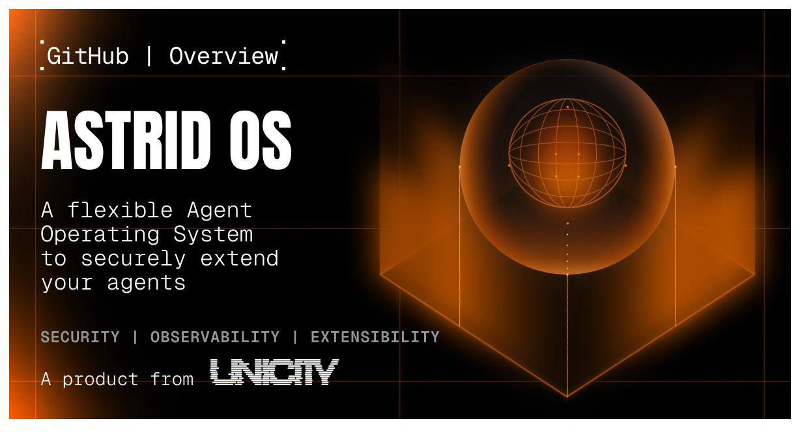
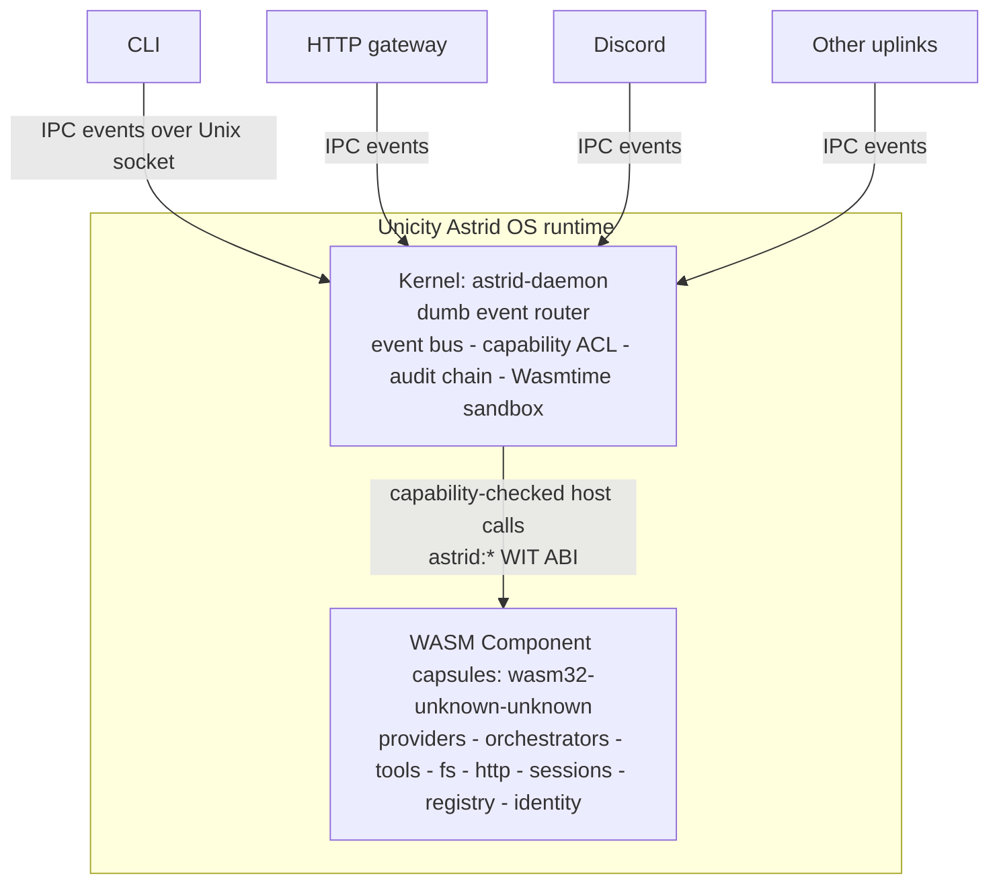
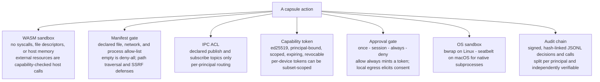

# Unicity Astrid OS

<p align="center">
  
</p>

**A modular operating system for AI agents. Build from sealed parts, swap any
part later, and keep every capability under control.**

[](https://github.com/unicity-astrid/astrid/actions/workflows/ci.yml)
[](https://github.com/unicity-astrid/astrid/actions/workflows/codeql.yml)
[](#license)
[](https://www.rust-lang.org)
[](https://www.rust-lang.org)
[](https://github.com/unicity-astrid/book)

---

Unicity Astrid OS treats an AI agent the way an operating system treats a
process. Every ability is a sealed WebAssembly **capsule**: the model, the
loop, memory, tools, skills, guards, and frontends. Compose them into an agent,
swap any part later, and the agent can never take more than you gave it.
Unicity Astrid OS slots in underneath the agent you already use.

The kernel underneath is small and deliberately dumb. It routes events,
enforces capabilities, runs the sandbox, and records the audit trail; it holds
no model, tool schema, or business logic. A jailbreak, poisoned tool, or plain
bug still cannot read a file, reach a network, or spawn a process outside its
grant. Authority is a capability the kernel enforces, not an instruction the
model is trusted to follow.

## Quick start

```bash
brew tap unicity-astrid/tap && brew install astrid
astrid init      # pick a provider, enter its key, install a distro
astrid doctor    # verify the daemon, capsules, and an LLM are ready
astrid chat      # start a session; the daemon auto-starts
```

Start with the [Astrid website](https://unicity-astrid.github.io/) for a live
tour, [the Book](https://unicity-astrid.github.io/book/) for the architecture,
or the [Contributor Handbook](https://unicity-astrid.github.io/handbook/) to
contribute to Unicity Astrid OS.

## Why Unicity Astrid OS exists

Agent frameworks put trust in the prompt. Unicity Astrid OS puts it in the runtime. An agent is untrusted code
executing on your machine with access to your files, your network, and your credentials. Telling it
to behave is not a security boundary. An OS-grade boundary is.

- **Cryptographic capability model.** Every file path, network host, and tool is a signed ed25519
  grant scoped to a resource pattern, principal-bound, expiry-checked, and globally revocable. No
  grant, no access.
- **WASM sandbox with no ambient authority.** Capsules run in Wasmtime with no syscalls, no file
  descriptors, and no host memory. Every external effect is a capability-checked host call over a
  WIT-typed ABI.
- **The kernel is dumb.** It instantiates an event bus, loads capsules, and routes IPC bytes under a
  capability ACL. It has no LLM handles, no conversation state, and no tool registry. All
  intelligence lives in capsules, so a capsule bug cannot corrupt shared kernel state.
- **Per-principal everything.** Each identity gets isolated capsule access, KV data, secrets, home
  directory, quotas, and audit chain. One principal can never read another's namespace, and it fails
  closed if the caller cannot be resolved.
- **Signed, hash-linked audit chain.** Each entry seals the hash of the one before it and is signed.
  Break the chain and the tampering shows.
- **Live capsule lifecycle.** Install, upgrade, and remove capsules on a running daemon. No restart.

## How it works

Frontends (the CLI, the HTTP gateway, Discord, and so on) are **uplinks**: protocol clients that
connect to the daemon over a Unix domain socket and speak in IPC events. There is no `Frontend`
trait. An uplink publishes events and receives responses like any other bus participant.



Capsules communicate exclusively through the bus. Each declares what it needs and what it provides
in a `Capsule.toml` manifest with typed `[imports]`/`[exports]` tables; the kernel resolves the
dependency graph by topological sort and boots capsules in order. Tools are an IPC convention, not a
kernel concept: a tool capsule intercepts `tool.v1.execute.<name>`, and the kernel never sees a tool
schema.

The host ABI is the WebAssembly component model with versioned `astrid:*` WIT packages:
`fs`, `io`, `kv`, `ipc`, `net`, `http`, `sys`, `process`, `approval`, `identity`, `elicit`, and
`uplink`. Guests import only what their manifest allows, and every call is capability-gated at the
boundary.

## The security model

Astrid's security is decomposed. There is no single gate every action funnels through. A capsule has
no ambient authority, and authorization is enforced by independent, per-area mechanisms, each
fail-closed and each enforced where the effect actually happens.



These mechanisms are real and independently tested. There is no unified interceptor orchestrating
them. The [five-layer gate](https://github.com/unicity-astrid/book) chapter of The Astrid Book walks
each layer against the source.

## Install

**Homebrew (macOS and Linux):**

```bash
brew tap unicity-astrid/tap
brew install astrid
```

**From crates.io (requires Rust 1.95+):**

```bash
cargo install astrid
```

**From source:**

```bash
git clone https://github.com/unicity-astrid/astrid
cd astrid && cargo build --release   # binary at ./target/release/astrid
```

Astrid installs four binaries that work together. You only ever invoke `astrid`; it starts and
manages the rest.

| Binary | Role |
|---|---|
| `astrid` | CLI uplink. Connects to the daemon over the Unix socket. TUI, headless mode, capsule and agent management. |
| `astrid-daemon` | The kernel process. Loads capsules, routes IPC, enforces capabilities, runs the sandbox. |
| `astrid-build` | Capsule compiler and packager. Builds to `wasm32-unknown-unknown`. |
| `astrid-emit` | Stdio-to-bus bridge for external hook producers. |

## Initial setup

`astrid init` fetches a *distro* (a curated capsule bundle), presents a provider multi-select, and
prompts for whatever each provider needs, including its API key. Secrets are stored per principal in
the secret store, never passed on the command line. `init` writes a `Distro.lock` pinning every
capsule by BLAKE3 hash, so the same `init` reproduces the same fleet.

```bash
astrid init                              # interactive: pick provider(s), enter keys
astrid init --yes                        # non-interactive, accept defaults
astrid init --offline ./bundle.shuttle   # install a signed bundle, no network
astrid init --distro @yourorg/your-distro
```

During onboarding the model field discovers the provider's live model list from its `/v1/models`
endpoint. After `init`, confirm the agent loop is ready, then talk to it:

```bash
astrid doctor    # daemon up? capsules ready? an LLM available?
astrid chat      # interactive session; the daemon auto-starts on first use
astrid models    # list the current provider's models (a registry-capsule verb)
```

### Headless and scripting

```bash
astrid -p "summarize the git log"                    # single prompt, prints and exits
git diff HEAD~1 | astrid -p "write a commit message" # stdin is appended to the prompt
astrid -p "fix all failing tests" --yes              # auto-approve tool requests
astrid -p "continue" --session "$SID"                # resume by id or name
```

### Daemon lifecycle

```bash
astrid start     # persistent daemon (survives terminal close)
astrid status    # PID, uptime, connected clients, loaded capsules
astrid ps        # loaded capsules and their lifecycle state
astrid stop      # graceful shutdown
astrid update    # download, verify, and stage the latest release (self-update alias)
```

## Per-principal isolation

Each principal (agent identity) is a fully isolated tenant: its own capsule access, KV namespace,
secrets, home directory, quotas, and audit chain. New principals inherit nothing by default.

```bash
astrid agent create ci-bot                     # clean-slate, least-privilege agent
astrid agent create staging --clone production # full profile + state replica
astrid agent modify ci-bot \
  --add-capsule astrid-capsule-fs              # grant access to a capsule's tools
astrid caps show ci-bot                        # inspect capability grants
astrid quota set -a ci-bot --memory 128MB      # per-principal resource limits
astrid pair-device issue --scope use-only      # scope a device token to a subset
```

Capsule access is enforced kernel-side at dispatch. A principal can only invoke capsules explicitly
granted to it, and two principals installing the same capsule bytes share one content-addressed
on-disk artifact while getting separate in-memory runtime instances.

## Write a capsule

A capsule is a WASM process described by a manifest. The scaffold generates a first-try-compiling
project targeting `wasm32-unknown-unknown`, plus an `AUTHORING.md` guide.

```bash
astrid capsule new my-capsule    # scaffold Capsule.toml, Cargo.toml, src/lib.rs, .cargo/config.toml
cd my-capsule
astrid capsule build             # compile and package
astrid capsule install .         # hot-loaded into the running daemon, no restart
```

Capsule authors depend on [`astrid-sdk`](https://github.com/unicity-astrid/sdk-rust), which mirrors
the `std` module layout (`fs`, `net`, `process`, `env`, `time`, `log`) and adds Astrid modules
(`ipc`, `kv`, `http`, `hooks`, `uplink`, `identity`, `approval`). The `#[capsule]` proc macro
generates the WASM ABI boilerplate: exports, serialization, and dispatch for tools, commands, hooks,
and lifecycle entry points.

```rust
use astrid_sdk::prelude::*;

#[derive(Default)]
struct Weather;

#[capsule]
impl Weather {
    #[astrid::tool]
    fn forecast(&self, args: ForecastArgs) -> Result<Forecast, SysError> {
        let key = env::var("WEATHER_API_KEY")?;
        let body = http::get(&format!("https://api.example.com/wx?q={}", args.city))?;
        Ok(serde_json::from_slice(&body)?)
    }
}
```

Building capsules is a first-class workflow in Astrid. The Forge (`astrid capsule new` plus authoring
tools and a scaffolding Skill) is the on-ramp; the direction is an agent that writes, builds, and
installs its own capsules within the capability sandbox.

### Live capsule lifecycle

```bash
astrid capsule install @org/capsule-name   # install and hot-load
astrid capsule update my-capsule           # hot-swap the running instance
astrid capsule remove my-capsule           # live-unload, no restart
astrid capsule list --verbose              # installed capsules with capability metadata
astrid capsule tree                        # imports/exports dependency graph
```

## What's new in 0.9

Five bodies of work plus a security-hardening pass. See [CHANGELOG.md](CHANGELOG.md) for the full
list.

- **Live capsule lifecycle.** Hot-load on install, hot-swap on upgrade, live-unload on remove, all
  without a daemon restart.
- **Per-principal isolation, hardened end-to-end.** Principal-view-aware capsule loading with
  content-addressed artifact reuse, kernel-side tool-surface access enforcement, and per-device
  capability scope threaded through the HTTP gateway.
- **LLM provider and model binding.** Multi-provider onboarding with live model discovery, plus
  gateway routes and `astrid models` / `astrid doctor` for per-principal model management and
  loop-readiness checks.
- **Conversation threads over the HTTP gateway.** List, fetch, update, delete, and full-text search
  threads, plus a per-principal live conversation feed with cross-principal isolation enforced at the
  bus.
- **`astrid:http@1.1.0` and operator-configurable limits.** Per-request timeouts, redirect policy,
  body caps, `https-only`, and subresource integrity; seven previously-hardcoded ceilings become
  operator knobs.
- **Security.** Local-egress consent (transport-origin marker, runtime elicitation, per-capsule and
  per-principal grants), an SSRF airlock that closes IP-literal and redirect bypasses, and a hardened
  supply-chain path (Sigstore attestation, CodeQL, pinned Action SHAs, least-privilege tokens).

## Documentation

- **[The Astrid Book](https://github.com/unicity-astrid/book)** is the canonical reference: the
  kernel, the capsule model, the host ABI, the bus, and the security model, grounded in the source
  with file and line anchors. Start with [Getting Started](https://github.com/unicity-astrid/book)
  to go from nothing to a working agent in a few minutes.
- **Operator guides** live in [`docs/`](docs/): the [unified config schema](docs/config.md),
  [LLM model selection](docs/models.md), [distro signing](docs/distro-signing.md), the
  [gateway deployment runbook](docs/gateway-deployment.md), and
  [generating a gateway client](docs/gateway-client.md).

## Development

```bash
cargo build --workspace
cargo test --workspace -- --quiet
cargo clippy --workspace --all-features -- -D warnings
cargo fmt --all -- --check
```

All crates enforce `#![deny(unsafe_code)]` except `astrid-sys` and `astrid-sdk`, where WASM FFI
requires it. Clippy runs at pedantic level and integer-overflow arithmetic is a lint error. Release
binaries for macOS and Linux (x86_64 and aarch64) are built on tag push and signed with keyless
Sigstore attestations.

## Contributing

Contributions are welcome. Astrid uses a tiered contributor system that protects security-critical
code while keeping the door open to new contributors. Every pull request must be linked to a GitHub
issue. See [CONTRIBUTING.md](CONTRIBUTING.md) for the issue-first workflow and tier descriptions.

Changes to any contract surface (the host ABI, the IPC protocol, the capability model, the manifest
schema, or the SDK public API) go through the RFC process in the
[RFCs repository](https://github.com/unicity-astrid/rfcs) before implementation.

## License

Dual-licensed under [MIT](LICENSE-MIT) and [Apache 2.0](LICENSE-APACHE), at your option.

Copyright (c) 2025-2026 Joshua J. Bouw and Unicity Labs.
