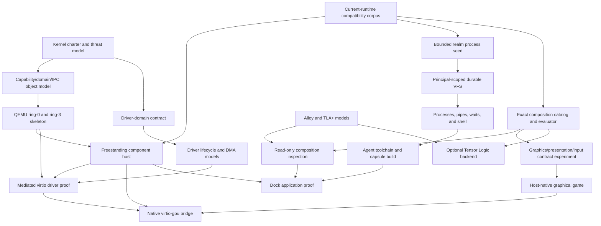

# Astrid AI-Native OS Workplan

Status: active architecture workplan

Last reviewed: 2026-07-18

Baselines:

- [Astrid Native Component Kernel](astrid-native-kernel.md)
- [Astrid Tensor Logic Composition](astrid-tensor-logic-composition.md)
- [Astrid Driver Domain Contract](astrid-driver-domain-contract.md)
- [AOS Principal Linux Realm](https://github.com/unicity-aos/aos-ce/blob/main/docs/principal-linux-realm.md)

## 1. Answer and purpose

There is enough architecture to begin methodically. There is not enough evidence to
claim that the kernel, driver, composition, graphical application, or Tensor Logic
designs are complete.

The first executable OS artifact is now the principal-owned AOS Realm workbench in
`unicity-aos/aos-ce`. Its nested-process seed is implemented, but it is not yet a
Linux environment: persistence, process semantics, a shell, and a toolchain remain
open. This workbench precedes the native kernel because it is useful on today's
runtime and becomes a concrete compatibility workload for every later host.

The existing documents capture the intended system and its major deployment
scenarios. This workplan converts them into dependency-ordered work with explicit
evidence and exit conditions. In particular, it prevents these category errors:

- treating a design paragraph as a verified property;
- treating a graphics API provider as the physical device driver;
- treating a successful host prototype as evidence for a native kernel;
- treating a model-checked abstraction as a proof of implementation;
- treating a tensor backend as an authority decision;
- treating a raw `.wasm` build as an installable Astrid capsule;
- treating one nested WASM process as evidence of Linux or Bash compatibility;
- expanding the first QEMU machine contract to consumer hardware by accident.

The driver scenario is captured at the architectural level and is decomposed into
executable work below. Its first missing artifact—the precise separation between
platform authority, device driver, resource virtualizer, and protocol service—is
recorded in the driver-domain contract.

## 2. Coverage audit

| Area | Captured now | Still required |
|---|---|---|
| Native-kernel purpose and boundary | Protection domains, capability handles, IPC, budgets, recovery, minimal QEMU machine | Kernel charter, threat model, formal object model, skeleton, fault evidence |
| Current Astrid preservation | Portability seams, host assumptions, stable capsule/WIT direction | Compile boundary audit, host conformance suite, explicit compatibility ledger |
| Principal Linux realm | Private guest ABI, bounded nested Wasmi process, installable no-`host_process` capsule, AOS Realm image direction | Principal-scoped durable VFS, processes, shell, toolchain, self-hosted capsule build |
| Driver architecture | WASM/native split, role separation, mediated queues, deferred IRQ, IOMMU/DMA, lifecycle/transition contract, three GPU deployments | Formal models, resolved open decisions, reset evidence, prototype measurements |
| Composition architecture | Principal catalog, exact relations, candidates, validator, materializer, Tensor Logic seam | Fixture corpus, executable sparse evaluator, Alloy/TLA+ models, production adapters |
| Tensor algebra | Named-axis IR and backend boundary reserved | Semantic comparison with Tensor Logic implementation, lowering adapter, differential suite; deliberately inactive |
| Dock | Application graph, ingress, state, update/remove expectations | One selected application, typed plan, ingress implementation, migration and rollback evidence |
| Graphical WASM applications | Graphics/presentation/input/audio split, resource handles, authoring lifecycle, provider paths | Contract experiment, SDK facade, host provider, game artifact, performance/security tests |
| Physical GPU support | Honest host/VM/bare-metal distinction | Native virtio-gpu experiment; vendor hardware intentionally uncommitted |
| Formal rigor | Methods, properties, and scenario tables | Checked model files, recorded tool versions/results, counterexample disposition |
| Repository ownership | Core-first internal library and RFC triggers | Re-evaluate after stable APIs and independent release cadence exist |

Nothing in the “still required” column is silently assumed complete.

## 3. Evidence states

Every consequential item carries one of these states in review notes and issues:

| State | Meaning | Required artifact |
|---|---|---|
| Captured | Intent and boundary are written | Reviewed design text and explicit open questions |
| Researched | Relevant prior art and standards were checked | Primary-source claim matrix and implications |
| Modeled | Structural or temporal behavior is executable | Alloy/TLA+/reference-model source plus bounded results |
| Prototyped | The riskiest mechanism runs in a controlled environment | Reproducible code, command, fixture, and measurements |
| Verified | Acceptance tests establish the stated implementation claim | Automated tests, fault injection, conformance evidence, and claim boundary |

A state is local to a claim. For example, “driver processes are isolated by a
domain” may be modeled while “virtio-net throughput is acceptable” remains merely
captured.

## 4. Dependency shape

The realm, host-native graphics, and exact composition can proceed without waiting
for the native kernel. Native graphics cannot. The realm remains an ordinary
capsule on both today's daemon and a future native host; its Linux-shaped ABI does
not become a ring-0 ABI.

## 5. Architecture covenant and traceability

- [x] Record the native-kernel scope and explicit non-goals.
- [x] Record the principal-owned Linux realm boundary, distribution direction, and
  relationship to current and future hosts.
- [x] Implement the bounded nested-process seed without `host_process` authority.
- [x] Record the exact composition/Tensor Logic scope and preservation strategy.
- [x] Record graphical game, host GPU, VM GPU, and bare-metal GPU scenarios.
- [x] Separate device driver, platform authority, resource virtualizer, and
  protocol/application service roles.
- [ ] Write a concise kernel charter stating what may never enter ring 0.
- [ ] Write the system threat model covering firmware, hypervisor, device firmware,
  malicious native domains, runtime-host compromise, malicious capsules, malicious
  drivers, DMA, and recovery infrastructure.
- [ ] Create a requirement-to-evidence matrix for every claimed security property.
- [ ] Record ADRs for protection domains, capability object representation, handle
  transfer, revocation, fault endpoints, scheduling, and audit ordering.
- [ ] Define the support-policy vocabulary: experimental machine, supported host,
  supported capsule contract, verified claim, and known residual risk.

Exit condition: every security or compatibility claim names its enforcing component
and planned evidence. No guarantee depends on “the architecture should prevent it.”

## 6. Preserve the current Astrid runtime

- [ ] Inventory the existing core crates by host dependency and portability class.
- [ ] Extract a host-profile matrix for native Tokio, browser, and freestanding
  execution.
- [ ] Capture real Capsule manifests and WIT references as sanitized fixtures.
- [ ] Freeze regression behavior for readiness, topological sorting, topic matching,
  principal visibility, capability denial, and schema lookup.
- [ ] Define canonical artifact, component, owner, port, and WIT fingerprints.
- [ ] Add compile-only gates for portable crates under the intended freestanding
  feature set before moving code.
- [ ] Record all currently implicit process-global, filesystem, socket, clock,
  entropy, and environment dependencies.
- [ ] Define host conformance tests that run unchanged against daemon and later
  native-kernel adapters.

Exit condition: kernel work can refactor host adapters without changing public
capsule behavior accidentally.

## 7. Principal-owned Linux realm

- [x] Keep the capsule, private guest ABI, image recipe, and product integration in
  the authoritative `unicity-aos/aos-ce` monorepo.
- [x] Embed and run one signed core-WASM guest under fixed fuel, memory, descriptor,
  instance, table, and output limits.
- [x] Package the outer component as an installable capsule with no host-process
  grant and adversarial tests for malformed modules and boundary violations.
- [ ] Define a principal-bound storage contract with generations, quotas, flush,
  atomic rename, crash points, snapshots, rollback, deletion, and key revocation.
- [ ] Implement the realm VFS over an immutable base, private writable overlay,
  durable `/home/agent`, explicit `/workspace`, ephemeral `/tmp`, and synthetic
  `/proc` and `/dev`.
- [ ] Implement process IDs, descriptors, pipes, spawn/exec, wait, signals, blocking
  calls, cancellation, output backpressure, and supervisor recovery.
- [ ] Add a small shell only after filesystem and process semantics have executable
  conformance tests; do not make Bash the process-model specification.
- [ ] Build the first immutable `AOS Realm` base and package index for the actual
  guest target, with digests, provenance, rollback, and no false Debian claim.
- [ ] Add compiler tooling and prove that an agent can build and export a canonical
  `.capsule` artifact entirely inside its realm.
- [ ] Expose structured status, effective authority, filesystem generations, build
  receipts, and failure records so an agent need not scrape terminal prose.
- [ ] Define an explicit capsule-to-realm job contract whose effective authority is
  the intersection of caller, calling capsule, realm, and per-job grants; never
  inject ambient Bash into every capsule.
- [ ] Migrate Forge as the first build-service consumer, then replace `aos-shell`
  in the default distro only after measured shell/process parity.
- [ ] Prove that a forged principal identifier, guest root, package hook, or child
  process cannot widen the realm's outer Astrid grants.

Exit condition: an agent can restart its realm, recover the same private home, use
files/pipes/processes through a shell, build an installable capsule, and export it
through an explicit portal; a second principal cannot observe that state, and no
guest action invokes a host process.

## 8. Exact composition foundation

- [ ] Select at least ten representative manifests spanning imports/exports,
  typed/opaque topics, tools, adapters, optional requirements, duplicate providers,
  and principal visibility.
- [ ] Add a graphical-game fixture with distinct graphics, presentation, input,
  clock, audio, asset, and optional network providers.
- [ ] Hand-derive canonical base relations and expected candidate plans.
- [ ] Specify cardinality and ambiguity without changing the public manifest.
- [ ] Implement the backend-neutral named-axis equation IR.
- [ ] Implement the deterministic sparse Boolean reference evaluator.
- [ ] Extract existing readiness/toposort compatibility logic into shared pure
  helpers with regression tests.
- [ ] Implement proposed/validated plan typestates and fresh epoch validation.
- [ ] Build principal-projected read-only inspection and explanations.
- [ ] Keep current routing and fan-out untouched.

Exit condition: exact plans and explanations are reproducible from fixtures, while
the daemon behaves identically with composition disabled.

## 9. Structural and temporal models

- [ ] Write the Alloy model for owner/port/type compatibility, cardinality,
  authority attenuation, principal isolation, adapters, and synchronous cycles.
- [ ] Generate valid examples as well as invalid counterexamples.
- [ ] Write the TLA+ model for catalog snapshot, propose, validate, reserve, audit,
  commit, revoke, quiesce, and rollback.
- [ ] Write the driver TLA+ model for claim, initialize, serve, fault, mask, drain,
  reset, DMA revoke, quarantine, and restart.
- [ ] Model the case where reset never completes and memory must not be reused.
- [ ] Model concurrent revocation, interrupt delivery, and in-flight completion.
- [ ] Pin model-checker versions, scopes, fairness assumptions, and commands.
- [ ] Store counterexamples and their design dispositions as regression traces.

Exit condition: the bounded models contain no unexplained counterexample for the
stated invariants. Results are described as bounded model evidence, not universal
proof.

## 10. Native kernel foundations

- [ ] Freeze the initial x86-64 QEMU/KVM, UEFI, single-CPU, virtio machine contract.
- [ ] Create the isolated native-kernel workspace and pinned toolchain.
- [ ] Implement deterministic image construction and machine-readable serial events.
- [ ] Bring up page tables, physical allocation, heap, exceptions, APIC timer,
  entropy seed, halt, and reboot.
- [ ] Add one tiny ring-3 domain before Wasmtime.
- [ ] Implement domain page tables, preemption, fault endpoints, kill, restart, and
  complete resource reclamation.
- [ ] Implement domain-bearing capability handles with rights reduction and bounded
  transfer.
- [ ] Implement bounded IPC, waits, timers, quotas, and deadlines.
- [ ] Fault-inject invalid pointers, forged handles, traps, hangs, and allocation
  pressure.
- [ ] Reserve resources for audit, reset, and recovery paths.

Exit condition: a hostile native test domain cannot corrupt or indefinitely stop
ring 0 or a peer, and every failure emits a structured record.

## 11. Freestanding component host

- [ ] Audit the pinned Wasmtime custom-platform requirements and maintenance risk.
- [ ] Choose and document AOT, Pulley, or other execution strategy per architecture.
- [ ] Implement only the runtime features needed by the first existing capsule.
- [ ] Bind compiled caches to canonical component identity and platform compatibility.
- [ ] Run Wasmtime in a restartable ring-3 runtime domain.
- [ ] Implement capability-checked host imports over kernel handles and IPC.
- [ ] Demonstrate typed request/response with an existing installable capsule.
- [ ] Test component trap, fuel exhaustion, memory exhaustion, deadline, host crash,
  restart, and stale-handle rejection.
- [ ] Run the same conformance case on the daemon.

Exit condition: a component trap stays inside Wasmtime, while compromise/failure of
the runtime host remains within its native domain and does not widen its grants.

## 12. Driver system

### Contract and terminology

- [x] Define the driver as the exclusive translator from one device interface to a
  device-class interface.
- [x] Separate platform enumeration/authority from the driver.
- [x] Separate multi-client resource virtualization from the driver.
- [x] Separate protocol stacks and application APIs from the driver.
- [ ] Decide which roles may cohabit for the first mediated virtio proof and record
  the resulting trust expansion.
- [ ] Define signed device matching using kernel-observed identities and explicit
  match specificity.
- [ ] Define ownership and precedence when multiple drivers match one device.

### Capability object model

- [ ] Specify device claim, mediated queue, interrupt, DMA space, DMA buffer, reset,
  and power handles with rights and generation numbers.
- [ ] Start with mediated queues and host-owned buffers; defer raw MMIO/direct DMA.
- [ ] Prohibit arbitrary physical addresses, port I/O, page tables, and global PCI
  configuration.
- [ ] Bind every handle to device identity, driver identity, domain, generation,
  and revocation epoch.
- [ ] Define bounded transfer of service handles upward without transfer of raw
  hardware handles.

### Lifecycle and failure

- [ ] Specify claim, feature negotiation, ready, quiesce, suspend, reset, restart,
  upgrade, detach, and quarantine transitions.
- [ ] Make reset a broker-controlled mechanism; a driver may request it but cannot
  forge completion.
- [ ] Define behavior when device reset or queue reset never completes.
- [ ] Keep failed-device DMA mappings and backing memory quarantined until the
  platform can establish that DMA has stopped.
- [ ] Define interrupt storm, missed interrupt, stuck level interrupt, driver
  deadline, and queue overflow behavior.
- [ ] Permit only versioned semantic state across hot upgrade; never raw pointers,
  DMA addresses, queue indices, or unvalidated firmware state.

### DMA and performance

- [ ] Specify IOMMU group/domain assumptions and unsafe-device-group handling.
- [ ] Implement broker-owned, zeroed, bounded buffers and direction-aware sync.
- [ ] Implement bounce-buffer mode for trusted/slow devices where isolation permits.
- [ ] Refuse the “untrusted direct DMA” claim without an effective IOMMU/SMMU.
- [ ] Measure copies, throughput, latency, CPU, memory, interrupt-to-work latency,
  and reset time for native versus WASM device logic.
- [ ] Admit a direct queue/DMA fast path only if measurements justify the added
  authority and revocation story.

Exit condition: the first driver proof cannot address memory outside its DMA space,
retain access after revocation, monopolize CPU/queue resources, or leave reusable
memory exposed to a device whose reset is unconfirmed.

## 13. First mediated virtio driver proof

- [ ] Choose one simple virtio class based on reset quality and testability; do not
  begin with a vendor GPU.
- [ ] Implement device discovery and exclusive claim from kernel-observed metadata.
- [ ] Keep descriptor validation, notification, DMA mapping, and reset in the native
  broker initially.
- [ ] Run device-class protocol state in the WASM driver capsule.
- [ ] Export a single-client typed class interface to a virtualizer or test consumer.
- [ ] Add malformed descriptor, feature-negotiation, queue-size, stale generation,
  and foreign-buffer tests.
- [ ] Add driver trap/hang, runtime-host crash, interrupt storm, device-needs-reset,
  queue-reset timeout, full-reset timeout, and hot-upgrade tests.
- [ ] Compare native and WASM implementations under the same trace corpus.
- [ ] Derive—not guess—the minimum candidate `astrid:device` WIT after measurement.

Exit condition: the proof meets the driver-system exit condition and produces enough
evidence to decide whether a public device RFC is warranted.

## 14. Host-native graphical application proof

- [ ] Compare `wasi:webgpu` with Astrid's audited `wasm32-unknown-unknown` import
  model and record compatibility choices.
- [ ] Define separate graphics device, presentation surface, input focus, clock,
  audio, asset, capture, and network authorities.
- [ ] Keep the physical host driver and host scheduler outside Astrid's claimed
  isolation boundary.
- [ ] Implement a supervised Astrid graphics API provider over `wgpu`.
- [ ] Identify explicitly which driver, virtualizer, scheduler, validator, and
  compositor roles are supplied by the host OS versus Astrid.
- [ ] Build a language-neutral game world and Rust-first SDK facade.
- [ ] Package a triangle and then a deterministic small game through
  `astrid capsule build`.
- [ ] Implement bounded frame scheduling, input batches, assets, resize, focus,
  suspend, device loss, and shutdown.
- [ ] Enforce GPU memory, feature, shader, queue, in-flight work, surface, and input
  grants at the host boundary.
- [ ] Test invalid shaders/commands, foreign handles, memory pressure, queue abuse,
  provider crash, surface loss, device loss, and deterministic replay.
- [ ] Measure Component Model call count, copies, upload throughput, frame time,
  jitter, CPU, and memory before proposing a batching/shared-memory extension.

Exit condition: an installable game capsule runs without DOM/POSIX/native-window
authority, and its exact composition plan exposes every provider and grant.

## 15. Native graphics path

- [ ] Reuse the upper graphics/presentation/input contracts from the host proof.
- [ ] Start with virtio-gpu in the fixed VM machine contract.
- [ ] Map the virtio-gpu frontend driver, resource virtualizer, graphics API, and
  compositor into explicit domains.
- [ ] Prefer exclusive GPU assignment for the first proof if safe multiplexing is
  not yet credible.
- [ ] Test scanout/resource creation, command validation, frame pacing, resize,
  reset, driver crash, compositor crash, and stale resource handles.
- [ ] Measure against host-native behavior and document feature/limit differences.
- [ ] Defer direct vendor GPU support until driver isolation, firmware, scheduling,
  memory management, and reset have their own funded hardware programme.

Exit condition: the same game artifact and upper contract run through a distinctly
identified native provider without pretending that virtio proves vendor hardware.

## 16. Dock application proof

- [ ] Select one local-first application whose server process can genuinely move
  into an Astrid capsule graph.
- [ ] Define its typed goal, ingress, identity, state, storage, network, and update
  requirements.
- [ ] Implement missing inbound ingress as a system service, not kernel HTTP logic.
- [ ] Produce the exact composition and authority-union report before launch.
- [ ] Test install, start, stop, update, reversible migration, rollback, removal,
  crash recovery, and state portability.
- [ ] Measure which server-side costs disappear and which external services remain.
- [ ] Preserve an honest boundary around DNS, relay, discovery, email, payments,
  federation, and public availability.

Exit condition: the application runs locally without a server-side application
process and without placing application semantics in the kernel.

## 17. Tensor Logic backend—reserved

- [ ] Keep the exact sparse evaluator as the semantic oracle.
- [ ] Compare the stable equation IR with the actual Tensor Logic language/compiler.
- [ ] Specify lowering for named axes, joins/contractions, union, recursion,
  nonlinearities, provenance, and aggregation.
- [ ] Separate hard Boolean eligibility from learned weights and ranking.
- [ ] Add differential tests over generated and real fixture programs.
- [ ] Isolate heavyweight/native/GPU evaluation and bound its input/output.
- [ ] Record evaluator code, configuration, and weight digests in explanations.
- [ ] Activate only for a measured workload where it improves planning or learning.

Exit condition: exact candidates agree with the oracle, learned output cannot mint
authority, and backend failure returns safely to exact or explicit behavior.

## 18. Supply chain, updates, and recovery

- [ ] Define reproducible kernel/system image inputs and signed provenance.
- [ ] Normalize `.capsule` archive metadata in `astrid-build` and gate two
  same-input builds on byte-identical package digests.
- [ ] Bind capsule source identity, compiled cache, driver match metadata, and
  provider implementation identity.
- [ ] Define A/B images, signed channel/candidate identity, rollback metadata, and
  immutable recovery authority.
- [ ] Threat-model malicious or stale firmware blobs and driver firmware loaders.
- [ ] Ensure driver update cannot preserve stale hardware or DMA authority.
- [ ] Test power loss and crash at every update transition.
- [ ] Keep public release/promotion outside automated architecture work and subject
  to explicit operator approval.

Exit condition: a broken image, driver, provider, or capsule cannot corrupt both
recovery paths or silently broaden authority.

## 19. Immediate execution tranche

The next bounded tranche is:

1. preserve and review the bounded realm seed in `unicity-aos/aos-ce`;
2. specify the principal-bound durable storage contract and crash traces;
3. implement the immutable-base/private-overlay VFS and cross-principal tests;
4. implement process, descriptor, pipe, spawn/exec, wait, and cancellation semantics;
5. add the first small shell and an AOS Realm base-image recipe;
6. compile, package, verify, and export one real Astrid capsule inside the realm;
7. in parallel, accept the driver-domain contract and create the kernel charter,
   threat model, composition fixtures, and first Alloy/TLA+ models;
8. start the native-kernel skeleton only when its machine contract and adversarial
   acceptance harness are frozen.

This ordering delivers a useful agent environment on the current runtime, then
uses it as a real workload for the broader OS. It still requires executable models
and counterexamples before large kernel and driver surfaces.

## 20. Repository and issue strategy

- Keep the AOS Realm capsule, private guest ABI, image recipe, and CE integration in
  `unicity-aos/aos-ce`; do not recreate a standalone capsule repository while those
  surfaces evolve together.
- Keep native-kernel architecture, exact composition integration, and early
  host/kernel prototypes in core while their interfaces change together.
- Do not create a separate Astrid driver repository before a stable independent
  contract and release cadence exist.
- Keep generic Tensor Logic language/compiler work independent of Astrid.
- Use the canonical WIT and RFC repositories only when a public contract is being
  proposed.
- Convert the unchecked items into GitHub issues only when implementation ownership
  and acceptance evidence are ready; avoid an umbrella issue containing work that
  cannot yet be closed objectively.
- Every core implementation PR still needs its own linked issue, complete template,
  and existing `[Unreleased]` changelog section where applicable.

## 21. Definition of programme success

The programme is successful when an agent has a durable, principal-private realm
that can build canonical capsules; Astrid can boot its own narrow machine substrate;
the same signed component contracts run across supported hosts; driver/runtime
domains isolate and recover; exact principal-scoped compositions can be derived; a
real local application can Dock; and a graphical WASM application runs through
explicit device and presentation services.

Tensor Logic may make that system adaptive and learnable. It is not required to
make the enforcement true.
