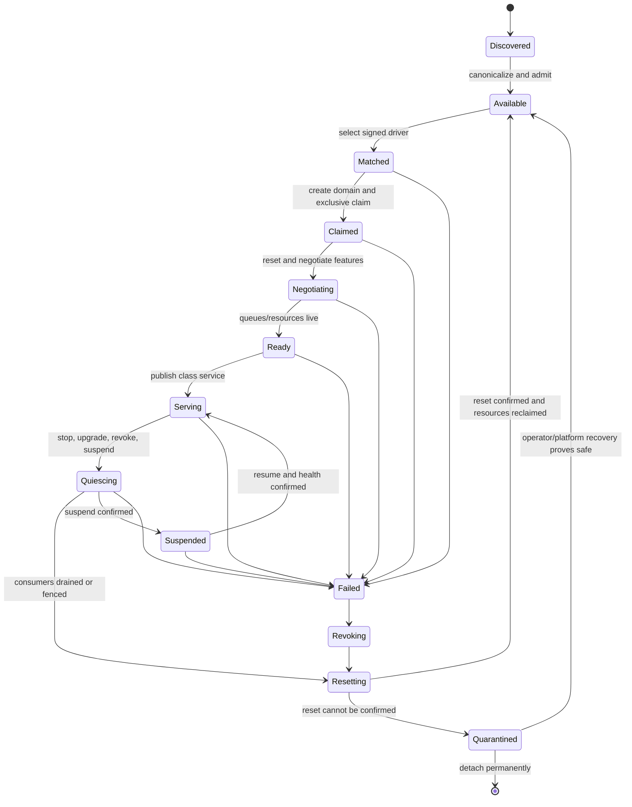

# Astrid Driver Domain Contract

Status: pre-RFC architecture contract and first research result

Last reviewed: 2026-07-18

Related:

- [Astrid AI-Native OS Workplan](astrid-ai-native-os-workplan.md)
- [Astrid Native Component Kernel](astrid-native-kernel.md)
- [Astrid Tensor Logic Composition](astrid-tensor-logic-composition.md)

## 1. Decision

In Astrid, a **device driver** is the policy-light, exclusive translator from one
kernel-observed physical or virtual device interface to one typed device-class
interface.

It is not automatically:

- the platform enumerator;
- the multi-principal resource scheduler;
- the graphics, filesystem, network, audio, or UI protocol stack;
- the compositor or window manager;
- the application-facing SDK;
- the kernel mechanism that maps MMIO, delivers interrupts, or constrains DMA.

Those roles may temporarily share a process in a prototype, but the architecture,
authority report, and failure analysis must continue to name them separately.

The useful invariant is:

> One exclusive device capability enters a driver domain; one bounded
> device-class service leaves it. Raw hardware authority never follows that
> service handle to ordinary consumers.

This definition matches the component-system distinction between a driver, which
translates one physical device for one client, and a resource multiplexer, which
turns that service into isolated virtual resources for multiple clients.

References:

- [Genode device-driver architecture](https://genode.org/documentation/genode-foundations/25.05/components/Device_drivers.html)
- [Genode component-role separation](https://genode.org/documentation/architecture/goals)

## 2. Four roles

### 2.1 Platform authority

The platform authority observes machine topology and owns operations that affect
the platform as a whole:

- enumerate buses and devices;
- interpret firmware/platform descriptions;
- assign an exclusive device claim;
- derive bounded MMIO/port-I/O ranges;
- route and mint interrupt handles;
- create IOMMU/SMMU domains;
- allocate/map/revoke DMA buffers;
- execute reset and power transitions;
- quarantine a device or inseparable hardware group.

In the first native Astrid system, parts of this authority reside in ring 0 because
there is no smaller trusted platform service yet. The long-term boundary may move
enumeration and policy into a privileged system domain, but the kernel remains the
ultimate enforcer for address spaces, interrupts, DMA mappings, and revocation.

No driver may enumerate or claim arbitrary peer devices through a global PCI or
ACPI interface.

### 2.2 Device driver

The driver owns device-specific protocol and state-machine logic:

- negotiate supported device features;
- initialize queues/registers within its claim;
- translate class operations into device operations;
- interpret completions and device errors;
- maintain device-specific queue/control state;
- request reset, suspend, resume, or reinitialization;
- expose health and bounded diagnostics.

The driver should serve one downstream component: either a single consumer or a
resource virtualizer. It should not contain principal selection, user policy,
application routing, or broad multi-client fairness.

The driver can be native or WASM. Execution format does not change its authority.
A WASM driver remains dangerous to availability and device integrity; the benefit
is memory-safe guest execution, portable protocol logic, metering, replaceability,
and an auditable host-call boundary.

### 2.3 Resource virtualizer or multiplexer

The virtualizer turns one device-class service into separately accountable virtual
resources:

- allocate per-principal contexts/queues/surfaces/streams;
- schedule and rate-limit competing clients;
- enforce memory and in-flight-work budgets;
- prevent cross-client handle/resource use;
- perform admission, fairness, priority, and backpressure policy;
- revoke one virtual resource without transferring the physical claim;
- expose residual interference and side-channel limitations.

This role is more security-sensitive than a single-client driver because it defines
client isolation. For complex devices such as GPUs, it may be implemented partly by
the host OS or hardware. Astrid must state which guarantees it inherits rather than
claiming them as its own.

### 2.4 Protocol or application-facing service

Higher services translate the device class into useful semantics:

- a graphics API validates shaders, resources, and command encoders;
- a compositor turns surfaces into a shared display;
- an audio mixer turns streams into one output device;
- a TCP/IP stack turns a NIC service into sockets;
- a filesystem turns a block service into named durable objects;
- a game facade supplies lifecycle, input, assets, clocks, and presentation.

These can often be instantiated per application or principal. They do not need raw
hardware authority simply because they ultimately cause device activity.

## 3. Role topology

```mermaid
flowchart LR
    Kernel[Kernel mechanisms]
    Platform[Platform authority]
    Driver[Exclusive device driver]
    Virtualizer[Resource virtualizer]
    Protocol[Protocol/API service]
    App[Application capsule]

    Kernel -->|bounded native capabilities| Platform
    Platform -->|one device claim and resources| Driver
    Driver -->|single-client class service| Virtualizer
    Virtualizer -->|principal-scoped virtual service| Protocol
    Protocol -->|application contract| App
```



For a simple single-client device, `Virtualizer` can be absent. For a mediated
prototype, `Platform` and the native half of `Driver` may cohabit. For a conventional
host OS, several lower roles are supplied by that host. Each collapsed boundary is
a recorded trust expansion, not a change in definitions.

## 4. Deployment mappings

### 4.1 Astrid on macOS, Linux, or Windows

```text
game capsule
  -> Astrid game/graphics WIT provider
  -> wgpu/WebGPU validation and API translation
  -> host user-mode graphics runtime/driver
  -> host kernel graphics scheduler, memory manager, and device driver
  -> GPU and display hardware
```

Astrid owns the capsule capability boundary, its resource table, its per-principal
budgeting, and the provider process/domain it creates. The host OS owns physical
device isolation, command submission, GPU scheduling, memory residency, reset, and
vendor driver behavior.

`astrid-graphics-wgpu` is therefore an **Astrid graphics API provider/broker**, not
the physical GPU driver. It may also implement some virtualizer policy. `wgpu` is a
safe cross-platform API implementation and validation/translation layer. The host
vendor stack remains the driver.

Modern GPU stacks are themselves layered. Windows WDDM, for example, separates a
user-mode driver, kernel-mode miniport, OS graphics kernel, scheduler, and video
memory manager. Astrid should not compress that system into a single “driver” box.

Reference: [Microsoft WDDM architecture](https://learn.microsoft.com/en-us/windows-hardware/drivers/display/windows-vista-and-later-display-driver-model-architecture)

### 4.2 Astrid native kernel in a VM

```text
game capsule
  -> Astrid graphics API provider
  -> Astrid GPU resource virtualizer or exclusive context
  -> Astrid virtio-gpu frontend driver
  -> Astrid platform authority and virtio transport
  -> hypervisor virtio-gpu backend
  -> host graphics stack and physical driver
  -> GPU/display
```

The Astrid-side driver is the virtio-gpu frontend. The hypervisor backend and host
vendor driver remain outside the Astrid image. The first proof may use one exclusive
graphics client and avoid claiming safe multi-tenant GPU virtualization.

Virtio is suitable because it defines feature negotiation, queue ownership,
initialization, reset, suspend, and device-error states. Astrid's lifecycle must
refine those normative states rather than invent an incompatible happy path.

Reference: [OASIS virtio 1.4](https://docs.oasis-open.org/virtio/virtio/v1.4/cs01/virtio-v1.4-cs01.html)

### 4.3 Astrid native kernel on physical hardware

```text
application/service
  -> protocol API
  -> virtualizer (if shared)
  -> vendor/device driver domain
  -> platform-authority capabilities
  -> MMIO/interrupt/IOMMU/reset kernel mechanisms
  -> physical device and firmware
```

The driver domain contains vendor/device-specific state. The platform authority
gives it only a derived claim. A complex proprietary driver can alternatively run
inside a dedicated driver VM that exports a narrow Astrid class service, but the VM
still needs safe device assignment and DMA isolation.

Direct vendor GPU support is not an extension of the first graphical-game proof.
It requires a distinct programme for firmware, user/kernel driver split, virtual
memory, scheduling, preemption, display, power, reset, hardware revisions, and
continuous hardware CI.

## 5. Trust and failure boundary

| Element | Trust required | Containment expectation |
|---|---|---|
| Ring-0 mechanisms | Highest; memory/capability/IRQ/DMA enforcement | Failure is machine-fatal; keep minimal |
| Platform authority | Can assign hardware authority and reset devices | Isolate where possible; compromise must not create arbitrary kernel capabilities |
| Driver domain | Driver code is untrusted; the runtime/host boundary is trusted to confine it; device correctness may remain trusted where hardware cannot contain it | Crash/restart without corrupting peers; may lose/wedge its device |
| Resource virtualizer | Trusted for isolation and fairness between its clients | One client must not obtain another's resources or monopolize unbounded work |
| Protocol/API service | Trusted only for its exported semantics | Restartable; no raw device authority |
| Application capsule | Untrusted | Confined to granted virtual resources |
| Device firmware | Hardware-dependent opaque TCB/risk | Treat as outside WASM isolation; constrain DMA/reset where possible |

User-mode drivers are an established microkernel pattern. seL4 maps device memory
and forwards IRQs to user processes; its own documentation also makes the crucial
qualification that ordinary CPU MMU isolation does not constrain DMA and that
IOMMU/SystemMMU support or additional driver/device trust is required.

References:

- [seL4 user-mode drivers and DMA assumptions](https://sel4.systems/About/FAQ.html#hardware)
- [LionsOS isolated driver components](https://lionsos.org/docs/services/drivers/)

## 6. Stable identities

Every driver-visible resource is bound to stable provenance:

```text
DeviceId          = boot/platform epoch + bus path + vendor/device/class identity
DeviceGeneration  = incremented after reset, detach, reassignment, or replacement
DriverId          = signed artifact digest + component identity + contract version
ClaimId           = DeviceId + DeviceGeneration + DriverId + claim epoch
DomainId          = native protection-domain identity
ResourceId        = ClaimId + resource class + monotonically unique generation
ServiceId         = DriverId + class-contract fingerprint + provider epoch
```

Names and bus addresses are discovery data, not authority. A driver never supplies
the authoritative `DeviceId` for the device it wants to claim.

All queue, interrupt, DMA, reset, and service handles become stale when their bound
generation or epoch changes. A content-identical restarted driver still receives
new runtime handles.

## 7. Candidate native capability objects

These are kernel/host resources, not a public WIT proposal.

| Object | Representative rights | Key restrictions |
|---|---|---|
| `device-claim` | inspect, negotiate, derive, release | Exclusive; minted from discovered hardware and signed match result |
| `mediated-queue` | describe, submit, poll, cancel | Broker validates indices/descriptors and owns physical addresses |
| `mmio-region` | read, write, fence | Fixed offset/width/alignment/range; no arbitrary mapping |
| `interrupt` | await, acknowledge, mask, unmask | Fixed source; bounded signal queue; generation-bound |
| `dma-space` | map, unmap, sync | One device/IOMMU domain; never exposes unrelated frames |
| `dma-buffer` | read, write, device-read, device-write | Bounded, zeroed, direction-aware, claim-bound |
| `reset-handle` | request, observe | Broker executes and confirms; non-transferable to applications |
| `power-handle` | inspect, request-state | Platform policy mediates shared rails/clocks |

The first driver experiment exposes only `device-claim`, `mediated-queue`, bounded
buffer handles, deferred completion, and broker-controlled reset. Raw MMIO,
interrupt, and direct DMA handles wait until the mediated contract and measurements
exist.

### 7.1 Derivation rules

- Capabilities are derived with equal or fewer rights.
- Raw hardware resources cannot be transferred through the device-class service.
- A service handle refers to virtual/class operations, never the underlying claim.
- Reset/power authority does not follow a queue or surface handle.
- A `dma-buffer` cannot be remapped to another claim without revoke, zero, and a new
  generation.
- Buffer ownership and device visibility are distinct states.
- Revocation is complete only when CPU handles are invalid and device access has
  stopped or the backing memory remains quarantined.

## 8. Driver matching and claim

A signed driver artifact may declare a bounded match expression over
kernel-observed metadata:

```text
transport/class
vendor and device identity where necessary
revision range
required feature bits
contract fingerprint/version
driver priority/specificity under operator policy
```

Matching produces a candidate. It does not grant the device.

The platform materializer:

1. canonicalizes discovered hardware metadata;
2. finds signed, installed, operator-eligible driver candidates;
3. rejects ambiguous matches unless explicit specificity/policy resolves them;
4. verifies the artifact and target compatibility;
5. creates an isolated driver-host domain;
6. mints one exclusive claim and the minimum derived handles;
7. records driver/device/claim identities in audit;
8. waits for the driver to establish its typed service before publishing it.

An application capsule cannot trigger a raw claim merely by naming a PCI identity.
Dock may make a signed driver artifact available, but platform policy performs the
match and claim.

## 9. Lifecycle state machine



### 9.1 Publication rule

The device-class service enters the composition catalog only in `Serving`. It is
removed or marked unavailable before new work is admitted in `Quiescing`, `Failed`,
`Revoking`, `Resetting`, or `Quarantined`.

Existing in-flight calls receive an explicit completion, cancellation, stale
generation, or device-lost result. They do not silently rebind to a replacement
driver.

### 9.2 Stop/failure ordering

Normal stop or upgrade:

1. unpublish/fence new service requests;
2. quiesce the virtualizer and consumers;
3. drain or cancel bounded in-flight operations;
4. mask/defer new interrupt delivery to the driver domain;
5. stop/reset live queues and then the device as required;
6. confirm that queues/device can no longer access buffers;
7. detach/revoke DMA mappings;
8. zero/reclaim buffers;
9. revoke native and WIT handles;
10. destroy/restart the domain;
11. publish a replacement only after a new claim generation reaches `Serving`.

Driver crash or deadline:

1. fence new work without relying on the driver;
2. mask its interrupt endpoint;
3. kill/preempt the driver domain;
4. use broker-held reset authority;
5. if reset completes, revoke mappings and reclaim;
6. if reset cannot be confirmed, keep the device and reachable memory quarantined;
7. audit and apply bounded restart/backoff policy.

The kernel must not free a DMA buffer for unrelated reuse merely because the CPU
mapping and driver process disappeared.

### 9.3 Virtio refinement

For a virtio proof, `Negotiating` refines the required reset, acknowledge, driver,
feature negotiation, feature acceptance, queue setup, and `DRIVER_OK` sequence.
`DEVICE_NEEDS_RESET` enters failure handling. Exposed buffers are not removed from
a live queue; queue or device reset must make it non-live first.

## 10. Interrupt contract

WASM never executes in hardware interrupt context.

```text
device interrupt
  -> minimal kernel/platform top half records and masks/coalesces as required
  -> bounded domain notification
  -> native driver host schedules WASM work with CPU/fuel/deadline budget
  -> driver processes device/completion state
  -> driver requests acknowledge/unmask through its fixed interrupt handle
```

Required behavior:

- notifications carry source and generation, not an ambient interrupt number;
- the queue is bounded and exposes coalescing/loss state;
- an unhandled level interrupt cannot spin ring 0 indefinitely;
- interrupt rate consumes a device/domain budget;
- driver timeout masks the source and enters fault policy;
- acknowledge/unmask cannot target a peer device;
- stale notifications after reset are rejected by generation.

Polling may be a deliberate high-throughput mode, but it consumes an explicit CPU
budget and never disables preemption globally.

## 11. DMA contract

WASM linear memory and CPU page tables do not constrain a bus-mastering device.

The honest direct-DMA claim requires:

- the device or inseparable hardware group is assigned to an effective IOMMU/SMMU
  domain;
- only broker-owned buffers are mapped;
- mappings use the minimum direction and lifetime;
- descriptors/indices are validated before device visibility;
- cache-coherency/synchronization requirements are explicit;
- reset or another platform mechanism can stop future access;
- mappings are revoked before memory is reused elsewhere;
- IOMMU faults are attributed, bounded, audited, and enter driver fault policy.

Without those conditions, use mediated copies/bounce buffers and keep the relevant
native driver/device in the trusted computing base, or do not support the device.

IOMMU isolation may operate at a group rather than an independently resettable
function. The platform must quarantine or assign the whole inseparable group rather
than presenting fictional per-function isolation.

## 12. Device-class service contract

The driver exports a class interface with:

- bounded operations and explicit maximum sizes;
- typed error results including stale, unavailable, reset, cancelled, quota, and
  unsupported-feature cases;
- opaque buffers/requests/resources rather than physical addresses;
- request and completion correlation;
- cancellation and backpressure semantics;
- service/claim generation;
- health and limit description without sensitive global topology;
- no method to obtain or transfer raw device authority.

The interface should be transport-neutral where semantics genuinely match. It
should not hide meaningful differences in persistence, ordering, loss, reset, or
coherency merely to make devices appear interchangeable.

Component Model resources are suitable handles for host-owned queues, buffers, and
devices, but the ABI and copy costs must be measured before freezing WIT.

Reference: [Component Model resources](https://component-model.bytecodealliance.org/language-support/using-wit-resources/rust.html)

## 13. Composition-system integration

The composition catalog sees typed services, not raw hardware authority.

Base/derived facts include:

```text
DiscoveredDevice(device, class, transport, features)
DriverCandidate(driver_artifact, device, match_specificity)
ExclusiveClaim(claim, device, driver, generation)
DriverReady(driver_instance, claim, service)
Provides(service, output_port, class_type)
Visible(principal, service)
HostGranted(principal, service, capability)
Healthy(service)
Located(service, host_class)
Limit(service, resource, quantity)
```

The general AI planner may recommend which eligible driver/provider graph satisfies
a machine goal. It never mints `ExclusiveClaim`, MMIO, interrupt, DMA, reset, or
power handles. Exact platform policy and the native materializer do that.

A physical driver service normally feeds a virtualizer/system service rather than
appearing in an ordinary application's catalog projection. An application sees the
virtual resource it may use.

Driver failure advances the catalog/provider epoch. A plan pinned to the failed
generation becomes stale; it does not name-match onto the restarted driver.

## 14. Graphics refinement

### 14.1 Host-native

| Role | Likely implementation |
|---|---|
| Astrid application API | Game/graphics WIT provider and SDK facade |
| WebGPU validation/translation | `wgpu` provider process/domain |
| Astrid admission/accounting | Principal resource broker around provider handles |
| GPU virtualization/scheduling/memory | Primarily host OS/hardware; guarantees must be documented |
| Physical driver | Host vendor user/kernel driver stack |
| Presentation multiplexer | Host window/compositor adapter plus Astrid surface authority |
| Input focus multiplexer | Host input/window adapter plus Astrid surface-scoped grant |

No host-native test proves that Astrid can safely drive a physical GPU. It proves
the capsule contract, provider/resource model, authoring workflow, and composition
plan.

### 14.2 Native VM

| Role | Candidate implementation |
|---|---|
| Platform/transport | Native kernel plus trusted virtio broker |
| Device driver | Restartable virtio-gpu frontend domain |
| Virtualizer | One exclusive context initially; explicit service later |
| Graphics API | Astrid graphics provider |
| Presentation | Native compositor/scanout service |
| Physical driver | Hypervisor host stack, outside Astrid |

### 14.3 Physical GPU

The architecture must answer separately:

- which code parses/compiles shaders;
- which code validates command streams;
- which code owns GPU page tables and memory residency;
- which code schedules and preempts contexts;
- which code handles display modes and scanout;
- which code loads device firmware;
- which code performs reset and recovers other clients;
- whether the hardware exposes effective per-context/device isolation;
- what remains available when the accelerated driver fails.

Until those answers and evidence exist, “WASM GPU driver” means an investigation,
not a supported hardware claim.

## 15. Non-graphics refinements

| Class | Driver output | Virtualizer/protocol above | First isolation concern |
|---|---|---|---|
| Serial | byte stream | console mux/log service | exclusive control and bounded buffering |
| Block | block requests | partition/volume service, filesystem | DMA, ordering, flush/durability, reset |
| Network | frame queues | virtual switch/filter, TCP/IP stack | DMA, queue fairness, spoofing, backpressure |
| USB host | device/endpoint operations | per-device/class drivers | one controller contains many trust domains |
| Audio | PCM/control stream | mixer and per-principal streams | timing, shared output, capture authority |
| Input | raw device events | focus/seat/surface router | keylogging and exclusive grabs |
| Sensor/I2C/SPI | bus/device operations | device-specific semantic service | shared bus arbitration and physical effects |

The same role separation applies even when all roles initially compile into one
prototype binary.

## 16. Safety invariants

1. One live exclusive claim exists per non-shareable device generation.
2. A driver can access only resources derived from its claim.
3. A service consumer cannot derive raw hardware resources from a class handle.
4. A principal can use only virtual/service resources in its projection.
5. A stale generation cannot submit, acknowledge, map, reset, or publish service.
6. DMA reaches only mapped broker-owned buffers for the active claim.
7. Unconfirmed reset prevents reachable memory from being reused elsewhere.
8. Interrupt work is bounded and never executes WASM in top-half context.
9. Driver failure cannot preserve raw pointers, physical addresses, or live queue
   ownership across restart.
10. A replacement service is not published until its new claim is healthy.
11. Multi-client fairness/isolation is enforced by an identified virtualizer, not
   assumed from the device driver.
12. Platform-wide enumeration, power, and routing authority is not delegated through
   an ordinary device claim.

## 17. Theory and fault scenarios

| Scenario | Required result |
|---|---|
| Two signed drivers match one device equally | Ambiguous; no claim until explicit policy resolves it |
| Driver claims a peer BAR | No handle exists; reject and audit |
| Driver uses stale queue after reset | Generation rejection |
| Driver crashes with DMA in flight | Fence, broker reset; quarantine mappings/memory until access is stopped |
| Device ignores reset | Quarantine device and reachable memory; do not restart optimistically |
| IOMMU fault occurs repeatedly | Attribute to claim, stop work, enter fault/backoff policy |
| Interrupt source storms | Coalesce/mask, charge budget, preempt driver work, reset/quarantine if necessary |
| Interrupt arrives after new generation | Drop as stale; never deliver to replacement as current work |
| Driver never acknowledges level interrupt | Mask and fault by deadline |
| Consumer holds service handle during driver upgrade | Handle becomes stale/cancelled; no implicit rebind |
| Safe semantic state version mismatches replacement | Cold reinitialize or abort upgrade |
| Virtualizer crashes but driver remains healthy | Revoke virtual resources; preserve/reset driver according to class policy |
| Driver crashes but compositor remains | Compositor shows loss/fallback; no raw driver authority inherited |
| Application requests physical device ID | Planner may explain availability; platform does not mint a claim |
| No IOMMU exists for bus-mastering device | Trusted/mediated/bounce mode or unsupported; no untrusted-direct-DMA claim |
| Device shares inseparable IOMMU/reset group | Assign/quarantine group together or reject isolation claim |
| Buffer is transferred to another device | Revoke, prove quiescence, zero, and mint new generation first |
| Feature negotiation changes after reset | New generation and fresh service identity/limits |
| Virtio `DEVICE_NEEDS_RESET` during live requests | Stop relying on completions, fence service, reset/recover explicitly |
| GPU host driver crashes on conventional OS | Astrid provider reports device loss; host OS owns physical recovery |
| GPU virtualizer leaks timing contention | Record residual channel; offer dedicated/exclusive policy where required |
| Driver artifact is removed while claimed | Existing pinned instance follows explicit lifecycle; no name substitution |

## 18. First formal models

### 18.1 Alloy

Model finite sets of:

- devices and hardware groups;
- driver artifacts and match predicates;
- claims, domains, generations, and capabilities;
- services, virtualizers, principals, and projections;
- buffers, DMA mappings, interrupts, and reset authority.

Check uniqueness, derivation, non-transfer of raw authority, principal isolation,
generation consistency, and DMA-buffer reachability.

### 18.2 TLA+

Model:

```text
Discover -> Match -> Claim -> Negotiate -> Publish -> Submit/Complete
Publish -> Quiesce -> StopQueue -> Reset -> RevokeDMA -> Reclaim
Submit -> DriverCrash -> Fence -> BrokerReset -> Confirm | Quarantine
Serving -> Upgrade -> Quiesce -> SafeState? -> NewGeneration -> Publish
```

Include reset that never completes, interrupt arrival at every transition, consumer
revocation, platform epoch change, and concurrent planner observation.

Safety properties include no reuse-before-safe-reset, no stale-generation action,
no double claim, and no service publication outside `Serving`. Liveness is stated
only with explicit assumptions about reset completion, scheduler fairness, and
non-failing recovery infrastructure.

## 19. First prototype

Use a virtio device under the fixed QEMU machine contract, mediated queues, and
broker-owned buffers.

The prototype must record:

- native versus WASM protocol implementation;
- calls and copies per operation;
- throughput, latency, CPU, memory, and interrupt-to-work time;
- queue depth and backpressure behavior;
- reset and restart latency;
- every capability derivation and revocation;
- malformed descriptor and stale-generation results;
- behavior when driver, runtime host, device, or reset fails.

The prototype does not publish `astrid:device` WIT. It exists to discover the
smallest honest contract.

## 20. Open decisions

- Which virtio class gives the best first reset/fault test without hiding important
  DMA behavior?
- Which platform operations remain ring 0 in the first image versus a privileged
  platform domain?
- Is the first driver capsule nested in a per-driver Wasmtime host or can several
  mutually trusted drivers share one runtime domain?
- Which classes can safely use a single-client class service without a virtualizer?
- What exact primitive fences a queue before DMA unmap on each transport?
- How is an unresponsive physical device proven unable to access memory, or how
  much memory remains quarantined?
- Are current Component Model resource calls sufficient for queue-control rate?
- Which buffer-sharing mechanism is compatible with Wasmtime and revocation?
- What minimum reset/power semantics can be portable across device classes?
- How are device firmware blobs measured, authorized, rolled back, and audited?
- What fallback is available when accelerated graphics is lost?

These are research/prototype questions. None is silently resolved by calling the
driver “WASM.”

## 21. Claim boundary

The research establishes that isolated user-mode drivers, platform brokers,
capability-derived hardware resources, deferred interrupts, and IOMMU-constrained
DMA are credible architecture patterns. It does not establish that Astrid's future
implementation is safe, fast, formally verified, or broadly hardware-compatible.

That claim begins only after the models, kernel mechanisms, mediated prototype,
fault injection, and hardware-specific evidence in the workplan exist.
