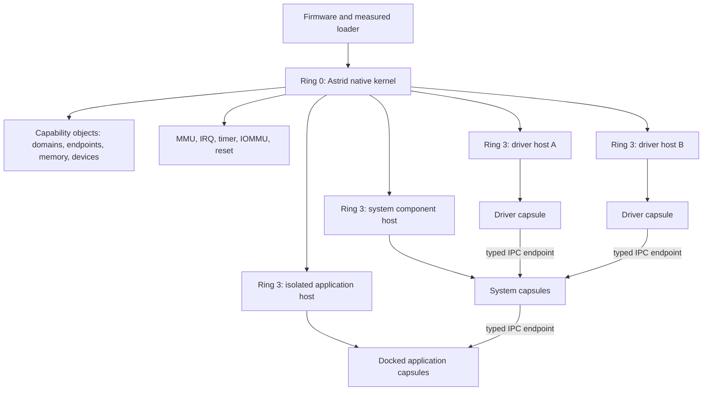
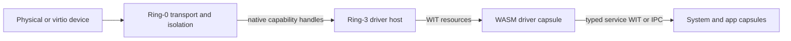

# Astrid Native Component Kernel

Status: exploratory architecture and execution plan

Last reviewed: 2026-07-17

Code baseline: Astrid Runtime `v0.10.1` (`4771bab3`)

Decision state: scope an Astrid-owned kernel; implementation choices remain open

## 1. Executive conclusion

Build an actual Astrid kernel.

The target is not Astrid statically linked into somebody else's library OS. It is
an Astrid-owned capability microkernel that boots on hardware or a microVM, creates
isolated protection domains, schedules them, routes IPC, brokers hardware, and
recovers them. Above it, WebAssembly components are the portable user space. There
is no POSIX process model, general syscall surface, shell, or Unix filesystem
contract unless a capsule deliberately provides one.

"Unikernel" then describes one deployment property: a signed machine image can
contain exactly the kernel, system components, drivers, and Docked applications it
needs. It does not describe the kernel architecture. Unlike a conventional
single-address-space unikernel, Astrid should retain hardware fault boundaries:

- **Ring 0:** boot, page tables, address spaces, scheduling, IPC endpoints,
  capability object tables, interrupts, timers, IOMMU/DMA mediation, reset,
  watchdogs, and minimal key/measurement primitives.
- **Ring 3 runtime domains:** small native `no_std` component hosts containing
  Wasmtime and narrowly selected Astrid host adapters.
- **WASM components:** driver, system, application, tool, and agent capsules with
  typed imports and per-invocation identity.

Wasmtime must not be part of the ring-0 trusted computing base. A runtime memory-
safety or code-generation defect should terminate a runtime domain, not compromise
the kernel. Driver hosts should be separated from the system host, and devices must
be constrained by IOMMU domains or a fully mediated native queue. Ordinary capsules
can initially share a runtime domain, but the maximum authority of that domain is
the union of their grants; sensitive capsules should be placeable in separate
domains.

The first supported machine should be x86-64 QEMU with UEFI, one CPU, fixed memory,
serial, a timer, and virtio RNG/block/net/vsock. The first vertical slice is:

```text
power-on
  -> verified Astrid kernel
  -> one ring-3 runtime domain
  -> one precompiled signed component
  -> one typed IPC request and response
  -> deliberate component and runtime faults
  -> runtime-domain restart while ring 0 remains alive
```

That proves the distinctive architecture before storage, TCP, a rich scheduler, or
broad hardware expands the project. Hermit remains valuable as source material,
a behavior comparison, and an optional portability harness. It is no longer the
recommended substrate or the first implementation artifact.

The architectural continuity with Astrid is strong: the kernel remains dumb. Here,
"dumb" means **mechanism without application policy**, not "a Unix daemon." Ring 0
knows about domains, endpoints, resource handles, memory budgets, devices, and
revocation. It does not know what a website, agent, USB class, filesystem, or LLM
provider is.

## 2. What "an actual kernel" means

The distinction is authority, not the boot animation. An actual kernel directly
owns the machine's privileged CPU state and is the only code allowed to create page
tables, schedule protection domains, program the interrupt controller, map physical
memory, and mint hardware capabilities. A library OS such as Hermit supplies those
facilities to one statically linked application. Astrid instead needs those
facilities to enforce boundaries *between* mutually distrusting runtime and driver
domains.

### 2.1 Protection architecture



A protection domain is deliberately smaller than a POSIX process abstraction. It
needs a page table, threads or tasks, a capability table, budget accounting, and a
fault endpoint. It does not need `fork`, users and groups, file descriptors,
signals, paths, environment variables, or a global filesystem namespace.

The component host inside a domain provides the higher-level Astrid environment:
WIT resources, capsule lifecycle, per-invocation principal propagation, fuel,
memory limits, and event routing. Ring 0 stamps the sending domain on cross-domain
messages. The host stamps and verifies capsule identity inside its domain. If one
host contains several capsules, a host compromise reaches the union of their
domain-level authority; the image builder must be able to split high-risk capsules
into different domains.

### 2.2 Minimal native ABI

The first ABI should be capability-oriented and intentionally non-POSIX:

| Operation family | Minimum purpose |
|---|---|
| Domain | Create from a verified image, start, stop, inspect fault, restart |
| Memory | Allocate, map, unmap, protect, share a bounded region, enforce W^X |
| IPC | Create endpoint, send/receive bounded messages, transfer named handles |
| Wait | Sleep on endpoint/timer/interrupt, wake, cancel, yield |
| Time/random | Monotonic deadline and kernel or hardware entropy |
| Device | Claim kernel-discovered device, map checked MMIO, bind IRQ, reset |
| DMA | Allocate/map/synchronize/revoke buffers within one IOMMU domain |
| Trust | Verify system object, sign or extend an audit root, report measurement |
| Debug | Write bounded boot diagnostics; absent or capability-gated in production |

Handles are unforgeable indices into a per-domain object table. Transferring a
handle across IPC derives a new handle with an equal or smaller rights mask. The
kernel does not accept a manifest claim as authority. The measured boot plan bounds
what the init domain may construct, and the kernel records every resulting grant
derivation.

The ABI must be versioned before it is stable, but it should remain private to the
native host initially. Capsules continue to target `wasm32-unknown-unknown` and the
existing `astrid:*` WIT world. The runtime host translates WIT calls into the small
native ABI, so native-kernel mechanics never leak into portable capsule contracts.

### 2.3 Trusted computing base and recovery

The ring-0 trusted computing base includes architecture code, allocators and page
tables, the scheduler, capability and IPC machinery, interrupt/IOMMU code, the image
verifier, and only the native device code required to reach the first user domain.
It excludes Wasmtime, network protocols, filesystems, application routing, and
device-class policy.

The initial system may still need native virtio queue code for console, block, RNG,
and the system bundle. That is bootstrap code, not a concession that all drivers
belong in ring 0. Once a driver host is alive, the kernel can expose mediated queue
resources and retire optional bootstrap paths. A runtime trap, invalid instruction,
page fault, or exhausted deadline must destroy the offending domain, revoke its
handles and DMA maps, notify its supervisor, and leave ring 0 available for restart
or rollback.

Fault containment and authority containment are different. A small native
init/recovery program belongs to the system trusted computing base even though it
runs in ring 3. Its domain-creation handle must be restricted to the domains and
grants authorized by the measured boot plan; it must not be an unrestricted
capability mint. Keeping this program out of Wasmtime means a component-runtime bug
does not automatically acquire system-construction authority.

## 3. Astrid's current starting point

Astrid does not need to move wholesale from a Unix daemon into a kernel. The
current tree already has a useful division between portable mechanisms and native
resource acquisition.

### 3.1 Existing portability seams

- `Kernel::with_resources` is the portable composition root. `KernelResources`
  injects KV storage, audit storage, signing material, session credentials, and
  optional uplink resources instead of acquiring them inside the kernel.
- `KvStore`, `IdentityStore`, `Vfs`, `Capsule`, and `ExecutionEngine` are trait
  boundaries. An in-memory KV implementation already exists.
- `astrid-runtime` centralizes task spawning, blocking work, timers, and wall-clock
  access. Its browser profile proves that the kernel does not intrinsically require
  the native Tokio surface at every call site.
- The capsule registry, dispatcher, access resolver, manifest analysis, event bus,
  capability store, audit semantics, and most kernel wiring compile without the
  native Wasmtime engine on the browser profile.
- `scripts/check-wasm-portability.sh` compile-checks twelve semantic/core crates for
  `wasm32-unknown-unknown` in CI.

These are not yet general host abstractions. Most conditions are expressed as the
specific negative target test "not browser WASM," so a freestanding runtime host
falls into the native branch and inherits Unix-oriented dependencies. The first
portability task is to replace that binary distinction with explicit build
profiles, for example:

```text
host-native   = Tokio + Wasmtime compiler + cap-std + Unix/Windows adapters
host-browser  = JS tasks/timers + browser engine/storage adapters
host-kernel   = native ABI executor/I/O + AOT Wasmtime + capability adapters
```

The names are illustrative. The invariant is more important: target selection must
happen at composition roots, not through scattered business logic.

### 3.2 Current host-OS assumptions

A freestanding `astrid-system` domain is not expected to build from
`astrid-daemon` unchanged. Current native paths assume:

- a multi-thread Tokio runtime, including `block_in_place`;
- Unix-domain sockets, peer credentials, file modes, advisory locks, PID files,
  and Unix signals;
- Wasmtime with its Cranelift compiler and `wasmtime-wasi` host machinery;
- `cap-std`, temporary directories, filesystem watchers, and platform-specific
  copy-on-write support;
- SurrealKV's file and lock behavior;
- native TCP/UDP/DNS sockets through Tokio and `socket2`;
- HTTP/TLS through Reqwest, Rustls, and `aws-lc-rs`;
- native subprocesses and the Linux/macOS process sandbox;
- host-level install, update, keychain, gateway, and telemetry integrations.

The new host therefore needs a dedicated composition root rather than more target
conditionals in `astrid-daemon`. It should reuse `Kernel::with_resources` and the
portable policy/event crates while excluding the CLI, Unix socket, native process,
watcher, updater UI, desktop keychain, and current gateway packages.

There is also a naming boundary to resolve. Today's `astrid-kernel` crate is the
semantic capsule/event supervisor inside a host process. The new ring-0 kernel is a
different object. The first prototype should use an unambiguous package name such
as `astrid-native-kernel` and avoid breaking the existing public crate. Over time,
the current semantic kernel can become the `astrid-system` user-space supervisor;
that migration is an internal architecture change, not a reason to change capsule
wire formats.

### 3.3 A current product gap relevant to Dock

`astrid:net@1.0.0` defines inbound TCP listeners, but the present Wasmtime host
implementation is an explicit fail-closed stub. Every TCP-listener operation returns
`capability-denied`. The native HTTP gateway can serve Astrid's management and agent
API, but a general capsule-hosted website cannot yet rely on `net.bind-tcp`.

"Dock a website engine" therefore needs an ingress implementation and application
routing contract; it is not merely a packaging feature.

## 4. Target system

The product is a verified machine bundle containing the native kernel, fixed-purpose
runtime-host binaries, a signed system Distro, optional driver capsules, and Docked
applications. Those pieces have different update and trust rules even when the
image builder emits one bootable artifact.

### 4.1 Boot sequence

```text
UEFI / hypervisor
  -> measured loader verifies kernel and immutable init bundle
  -> ring 0 initializes CPU, memory, exceptions, timer, interrupt controller
  -> ring 0 discovers the fixed virtio machine and creates capability objects
  -> ring 0 creates a small native init/recovery domain from a verified image
  -> init verifies the signed system Distro and measured domain plan
  -> ring 0 creates only the driver and system domains authorized by that plan
  -> storage, audit, network, ingress, and updater services become ready
  -> application hosts receive only their declared IPC and resource grants
  -> Dock routes become available
```

The immutable init bundle is not the mutable capsule store. It contains only enough
code and policy to verify, select, and recover the active system slot. Durable state
and application artifacts live on a separately versioned state device. Updates use
A/B system slots plus monotonic rollback metadata; application data migration has a
separate reversible policy.

### 4.2 Native substrate responsibilities

Ring 0 should own only facilities that cannot safely or coherently be delegated
before a runtime domain exists:

- architecture boot and CPU initialization;
- physical and virtual memory management;
- user-mode entry, domain page tables, and W^X mappings;
- interrupt and timer setup;
- preemptive scheduling with bounded work and domain budgets;
- IPC endpoints and capability-bearing object tables;
- device discovery through PCI/ACPI for the fixed first machine;
- IOMMU domains, DMA allocation/mapping, and cache-coherency primitives;
- a minimal boot console and one boot storage transport;
- image measurement, verification, and key-handle mediation;
- crash containment, revocation, reset, watchdog, halt, and reboot.

Wasmtime trap handling needs kernel support for user-domain faults and executable
memory mappings, but the WebAssembly runtime itself remains in ring 3. Ring 0 knows
that a domain owns an endpoint, page range, CPU budget, device handle, DMA region,
and interrupt subscription. It does not know how an NVMe queue, USB class, website,
agent loop, or LLM provider behaves.

### 4.3 Runtime-domain responsibilities

The native runtime host is a freestanding user program. It should contain:

- a small executor built over endpoint/timer wait operations;
- a minimal Wasmtime `no_std` embedding with component-model support;
- AOT or Pulley artifact loading, never an in-image optimizing compiler initially;
- WIT host adapters backed by kernel handles or typed IPC service endpoints;
- per-component fuel, memory, handle, deadline, and queue accounting;
- existing capsule verification, registry, dispatcher, and event semantics where
  they do not duplicate ring-0 enforcement;
- a supervisor protocol for health, fault reporting, quiesce, and restart.

There should be several instances of this same small host binary with different
grants, not one giant privileged runtime. The image policy decides placement:

| Domain class | Contents | Maximum authority |
|---|---|---|
| Init/recovery | Native verifier and slot selector; no Wasmtime | Boot metadata and plan-constrained domain creation |
| Driver host | Usually one driver capsule | One device, its IRQs, mediated queues or DMA domain |
| System host | Audit, storage, network, ingress, identity services | Named system endpoints and narrow device services |
| Application host | One Dock or compatible capsule group | Principal-scoped state, selected services and routes |

These classes are policy templates, not self-declared privilege levels. Manifests
remain untrusted. Only verified boot policy can assign a component to a domain class
and derive the matching kernel handles.

### 4.4 Enforcement split

Astrid will have two enforcement boundaries, and the threat model must not blur
them:

1. Ring 0 enforces memory, CPU time, cross-domain IPC, hardware, and domain-level
   capability boundaries even if a native runtime host is malicious.
2. The component host enforces WIT operations, principal identity, fuel, and
   per-capsule authority within its domain.

A Wasmtime or host compromise must not escape its domain, but it can exercise every
kernel grant held by that domain. Therefore driver hosts are isolated individually,
and unrelated high-authority capsules must not be co-located merely to save memory.
The native init/recovery domain is also privileged system TCB, even though a defect
there remains ring-3 contained. The image builder should report each domain's
authority union so reviewers can see both compromise authority and fault radius
before signing an image.

## 5. Native-kernel implementation shape

The kernel should begin as an isolated sub-workspace in this repository so the ABI,
portable Astrid crates, and QEMU tests can evolve in one review. Freestanding target
constraints make forcing it into every host workspace command counterproductive.
Split it into a separate repository only when its toolchain and release lifecycle
are proven to be independently useful.

### 5.1 Proposed source layout

Names are illustrative, but ownership boundaries should be visible in the tree:

```text
native-kernel/
  Cargo.toml                       independent no_std workspace
  abi/                             versioned syscall, IPC, boot-image structures
  arch/x86_64/                     entry, GDT/IDT, page tables, APIC, context switch
  kernel/                          scheduler, domains, capabilities, IPC, faults
  device/                          PCI, IOMMU, IRQ, DMA, minimal virtio bootstrap
  loader/                          UEFI/bootloader integration and measurement
  userspace/runtime-host/          ring-3 no_std Wasmtime component host
  userspace/init/                  verified system selection and supervision
  image/                           deterministic signed image builder
  tests/qemu/                      serial protocol and fault-injection harness
```

The `abi` crate must be `no_std`, pointer-width explicit, fuzzable on the host, and
shared by the kernel and native user programs. Architecture code must not leak into
capability or IPC semantics. The component host may depend on portable event,
capsule, capability, crypto, audit, and storage traits from today's workspace; it
must not depend on the CLI, desktop daemon, native subprocess host, OS sandbox,
updater UI, keychain, or current HTTP gateway.

The prototype should reuse maintained Rust ecosystem components where their safety
and license fit: a UEFI/BIOS loader, the `x86_64` register/page-table crate, a
`no_std` virtio transport, and selected protocol libraries. Astrid ownership means
owning the security architecture, ABI, compatibility policy, review, release, and
failure behavior—not rewriting correct primitives for aesthetic purity.

### 5.2 Ring-3 Wasmtime strategy

Astrid's capsule ABI is the WebAssembly Component Model, so swapping to a small core-
WASM interpreter is not automatically compatible. The first choice should be a
minimal Wasmtime embedding because it preserves current WIT/component bindings and
resource behavior.

Wasmtime documents `no_std` support for the runtime, component model, async support,
and Pulley interpreter, but not for Cranelift or Winch. The ring-3 host must
implement Wasmtime's low-level custom-platform hooks over the Astrid native ABI:
page allocation and protection, executable mappings, trap delivery, time, and
synchronization. That API is currently unstable. This gives two feasible runtime
modes:

1. **Native AOT artifacts.** Compile components outside the machine for each target
   architecture and Wasmtime configuration, verify them at install, then deserialize
   them in the runtime domain. This is fastest but target-specific. Wasmtime's
   serialized objects are only compatible when engine configurations match.
2. **Pulley artifacts.** Precompile to Wasmtime's portable Pulley bytecode and
   interpret it in the runtime domain. This preserves broader ISA portability at a
   performance cost and still requires conformance testing for every Astrid
   component feature.

The existing `.capsule` archive should remain the source and signature identity.
Target-specific compiled material should be a verified cache or an additional signed
artifact, never a silent replacement for the canonical component hash. The loader
must bind:

```text
source component hash
+ Astrid host ABI set
+ Wasmtime version/config compatibility hash
+ target ISA or Pulley ISA
-> compiled artifact identity
```

Relevant Wasmtime references:

- [Custom and `no_std` platform support](https://docs.wasmtime.dev/stability-platform-support.html)
- [Minimal embedding](https://docs.wasmtime.dev/examples-minimal.html)
- [Wasmtime engine and precompile compatibility](https://docs.rs/wasmtime/latest/wasmtime/struct.Engine.html)
- [Pulley design](https://github.com/bytecodealliance/rfcs/blob/main/accepted/pulley.md)

### 5.3 Storage strategy

The first runtime domain should use the existing `MemoryKvStore` only to prove
component execution. The next gate must be durable state; an in-memory success is
not an Astrid system.

Prefer a user-space storage service over putting a filesystem or database in ring 0.
It can expose a block-backed log-structured KV protocol implementing `KvStore`
semantics without porting every SurrealKV filesystem assumption immediately.
Required semantics include:

- atomic compare-and-swap;
- namespace range operations;
- explicit flush/close and crash recovery;
- bounded writes and storage quotas per principal;
- power-loss tests;
- versioned on-disk format and migration policy.

Audit currently hides its storage trait inside `astrid-audit` and exposes only
SurrealKV-backed or in-memory constructors. It should gain an additive constructor
over an injected audit storage/KV surface so capability state and the audit chain can
use the user-space durable backend without changing public wire formats. Ring 0 can
anchor a sequence number or root hash; it should not understand log records.

### 5.4 Networking and ingress

The first control plane should use virtio-vsock because it avoids a TCP/IP stack and
public-network exposure in the earliest system. A later system host can use
virtio-net through a driver endpoint and run `smoltcp` or another audited user-space
network stack.

The ingress progression should be:

1. console test protocol;
2. vsock authenticated uplink;
3. loopback/LAN TCP uplink;
4. HTTP application ingress capsule;
5. optional public ingress with TLS and explicit network policy.

TLS is a separate portability item. Astrid's current Rustls provider uses
`aws-lc-rs`; the native user-space toolchain must prove that provider or select a
supported alternative. During early QEMU bring-up, a trusted outer vsock proxy may
terminate TLS. "Disable TLS" is not a public-ingress design.

### 5.5 First vertical-slice gate

The first kernel milestone is complete only when a reproducible QEMU test can:

- boot x86-64 from a pinned toolchain into ring 0 and emit a structured serial log;
- initialize memory, exceptions, monotonic time, preemption, and entropy;
- enter one ring-3 native domain with a deliberately tiny capability table;
- exchange a bounded typed message across a kernel IPC endpoint;
- map AOT code W^X and start one existing component-model capsule;
- enforce component fuel and memory limits inside the runtime domain;
- turn a component trap into an invocation failure without killing its host;
- turn a host page fault or infinite loop into domain teardown and restart without
  rebooting ring 0;
- reject a forged handle and an out-of-range memory or IPC operation;
- produce a deterministic signed image and machine-readable CI transcript.

Persistent KV, public networking, SMP, dynamic drivers, and Dock are intentionally
outside this first gate. A serial-only, single-core result that proves hardware and
WASM fault boundaries is more valuable than a feature-rich single-address-space
image.

## 6. Hermit and ecosystem reuse

Hermit is useful, but it solves a different composition problem. It is a library OS:
the application is statically linked with its kernel and becomes one ELF image. Its
sparse `hermit-rs` repository delegates the substantial work to the `kernel`
submodule, which contains architecture bring-up, memory, scheduling, syscalls,
networking, filesystems, and drivers.

As of this review, Hermit supports x86-64, AArch64, and RISC-V variants and contains
SMP, ACPI, PCI, `smoltcp`, and virtio net/filesystem/vsock/console support. That makes
it a strong source of mechanisms and a useful comparison boot. It does not provide
the ring-0/ring-3 capability-domain architecture above, and inheriting its
application-facing syscall/file-descriptor model would pull Astrid toward POSIX
compatibility it does not need.

Rust classifies Hermit targets as Tier 3: `std` is supported, but Rust does not ship
precompiled artifacts or run the target test suite. Hermit also documents a current
limitation combining its Rust and C cross-compilation paths. An
`astrid-host-hermit` build may still be valuable later as a portability experiment,
but it is not on the critical path to the first Astrid native-kernel proof.

Sources:

- [Hermit for Rust](https://github.com/hermit-os/hermit-rs)
- [Hermit kernel](https://github.com/hermit-os/kernel)
- [Hermit kernel feature manifest](https://github.com/hermit-os/kernel/blob/main/Cargo.toml)
- [Rust Hermit target support](https://doc.rust-lang.org/rustc/platform-support/hermit.html)
- [Hermit application template](https://github.com/hermit-os/hermit-rs-template)

### 6.1 Reuse policy

Candidate code should be evaluated at a narrow seam rather than adopting another
OS wholesale:

| Source | Potential use | Astrid-owned boundary |
|---|---|---|
| Rust OSDev bootloader | Initial x86-64 BIOS/UEFI loading | Signed image format, measurements, handoff ABI |
| `x86_64` crate | Registers, instructions, paging structures | Page-table policy, fault behavior, domain isolation |
| `virtio-drivers` | `no_std` virtio transports and devices | Capability handles, buffer validation, IOMMU policy |
| Hermit kernel | Architecture and virtio implementation reference | Domain ABI, capability model, fault containment |
| Theseus and Redox | Rust OS design and failure-model reference | Astrid implementation and compatibility promises |
| `smoltcp` | User-space TCP/IP service | Network capabilities, ingress and principal policy |
| Wasmtime | Component execution in ring 3 | Host adapter, artifact policy, budgets, restart semantics |

Relevant upstreams:

- [Rust OSDev bootloader](https://github.com/rust-osdev/bootloader)
- [`x86_64` crate](https://github.com/rust-osdev/x86_64)
- [`virtio-drivers`](https://github.com/rcore-os/virtio-drivers)
- [Theseus OS](https://github.com/theseus-os/Theseus)
- [Redox kernel](https://github.com/redox-os/kernel)

Every imported crate becomes part of the security and release dependency graph.
Pin revisions for reproducible images, retain license provenance, fuzz parsers and
descriptor validation locally, and upstream fixes where possible. A fork is a
security maintenance commitment, not a shortcut.

### 6.2 Minimal first machine contract

The first supported machine is deliberately fixed:

- x86-64 under QEMU/KVM;
- UEFI through a pinned loader;
- one CPU and a static memory map initially;
- APIC timer and one interrupt-controller configuration;
- serial console plus virtio RNG, block, net, and vsock;
- no USB, GPU, audio, suspend/resume, hotplug, or arbitrary PCI devices;
- IOMMU emulation enabled before any untrusted domain receives direct DMA.

This is enough to run a local service machine and validate Astrid's kernel model. It
is not a laptop or general-purpose OS. AArch64 should follow only after the ABI and
architecture abstraction survive the x86-64 vertical slice.

### 6.3 Effort boundary

Approximate ranges are planning bands, not commitments. They assume engineers
already productive in Rust and Astrid and at least one engineer experienced in OS
bring-up; otherwise calendar time increases sharply.

| Outcome | Indicative effort | Excluded |
|---|---:|---|
| Ring-0 serial boot and user-domain fault containment | 2–4 engineer-months | Wasmtime, storage, networking |
| First component in restartable ring-3 host | 4–8 engineer-months cumulative | Durable state, dynamic drivers |
| Usable QEMU system with state and authenticated uplink | 12–24 engineer-months cumulative | Broad hardware, production SLA |
| Dock plus one mediated WASM driver proof | 18–30 engineer-months cumulative | Consumer hardware support |
| Credible native-kernel developer preview | 24–48 engineer-months cumulative | Mature multi-architecture ecosystem |
| Broad bare-metal platform | Continuing multi-year OS team | It is never a one-time port |

Parallel expertise can reduce calendar time, but not the engineering content. A
credible first component proof might take a small expert team several months; a
production platform is a sustained OS program. The code that routes events can stay
compact. Most cost sits in architecture correctness, hostile failure behavior,
toolchains, updates, observability, hardware validation, and recovery.

## 7. WASM drivers

WASM drivers are viable when "driver" is decomposed instead of treated as one blob.
"Self-driving" should mean that a signed system or Dock bundle carries the portable
device-class logic it needs and can request a match against kernel-discovered
hardware. It must not mean that an application manifest can seize a PCI function or
invent MMIO authority. Boot policy matches signed driver metadata to a device,
creates a dedicated driver-host domain, and derives only the required handles.

### 7.1 Driver split



The native transport shim should perform operations that require privileged CPU or
platform state. The driver capsule should own device-class and protocol logic.

Examples:

- Native: PCI enumeration, BAR mapping, interrupt controller programming, IOMMU
  domain assignment, DMA map/unmap, cache maintenance, device reset.
- WASM: USB class protocol, sensor protocol, filesystem semantics, packet filtering,
  higher-level NIC queue policy, device-specific control state machines.

For virtio, the first split should put descriptor validation, device notification,
and DMA mapping in native code while a driver capsule manages protocol state over a
mediated queue interface. That works without granting the driver direct DMA. A later
fast path can move queue management into a dedicated ring-3 domain backed by an
IOMMU. Whether buffers can also be shared with the WASM instance depends on a
zero-copy, bounded-memory design and Wasmtime's supported memory model.

### 7.2 Required hardware host interface

A future RFC may define an `astrid:device` family, but the contract should be derived
from a prototype. It will likely need opaque resources resembling:

```text
device               metadata and exclusive claim
mmio-region           checked volatile reads/writes within one BAR/range
interrupt             await, acknowledge, mask, unmask
dma-buffer            bounded allocation, device mapping, sync direction
queue/ring             checked producer/consumer indices without list copying
reset-handle          device-function reset controlled by the broker
```

The first prototype should expose `queue` and bounded buffer handles only. Raw MMIO,
interrupt, and DMA resources can follow after the mediated path establishes the
functional contract and measurements prove the extra authority is worthwhile.

Do not expose arbitrary physical addresses, arbitrary port I/O, raw page-table
access, or an unconstrained "map memory" call. Every resource must be minted from a
kernel-observed device description and bound to the loaded driver identity.

The Component Model canonical ABI copies `list<u8>` values. A packet or block driver
that crosses this boundary per payload will be predictably expensive. Bulk data
should stay in host-owned DMA buffers or rings referenced by opaque handles; WIT
calls carry ownership and indices, not repeated payload copies. Any shared-memory
extension must preserve bounds checking and revoke access when a driver stops.

### 7.3 Interrupt model

WASM code should not execute directly in the hardware interrupt context. Use a
three-boundary model:

1. a tiny ring-0 top half records or masks the interrupt and signals a bounded
   driver-domain endpoint;
2. the native ring-3 host translates that signal into a WIT resource event;
3. the driver capsule processes it as scheduled work with CPU, fuel, and deadline
   accounting;
4. the broker acknowledges or unmasks only through the driver's interrupt handle;
5. timeout or repeated fault triggers mask, DMA revocation, reset, audit, and domain
   restart policy.

This matches the direction demonstrated by current WASM-driver research: the runtime
mediates named hardware resources and defers WASM work rather than allowing an
untrusted component to own raw interrupt entry.

### 7.4 DMA and the IOMMU are non-negotiable

WASM linear-memory isolation does not constrain a bus-mastering device. A malicious
or broken driver can program DMA to overwrite kernel or other capsule memory unless:

- each device is placed in an IOMMU domain;
- mappings are minted only for broker-owned DMA buffers;
- the broker validates queue descriptors before exposing them to the device;
- mappings are revoked before driver restart or update;
- devices without isolation use bounce buffers or remain trusted/native.

On machines without a usable IOMMU, "untrusted hot-swappable WASM DMA driver" is not
an honest security claim.

### 7.5 Driver lifecycle

Driver capsules need a stricter lifecycle than ordinary tools:

```text
discovered -> matched -> claimed -> initialized -> serving
     |            |          |           |
     +---------- failed / quarantined ----+
                               |
                         reset -> restart
```

Hot upgrade requires quiescing consumers, draining or cancelling I/O, masking
interrupts, revoking DMA maps, resetting the device when required, transferring only
versioned safe state, starting the replacement, and rolling back if health checks
fail. The kernel audits each transition. A driver must never preserve an opaque raw
pointer or DMA address across restart.

### 7.6 Evidence and standards direction

This direction is active but not mature enough to outsource Astrid's design:

- WASI I2C is currently Phase 2; WASI GPIO, SPI, and USB are Phase 1.
- The cyber-physical WebAssembly work demonstrates I2C and USB device logic in WASM
  behind capability-aware host components, with reported USB overhead up to 8% in
  its tested configurations. Cold-start overhead was more significant.
- Wasm-IO demonstrates MMIO/register APIs, DMA-assisted paths, and deferred interrupt
  handling over Zephyr/WAMR for embedded devices.

These systems validate the decomposition, not a production NIC/storage kernel for
Astrid. Their interfaces and measurements are inputs to a prototype and threat model.

Sources:

- [Current WASI proposal phases](https://wasi.dev/releases)
- [WASI I2C](https://github.com/WebAssembly/wasi-i2c)
- [WASI USB](https://github.com/WebAssembly/wasi-usb)
- [Cyber-physical WebAssembly paper](https://arxiv.org/abs/2410.22919)
- [Wasm-IO paper](https://doi.org/10.1145/3760387)

## 8. Dock: local application engines as capsule graphs

"Dock" is a useful product concept if it remains above the kernel. A Dock is a signed,
installable application graph that runs on the user's Astrid machine and exposes a
local or network application endpoint.

It should initially compose existing primitives rather than add application logic to
the kernel:

```text
signed application bundle
  -> one or more application capsules
  -> declared system-service dependencies
  -> principal-scoped durable state
  -> static UI assets
  -> ingress route(s)
  -> capability and resource budget request
  -> update and migration policy
```

The current Distro/Shuttle machinery may already be the right signed graph and
distribution layer. A separate `Dock.toml` should not be introduced until a working
application proves that Distro semantics cannot express lifecycle, routing, or data
migration requirements.

### 8.1 First Dock proof

Build a deliberately small local-first application:

- one UI bundle served by an ingress/system capsule;
- one application capsule handling typed requests over IPC;
- one principal-scoped KV namespace;
- no native subprocesses;
- loopback access first, LAN access second;
- signed update with a reversible state migration;
- offline operation after install.

This validates that the same bundle runs on today's daemon-hosted Astrid and the
native-kernel runtime host. The application should not know which host it is using.

### 8.2 Ingress architecture

Do not let every app become a public TCP stack. A system ingress capsule or host
service should own listeners and route requests to applications over typed IPC. It
can centralize:

- port ownership and route conflicts;
- TLS certificates and protocol negotiation;
- request/body/time quotas;
- authentication and principal stamping;
- origin, CORS, CSRF, and local-network policy;
- observability and graceful draining during app updates.

The kernel only enforces the ingress capsule's network authority and the app's IPC
ACL. It remains unaware of websites and routes.

### 8.3 Honest server-cost claim

A local Dock can remove hosted compute and primary-storage cost for workloads that
need only the user's machine. It cannot universally remove infrastructure:

- remote access across NAT may need rendezvous or relay;
- cross-device sync needs an available peer or service;
- push notifications depend on platform services;
- shared multi-user applications need an availability and conflict model;
- updates and discovery need distribution infrastructure;
- a powered-off local machine cannot serve remote clients.

The stronger and defensible claim is: **move application compute and authoritative
personal state to the user's machine by default, and purchase network coordination
only when the application actually needs it.**

## 9. Execution plan and gates

### Milestone 0: architecture covenant

Duration: 1–2 engineer-weeks.

Deliverables:

- freeze the x86-64 QEMU machine contract and boot handoff;
- define the native capability, IPC, domain, and fault object model;
- write the threat model for firmware/hypervisor trust, malicious native domains,
  compromised Wasmtime hosts, malicious capsules, and malicious devices;
- decide what ring 0 may allocate dynamically and which operations are fallible;
- pin Rust nightly, loader, Wasmtime, and initial OSDev crate revisions;
- define serial event schema, image format, and reproducible-build inputs;
- record boot-time, image-size, steady-memory, IPC, restart, and capsule-latency
  measurements to capture from the first test.

Exit gate: a short reviewed kernel charter states what must never enter ring 0 and a
version-zero ABI sketch has no path, stringly syscall, or ambient-authority handle.

### Milestone 1: ring 0 survives

Duration: 4–8 engineer-weeks.

Deliverables:

- UEFI-to-Rust entry under QEMU;
- serial output, physical allocator, kernel page tables, heap, exceptions, APIC
  timer, entropy seed, clean halt, and reboot;
- deterministic image builder and QEMU runner;
- machine-readable serial assertions in CI;
- host-unit tests and fuzz targets for boot structures and allocators where they can
  execute outside QEMU.

Exit gate: repeated cold boots are deterministic, malformed boot data fails closed,
and every unexpected exception ends in a structured crash record rather than a
silent hang.

### Milestone 2: domains, capabilities, and IPC

Duration: 6–10 engineer-weeks.

Deliverables:

- ring-3 entry and return, per-domain page tables, preemptive scheduling, and fault
  endpoints;
- capability object table with rights reduction and bounded handle transfer;
- bounded IPC send/receive plus timer/wait primitives;
- memory quota, CPU deadline, domain kill, complete handle revocation, and restart;
- a tiny native test program with no Wasmtime dependency.

Exit gate: forged handles, invalid user pointers, page faults, divide-by-zero, and an
infinite loop in a test domain cannot corrupt or indefinitely stop ring 0 or a peer
domain.

### Milestone 3: first component host

Duration: 8–16 engineer-weeks.

Deliverables:

- explicit `host-kernel` composition for portable Astrid crates;
- freestanding executor and Wasmtime custom-platform adapter;
- minimal Component Model, AOT and/or Pulley loader;
- verified `.capsule` source identity bound to compiled-artifact compatibility;
- one existing capsule handling a typed request over a kernel IPC endpoint;
- fuel, memory, handle, deadline, trap, and host-crash tests;
- native-daemon conformance test for the same capsule behavior.

Exit gate: a component trap remains inside Wasmtime, while a corrupted runtime host
is torn down and restarted as a domain without rebooting or widening its grants.

### Milestone 4: persistent and reachable system

Duration: 3–6 engineer-months.

Deliverables:

- minimal virtio RNG, block, and vsock substrate;
- user-space durable KV and audit services with crash/power-loss tests;
- signed capsule artifact store and system Distro loader;
- authenticated vsock management uplink;
- A/B immutable system images, rollback metadata, recovery console, and graceful
  restart;
- later, a user-space virtio-net service with DHCP/static configuration and DNS.

Exit gate: reboot preserves capability and audit integrity; a torn state write,
broken system slot, bad capsule, or interrupted update cannot brick both recovery
paths or broaden authority.

### Milestone 5: Dock proof

Duration: 1–2 engineer-months after system ingress exists.

Deliverables:

- implement the currently stubbed inbound TCP/ingress path as a system service;
- one signed local-first application graph running unchanged on the daemon and
  native-kernel hosts;
- principal-scoped state, loopback/LAN policy, signed update, reversible migration,
  rollback, and removal;
- an image-authority report showing the application's domain grants.

Exit gate: a user can install, run, update, roll back, and remove the application
without a server-side application process or kernel awareness of HTTP routes.

### Milestone 6: WASM driver proof

Duration: 3–6 engineer-months.

Deliverables:

- one driver-host domain over a virtio device, using mediated queues first;
- prototype opaque queue/buffer/interrupt resources and signed device matching;
- deferred interrupt scheduling, component fuel, native CPU budgets, and backpressure;
- crash, DMA-revocation, reset, restart, and hot-upgrade tests;
- native-versus-WASM latency, throughput, copy count, memory, and CPU measurements;
- an RFC only after the prototype determines the smallest WIT device contract.

Exit gate: a driver cannot address memory outside its grants, monopolize a CPU,
retain device access after revocation, impersonate a peer endpoint, or wedge the
device across reset.

### Milestone 7: expansion and hardening

Only after the preceding evidence should the project add SMP, AArch64, real IOMMU
hardware, direct-DMA fast paths, NVMe, USB, or consumer devices. Each addition needs
a machine contract, recovery story, compatibility promise, and hardware CI. Hermit
and other Rust kernels remain comparative references; there is no later decision to
replace the Astrid kernel with a library OS by default.

## 10. Validation matrix

Every milestone should add executable evidence in four dimensions.

### Functional

- deterministic boot and shutdown;
- capsule install/load/invoke/unload;
- IPC routing and per-principal isolation;
- durable KV, audit, and key recovery;
- networking and ingress;
- update, rollback, and migration.

### Security

- malformed image, manifest, component, and compiled artifact rejection;
- capability denial for undeclared host and device operations;
- fuel, memory, handle, I/O, and deadline exhaustion;
- DMA/IOMMU escape attempts;
- malicious interrupt rate and driver non-response;
- rollback and downgrade attempts;
- audit-chain verification after crash and power-loss injection.

### Reliability

- repeated cold boot under QEMU;
- state-device truncation and torn writes;
- capsule trap/panic/hang;
- network loss and malformed traffic;
- driver reset during active I/O;
- failed image and capsule update;
- resource reclamation after every failure.

### Performance

- image size and boot-to-ready time;
- idle and loaded memory;
- capsule cold start and steady invocation latency;
- native vs Pulley/AOT execution;
- network throughput, latency, and copies;
- storage IOPS, latency, and recovery time;
- interrupt-to-bottom-half latency;
- driver CPU per byte/packet/operation.

No single microbenchmark decides the architecture. The system must retain Astrid's
security model while becoming operationally smaller and more local.

## 11. Major risks

| Risk | Consequence | Early reduction |
|---|---|---|
| Wasmtime custom-platform API is unstable | Ongoing port maintenance and security risk | Pin exact version; minimal embedding; isolate adapter crate; upstream changes |
| Component AOT changes capsule portability | Per-target artifacts and update complexity | Keep canonical component identity; bind caches to compatibility hash |
| Tokio/native async assumptions leak into core | Freestanding host becomes a forked runtime rewrite | Explicit host profiles; compile-only portability CI; composition-root adapters |
| Runtime host is granted too much | Wasmtime compromise reaches unrelated services | Small domain grants; per-driver domains; authority-union report; easy placement split |
| Native ABI grows toward POSIX | Kernel becomes broad and hard to secure | Capability handles; typed bounded messages; no paths or ambient namespaces |
| User-pointer or IPC validation bug | Ring-3 compromise becomes ring-0 compromise | Copy/validate once, fuzz ABI parsers, adversarial domain tests, unsafe-code audit |
| Scheduler or allocator failure under pressure | Whole-machine denial of service | Bounded kernel allocations, reservations for recovery, deterministic reclamation |
| TLS provider cannot build freestanding | No safe public ingress | Prove supported provider; keep early management on authenticated vsock |
| Durable store semantics are under-scoped | Corruption or broken capability/audit state | Power-loss harness and CAS conformance before application work |
| WASM driver can program unsafe DMA | Isolation bypass | IOMMU domains, broker-owned buffers, validation, revocation, bounce fallback |
| Driver interrupt or queue storm | Whole-machine denial of service | Deferred work, fuel/deadlines, queue limits, watchdog/reset |
| "Dock" becomes kernel product logic | Kernel boundary erodes | Keep graph/routing/update policy in system capsules and tooling |
| Broad hardware attempted too early | Indefinite driver program before product proof | QEMU/virtio-only machine contract through the first driver experiment |
| Reused OS crate is effectively abandoned | Security and toolchain burden moves in-house | Narrow adapters, pinned provenance, upstream health gate, replaceable seam |
| Recovery depends on broken user space | Fault cannot be repaired in place | Immutable init/recovery domain, reserved resources, A/B slots, serial recovery path |

## 12. Recommended immediate next artifact

The next implementation should be a bounded native-kernel skeleton, not a Hermit
host:

1. Add the isolated `native-kernel/` workspace with pinned toolchain, loader,
   x86-64 architecture crate, deterministic image builder, QEMU runner, and serial
   event schema.
2. Boot through UEFI, initialize page tables and a physical allocator, handle
   exceptions, start an APIC timer, and cleanly halt or reboot.
3. Add a deliberately tiny ring-3 test domain and only enough ABI for bounded debug
   output, yield, memory mapping, and one IPC endpoint.
4. Demonstrate that invalid memory, forged handles, divide-by-zero, and an infinite
   loop terminate or preempt the domain while ring 0 emits a passing test record.
5. Only then start the Wasmtime custom-platform adapter in the same ring-3 domain.

The first review should include a kernel charter and threat model beside the code.
It should not include networking, a filesystem, SMP, a general allocator exposed to
user space, or a new public WIT contract. The artifact is successful when it proves
that Astrid can own hardware isolation with a small non-POSIX ABI. Component hosting
is the next proof, not a prerequisite for learning whether the kernel boundary is
sound.

## 13. Relationship to Astrid's architecture rules

- The kernel remains product-neutral and tool-blind.
- Capsules still target `wasm32-unknown-unknown` and use versioned `astrid:*` WIT
  imports; host deployment does not leak into guest code.
- Wasmtime and existing semantic-kernel machinery execute in ring 3; the ring-0
  kernel owns only native mechanisms and domain-level enforcement.
- Hardware authority is a kernel-enforced capability, never a prompt or
  self-declared manifest privilege.
- Driver and Dock contracts that alter WIT require an Astrid RFC before adoption.
- Public capsule and wire shapes remain stable; host profiles are additive.
- The current native daemon remains supported while the image path matures.
- A signed single-purpose machine image is an additional deployment surface, not a
  release-channel alias and not an implicit promotion of experimental code.
