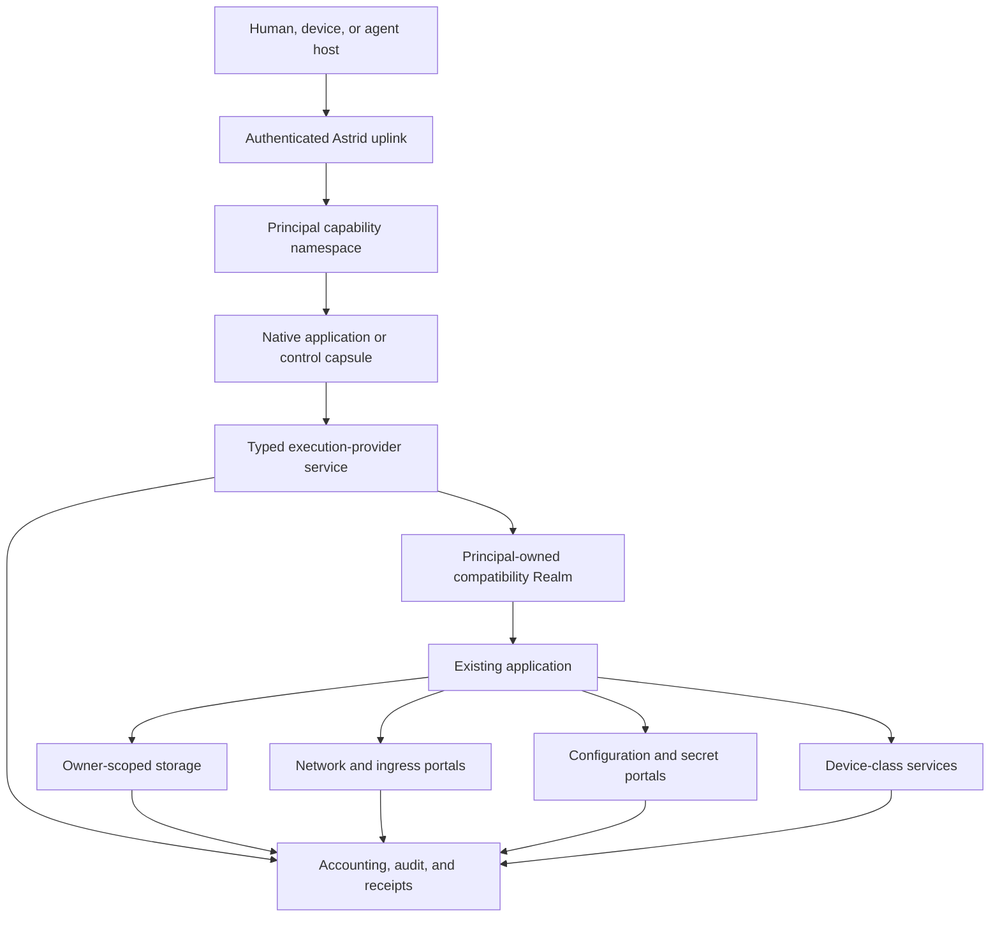

# Astrid Universal Application Substrate

Status: WP0 architecture freeze. This document is a locked architecture
contract, not an assertion that the kernel, Realm, Hermes, boot chain, or
first-owner ceremony has landed. No section is a standalone completion claim.

Canonical namespace: `astrid-runtime`. Redirects from `unicity-astrid` are not
authority.

Implementation epic: [astrid#1564](https://github.com/astrid-runtime/astrid/issues/1564)

Last reviewed: 2026-08-25

Evidence snapshot: `astrid-runtime/astrid` `origin/main`
`6e43da5f68f4ca10899236598988fe3ebadd7a39`. Historical branch snapshots and
green runs are not merge evidence.

Landed storage on this main, not future work:
[astrid#1535](https://github.com/astrid-runtime/astrid/pull/1535) merged
`3f82d81e` (2026-08-19);
[astrid#1562](https://github.com/astrid-runtime/astrid/pull/1562) merged
`0aca3f40` (2026-08-20);
[astrid#1601](https://github.com/astrid-runtime/astrid/pull/1601) merged
`a7d50f55` (2026-08-22). `AstridVolume` is media/projection over one catalog
CAS/blob path, not a second ingest. Volume WAL is the `transactions.wal`
region, default off, not a host `PathBuf` authority.

Types foundation [astrid#1565](https://github.com/astrid-runtime/astrid/issues/1565)
exists on `codex/resource-types-foundation`
`800cee5a4731c38a912ebc72f053c5165f8cd9b4`, with no pull request. Independent
local quality evidence on that SHA is 17 tests, `no_std`/`wasm32` checks,
`clippy -D warnings`, and `fmt`. It is not merged and is not a behavior change.

Named systems such as Hermes, BusyBox, Linux Realm, QEMU/q35, NVIDIA, and
other workloads, vendors, or devices are non-normative fixtures or
falsifiers. They are not canonical product identity, dependencies, or
sequencing authority. No provider, resource, device, or application
contract specializes to them. Fixture ordering does not order architecture
tracks. Linux Realm is one compatibility personality, not the native OS
or the application model. A machine or device example proves only its
named conformance boundary.

A recoverable RV64-in-WASM oracle plus a BusyBox argv fixture is one
compatibility-backend falsifier, not the definition of Realm.
[unicity-aos/aos-ce#77](https://github.com/unicity-aos/aos-ce/pull/77)
(`b64d8d94`, draft, conflicting) is inventory only.

Related documents:

- [Astrid Resource Ownership Model](astrid-resource-ownership-model.md)
- [Astrid AI-Native OS Workplan](architecture/astrid-ai-native-os-workplan.md)
- [Astrid Kernel Charter](architecture/astrid-kernel-charter.md)
- [Astrid Native Component Kernel](astrid-native-kernel.md)
- [Astrid Driver Domain Contract](architecture/astrid-driver-domain-contract.md)
- [Astrid Principal Store](architecture/astrid-principal-store.md)
- [Astrid Principal Store Runtime Realization](reference/astrid-principal-store-runtime.md)
- [Astrid User, Fleet, and Principal Ownership](architecture/astrid-user-fleet-ownership.md)
- [Distro Signing and Trust](operations/distro-signing.md)

## 1. Decision

Astrid is the operating system. Existing operating systems, language runtimes,
frameworks, agent harnesses, and applications are compatibility payloads or
service providers inside Astrid; they are not the authority beneath Astrid.

Astrid is a standalone, independently bootable operating-system substrate.
Astrid machine authority begins at verified firmware/loader handoff and the
native kernel. A distribution selects a signed Astrid System Generation:
system and provider Capsules, compatibility Realms, policy inputs, defaults,
applications, and update/recovery policy. The distribution does not replace or
sit beneath Astrid's machine authority.

Astrid also supports a hosted deployment on Linux, macOS, or Windows. Hosted
Astrid exposes the same principal, Capsule, storage, authority, generation, and
application contracts while explicitly inheriting firmware, kernel, process,
device, and physical-isolation guarantees from its host. It is a valid
deployment and development/conformance environment, but hosted evidence cannot
satisfy a standalone-machine, native boot, DMA-containment, or physical-device
claim. When hosted behavior and the portable Astrid contract disagree, the
contract and standalone executable evidence win.

An existing program should retain the ABI and ergonomics it expects while its
consequential effects map onto Astrid-owned resources:

```text
program-visible operation       Astrid-owned effect
-------------------------       -------------------
open/read/write/fsync           owner-scoped durable storage
socket/connect/listen           governed network and ingress portals
getenv/read credential          scoped configuration or secret delivery
spawn/exec/thread               principal-charged compute and lifecycle
clock/random                    admitted time and entropy services
device access                   typed device-class capabilities
stdout/stderr/logging           bounded streams, audit, and receipts
service discovery              principal capability namespace
```

Linux is one compatibility personality because it admits existing software
with little rewriting. It is replaceable and is not the native OS or the
application model. A principal's identity, authority, state, applications,
and history must survive replacement of the Linux distribution, runtime
backend, host operating system, or physical machine.

The system therefore follows this rule:

> Preserve the application's interface; replace the plumbing beneath it with
> principal-scoped Astrid resources.

This specification is the joining contract for the hosted runtime, Principal
Store, compatibility Realms, native component kernel, remote administration,
and distributions. Named application proofs such as Hermes are fixtures,
not the joining identity of the architecture.

The resource ownership model defines the locked native semantics beneath this
product architecture. Where this document describes an application-facing
resource, the ownership model controls its authority, lifecycle, transfer,
accounting, and recovery behavior.

## 2. Scope and claim boundary

### 2.1 Goals

Astrid must support:

1. one verified immutable application closure reused by many principals;
2. isolated mutable state, secrets, processes, budgets, and capability
   namespaces for every principal;
3. unmodified or minimally adapted Linux applications without granting ambient
   host process, host filesystem, or host network authority;
4. native WASM components and compatibility workloads in the same authority
   model;
5. atomic system generations, rollback, recovery, and replacement of the
   compatibility distribution without replacement of principal state;
6. familiar human administration through authenticated remote CLI, mounted
   filesystems, terminal sessions, and an optional SSH compatibility gateway;
7. a bootable native Astrid system whose application, storage, authority, and
   receipt contracts are also provided by hosted Astrid deployments; and
8. measured economic evidence for artifact reuse, dormant-state cost, startup,
   execution overhead, storage amplification, and operational density.

### 2.2 Non-goals

This specification does not:

- define, ship, or privilege one canonical agent, reasoning loop, model
  provider, memory strategy, tool broker, prompt format, or harness;
- place Linux, POSIX, Python, Hermes, package management, or user policy in ring
  0;
- require existing applications to be rewritten as WASM;
- make a pathname, port number, process identifier, tool name, or manifest
  declaration an authority token;
- reproduce all of Unix or Rust `std` inside the native kernel;
- make a shared multi-tenant application process the principal isolation
  boundary;
- expose the host root filesystem, host process table, Docker socket, or host
  network namespace as a compatibility shortcut;
- claim binary compatibility before a conformance workload has run;
- let a host mint, copy, or widen action handles through labels, icons, or
  layout;
- treat QEMU, TCG, or KVM success as bare-metal, no-host, or hypervisor
  machine authority, or as proof that host or hypervisor authority is
  absent;
- treat hosted success as evidence that Astrid itself boots, owns the machine,
  contains hardware effects, or satisfies a product release gate; or
- make Hermes, BusyBox, Linux Realm, QEMU/q35, NVIDIA, or any named
  workload, vendor, or device an architectural dependency, sequencing
  authority, or the specialization target of a provider, resource, device,
  or application contract.

### 2.3 Terminology

- **Principal computer:** the durable logical computer projected to one
  principal: its capability namespace, service instances, private state,
  workspaces, budgets, and compatibility Realms.
- **Application closure:** an immutable, content-identified set of program,
  runtime, library, configuration-schema, and provenance objects.
- **System generation:** an atomically selectable immutable composition of
  Astrid services, application closures, compatibility images, and policy
  inputs. It excludes secrets and principal-writable state.
- **Realm:** a principal-owned compatibility environment implementing a guest
  ABI over Astrid resources. Linux Realm is one compatibility personality,
  not the definition of Realm, the native OS, or the application model.
- **Execution provider:** a typed service that admits, runs, supervises, and
  accounts for a workload without widening the caller's authority.
- **Portal:** a typed boundary that maps a guest-visible effect to an
  independently authorized Astrid resource.
- **Projection:** a consumer-specific view of an authoritative Astrid resource,
  such as a POSIX filesystem mount or a Linux block device.
- **Agent composition:** an ordinary distribution/application composition of
  Capsules, providers, state, tools, ingress, and policy. Astrid does not
  interpret an agent role: a loop Capsule, model connector, memory service, or
  tool provider is simply a component with typed resources and explicit
  authority.

## 3. System invariant

For every effect `E` requested by workload `W` on behalf of principal `P`, the
effective authority is intersection-only. The initiating authority is exactly
one host-stamped authenticated invocation or one durable, revocable service
lease; scheduled/background services do not fabricate a human session:

```text
effective(E) =
    (authenticated invocation authority OR admitted service-lease authority)
  ∩ principal P authority
  ∩ calling application/capsule authority
  ∩ execution-provider authority
  ∩ Realm-instance authority, when applicable
  ∩ guest job/process/descriptor authority, when applicable
  ∩ selected portal authority
  ∩ per-job resource and policy ceilings
```

No layer may union rights, infer authority from a name, or fall back to an
ambient host operation when an Astrid provider is unavailable. Failure to
resolve, authenticate, bind, meter, or establish required admission/receipt
evidence fails closed for the effect. Loss of observability-only telemetry
follows its declared continue-and-alert policy and is never represented as a
durable receipt.

The host or kernel stamps the effective principal. A guest payload cannot name
another principal, owner, fleet, workspace, secret set, or network policy to
change the binding.

## 4. Architecture



Astrid has two deployment modes. Standalone Astrid begins at firmware handoff
and owns the machine through its native kernel and system-service domains.
Hosted Astrid begins at an authenticated adapter boundary above an existing
host OS and inherits that host's lower-level guarantees. Both expose the same
portable semantic resources and run the same conformance suite, but only
standalone evidence establishes Astrid-owned machine authority. Hosted
implementation details must not enter application identity or durable principal
state.

## 5. Principal computers and shared applications

### 5.1 Share bytes, not authority

An application such as Hermes is installed once as an immutable closure. Many
principals may reference the same closure. Physical reuse is a placement
optimization, not shared ownership.

Each principal nevertheless receives a distinct logical service instance with:

- its own service identity and lifecycle generation;
- its own home, databases, sessions, memory, skills, and configuration;
- its own secret handles and provider credentials;
- its own process tree, descriptors, temporary state, and workspace mounts;
- its own CPU, resident-memory, storage, network, and operation budgets; and
- its own visible capability namespace.

The privacy ceiling for physical sharing and dedup is:

- the default is hostile-principal isolation of every physical sharing class;
- a sharing class is permitted only when a named, evidence-backed threat
  model covers that exact class;
- verified immutable application or system closure bytes remain a candidate
  sharing class, not an automatic exemption from isolation or leakage
  controls;
- hostile principals must not share writable pages, residual memory after
  use, credentials, or live handles;
- isolation and any permitted sharing class must cover storage contention
  and timing, dedup equality and existence observability, shared device
  queues, cache and microarchitectural channels, and any equivalent
  cross-principal leakage;
- logical owner, quota, accounting, and non-enumeration remain separate
  whether or not physical bytes are shared; they do not close those leakage
  classes by themselves; and
- content-addressed deduplication may share physical bytes of non-secret
  immutable objects without merging logical owners only when the named
  threat model for that class is proven.

A later measurement may prove a narrower sharing implementation. It cannot
relax this ceiling by default or treat cache warmth, logical accounting, or
non-enumeration as a security proof.

### 5.2 Lifecycle

A principal service may be:

- **cold:** no resident process or Realm memory; durable state remains;
- **starting:** immutable generation and principal state are admitted;
- **ready:** service endpoint is published in the principal namespace;
- **busy:** one or more bounded jobs are active;
- **draining:** new work is rejected while admitted work reaches a defined
  completion or cancellation boundary;
- **suspended:** a verified checkpoint and durable state exist without active
  compute; or
- **failed:** the endpoint is withdrawn and recovery policy decides restart,
  rollback, or operator intervention.

Namespace publication is atomic with readiness. A stale endpoint or handle must
fail closed after restart, replacement, revocation, or generation change.

### 5.3 Fleet sharing

Fleet storage, services, and application instances are separate owner classes,
not implicit extensions of every member's home. A principal sees a fleet
resource only through a granted mount or service handle. Mounting does not
create an owner, principal, quota, application, or workspace.

## 6. Application and system generations

### 6.1 Application descriptor

The universal application descriptor must name or derive:

- application identity and immutable closure root;
- executable entry points and supported execution-provider interfaces;
- guest ABI and architecture requirements;
- configuration schema and non-secret defaults;
- requested portals and their typed operations;
- resource-envelope requests and hard maxima;
- service endpoints, health checks, shutdown, and checkpoint hooks;
- durable-state schema version and migration hooks;
- upgrade, rollback, and incompatibility policy;
- provenance, source, builder, dependency, and signature evidence; and
- expected conformance suite and known semantic gaps.

The descriptor requests authority. It never grants itself authority.

### 6.2 Closure identity

Application identity must exclude:

- principal identifiers;
- secrets;
- writable homes and databases;
- invocation workspaces;
- host paths;
- runtime process identifiers;
- transient network endpoints; and
- machine-local compiled caches unless their compatibility tuple is part of a
  separate derived identity.

A target-specific AOT artifact or Realm image is derived from the canonical
source closure and an exact build/target profile. The derivation binds its
builder, inputs, configuration, target ABI, and output digest.

### 6.3 Atomic selection

An update constructs and verifies a complete candidate generation before
selection. Selection atomically changes one generation pointer. Activation and
data migration are separately receipted. Rollback changes the selected system
generation without silently rolling back or discarding principal data.

Garbage collection follows live roots, retained rollback generations, active
leases, checkpoints, exports, and policy pins. It must not scan a host directory
and infer authority from whatever files remain there.

## 7. Execution-provider contract

The internal execution-provider contract is workload-neutral. Linux Realm
may be one consumer; the contract does not specialize to Linux, Hermes,
BusyBox, NVIDIA, or any named vendor or device. It requires at least:

```text
inspect(provider, stamped_context) -> capabilities and limits
admit(stamped_context, application, generation, resource_request, portals) -> instance
start(instance) -> lifecycle generation
execute(instance, job, stdin, workdir, limits) -> streams and result
attach(instance, stream_or_terminal) -> bounded attachment
signal(instance_or_job, typed_signal) -> acknowledgement
checkpoint(instance, policy) -> immutable checkpoint reference
restore(instance, checkpoint, refreshed_portals) -> lifecycle generation
drain(instance, deadline) -> outcome
stop(instance, reason) -> outcome
status(instance) -> typed state and accounting
```

Every handle binds provider identity, application generation, owner principal,
authority epoch, lifecycle generation, and resource envelope. Workdir and mount
selection use admitted opaque attachments, not guest-supplied host paths.

The provider may implement execution through:

- an Astrid-native WASM component;
- nested core WASM;
- an interpreted or translated Linux machine;
- hardware virtualization behind the same Realm contract;
- a remote Astrid execution domain; or
- a future architecture-specific native domain.

Provider replacement is permitted only when the conformance suite establishes
the promised behavior and receipts state the selected backend. There is no
silent host-shell fallback.

## 8. Astrid-owned plumbing

### 8.1 Storage

Authoritative storage is the owner-scoped Principal Store over `AstridVolume`,
not a host directory. `AstridVolume` is media/projection: it holds bytes and
recovery regions for the one catalog CAS/blob path. It is not a second ingest,
not a second store, and not an owner. A hosted deployment may place the volume
in a host file; bare metal may place it on a block device; tests may use
memory. Those are providers of the same path-free volume contract. A host file
or `PathBuf` that contains the volume is placement, not owner authority.

Applications receive one or more projections:

- immutable system/package generation;
- principal-durable home or application state;
- explicitly granted workspace;
- explicitly granted fleet share;
- ephemeral temporary storage; and
- optional synthetic status/device trees.

The application cannot select an owner through a path. The kernel-issued lease
or portal handle fixes the owner and access mode.

### 8.2 Filesystem and block semantics

Astrid must not describe all storage projections as equivalent. Providers must
advertise supported semantics, including:

- atomic rename and replacement;
- durability and flush boundaries;
- file and directory identity;
- sparse files and allocation behavior;
- links and path traversal;
- advisory and mandatory locking;
- memory mapping;
- open-after-unlink;
- mode, ownership, and extended attributes;
- device and special-node behavior; and
- crash recovery.

Simple native capsules should use typed file/object/KV interfaces. Compatibility
workloads that require SQLite, compilers, package managers, or databases should
receive a block-local filesystem or another provider that actually satisfies
their POSIX expectations. A narrow 9P projection must not be represented as a
general POSIX disk merely because ordinary reads and writes work.

### 8.3 Processes and compute

Astrid owns admission, attribution, ceilings, cancellation, and lifecycle.
The compatibility personality may implement process identifiers, signals,
pipes, threads, and exec semantics internally, but it cannot mint additional
CPU, memory, descriptors, executable artifacts, or external effects.

Child and sub-agent budgets attenuate from the parent's delegated authority.
Resident memory uses a host-wide physical ledger and per-principal logical
charges. Termination, crash, revocation, and principal deletion release every
non-durable reservation.

### 8.4 Networking and ingress

Guest sockets terminate in an Astrid network portal or virtual device whose
policy is bound before use. The portal owns:

- DNS and endpoint resolution policy;
- destination and listen scope;
- protocol, byte, connection, and rate ceilings;
- TLS key and certificate access where delegated;
- connection attribution and revocation;
- inbound route publication; and
- audit and receipt coverage.

Applications may retain normal sockets. They must not receive a raw host network
namespace as an implementation shortcut. Provider capsules should hold external
service credentials where possible; compatibility secrets placed in a guest
environment are an explicitly broader grant.

### 8.5 Configuration and secrets

Non-secret configuration is versioned input to an application instance. Secrets
are independently authorized resources. A secret may be delivered as:

- an operation-specific connector handle;
- a short-lived file or descriptor;
- a bounded environment value for an unmodified application; or
- a local proxy that performs the credentialed operation without revealing the
  credential.

The narrowest compatible delivery wins. Secret rotation must not require
rebuilding the immutable application closure.

### 8.6 Time, entropy, devices, and observability

Clock and entropy providers state their guarantees. Checkpoints cannot restore
stale authority, secrets, wall clocks, nonces, or live handles.

Hardware is exposed through typed resource services. A guest never receives
arbitrary MMIO, DMA, interrupts, or physical addresses. Astrid has no
privileged driver subsystem. Device-specific behavior lives in restartable
provider Capsules or isolated compatibility/device Realms. Ring 0 owns only
discovery facts, protection, interrupt routing, IOMMU/DMA mediation and
revocation, reset, quarantine, and capability transfer. It contains no
device-class policy, vendor protocol, filesystem, network stack, dynamically
loaded module, or conventional driver stack.

Normal application output remains ergonomic. Detailed principal, generation,
authority, accounting, and causal evidence belongs in structured operator
receipts rather than being injected into every model response or terminal line.

## 9. Storage independence is the immediate dependency

The host-filesystem-independent storage programme has landed on `origin/main`
through [astrid#1535](https://github.com/astrid-runtime/astrid/pull/1535),
[astrid#1562](https://github.com/astrid-runtime/astrid/pull/1562), and
[astrid#1601](https://github.com/astrid-runtime/astrid/pull/1601). Dependent
universal-application work consumes that volume, owner, mount, and recovery
contract. It must not invent a parallel persistence authority or a second
ingest.

The remaining sequence is:

1. place remaining authoritative system, principal, fleet, audit,
   capsule-registry, configuration, secret metadata, and workspace state
   behind the landed typed storage interfaces;
2. retain host paths only as hosted volume placement, explicit external
   attachments, import/export sources, and human mounts;
3. keep certifying recovery, migration, quota, compaction, physical
   reclamation, and mounted-provider behavior against the landed volume;
4. expose owner-bound filesystem and block portals without leaking provider
   paths into requests;
5. make the same volume and storage protocols available to native user-space
   storage domains; and
6. preload the authenticated kernel, recovery, and initial provider bundle
   before kernel handoff, then give an isolated storage provider mediated
   device resources while keeping device protocol, filesystems, databases,
   placement, and GC outside ring 0.

`AstridVolume` remains media/projection over one catalog path. Host
independence does not mean that the hosted deployment stops using files. It
means host filesystem objects no longer define Astrid identity, ownership,
authority, or logical layout.

## 10. `no_std`, `std`, and compatibility semantics

### 10.1 Direct answer

Astrid needs a `no_std` kernel and portable `no_std` contracts. It does **not**
need to recreate the complete Rust standard library or complete POSIX semantics
inside ring 0.

Astrid must own the semantics that form its security and recovery boundary:

- memory and protection domains;
- capability handles and revocation;
- IPC, waits, deadlines, and cancellation;
- scheduling and resource accounting;
- interrupt, DMA, and device admission;
- boot, measurement, recovery, and monotonic epochs; and
- device-independent clock, entropy, bounded debug, and resource mediation
  needed to start preloaded user-space services.

Filesystems, sockets, TLS, package management, SQLite, shells, process models,
and broad language-runtime behavior belong outside ring 0.

### 10.2 Rust portability classes

The workspace should classify crates explicitly:

1. **Kernel/ABI (`#![no_std]`, normally no allocator in critical paths):**
   syscall and IPC structures, identifiers, capability rights, bounded codecs,
   boot records, and architecture-independent kernel objects.
2. **Portable system library (`#![no_std]` plus `alloc`):** canonical encodings,
   crypto primitives where supported, typed resource clients, storage formats,
   and pure policy/state machines.
3. **Native Astrid user-space:** small executors and runtime hosts built against
   the Astrid native ABI; use `alloc` and selected portable libraries, with no
   assumption of Unix processes or paths.
4. **Hosted adapters (`std`):** Tokio, Unix sockets, FSKit/FUSE/WinFsp,
   host-process sandboxes, host networking, CLI, and desktop integration.
5. **Compatibility payloads (`std`/libc/POSIX as expected):** Linux programs,
   Python, Node, databases, compilers, and agent harnesses. Their familiar
   semantics are supplied by the Realm and its advertised storage/network
   providers.

Feature boundaries must be additive and testable. A portable crate must not
hide host filesystem, environment, thread, wall-clock, or socket use behind a
default feature that native builds accidentally enable.

### 10.3 Astrid native ABI

The native ABI should stay smaller and more explicit than POSIX. It requires
bounded operations for:

- domain and thread lifecycle;
- memory allocation, mapping, protection, and shared-memory handles;
- capability transfer and revocation;
- endpoint send/receive and multiplexed waits;
- monotonic timers and deadlines;
- structured fault delivery;
- block, stream, interrupt, and DMA resource handles; and
- audit/recovery events.

Higher-level Rust crates can construct ergonomic async, file, network, and
service APIs over those primitives. Compatibility Realms construct POSIX
semantics over the same resources. The kernel does not expose a global Unix
filesystem or process namespace.

### 10.4 Optional Rust `std` target

A future Rust target with an Astrid `std` port may be valuable for conventional
native applications. It is optional and sequenced after the ABI stabilizes.
Such a port would define threading, synchronization, time, networking,
filesystem, environment, panic, and process behavior over Astrid services. It
must not become a prerequisite for the kernel, component host, or Linux
compatibility path, and it must not pretend unsupported Unix behavior exists.

### 10.5 Conformance rule

Every semantic surface is versioned and advertised. An application is admitted
only when its required semantics are a subset of those supplied by the selected
provider. Provider names such as `linux`, `posix`, `filesystem`, or `std` are not
sufficient evidence; executable conformance cases establish the claim.

## Continued chapters

Normative text after section 10 continues in these chapter files. Numbered headings below stay on this path so existing `#` anchors still resolve.

- [11 through 14. Applications, access, distro, and deployments](architecture/universal-application-substrate/applications-and-deployments.md)
- [15 through 22. Security, economics, programme, and evidence](architecture/universal-application-substrate/programme-and-evidence.md)

## 11. Agents are applications

Full text continues in [Applications and deployments](architecture/universal-application-substrate/applications-and-deployments.md#11-agents-are-applications).

### 11.1 Sharing and isolation

Full text continues in [Applications and deployments](architecture/universal-application-substrate/applications-and-deployments.md#111-sharing-and-isolation).

### 11.2 Initial compatibility closure

Full text continues in [Applications and deployments](architecture/universal-application-substrate/applications-and-deployments.md#112-initial-compatibility-closure).

### 11.3 Vertical slices

Full text continues in [Applications and deployments](architecture/universal-application-substrate/applications-and-deployments.md#113-vertical-slices).

#### H0: dependency and filesystem proof

Full text continues in [Applications and deployments](architecture/universal-application-substrate/applications-and-deployments.md#h0-dependency-and-filesystem-proof).

#### H1: one governed turn

Full text continues in [Applications and deployments](architecture/universal-application-substrate/applications-and-deployments.md#h1-one-governed-turn).

#### H2: Astrid tool plumbing

Full text continues in [Applications and deployments](architecture/universal-application-substrate/applications-and-deployments.md#h2-astrid-tool-plumbing).

#### H3: supervised service

Full text continues in [Applications and deployments](architecture/universal-application-substrate/applications-and-deployments.md#h3-supervised-service).

#### H4: human ergonomics

Full text continues in [Applications and deployments](architecture/universal-application-substrate/applications-and-deployments.md#h4-human-ergonomics).

### 11.4 Hermes claim gate

Full text continues in [Applications and deployments](architecture/universal-application-substrate/applications-and-deployments.md#114-hermes-claim-gate).

## 12. Human and operator access

Full text continues in [Applications and deployments](architecture/universal-application-substrate/applications-and-deployments.md#12-human-and-operator-access).

### 12.1 Higher-layer experience enabled by Astrid

Full text continues in [Applications and deployments](architecture/universal-application-substrate/applications-and-deployments.md#121-higher-layer-experience-enabled-by-astrid).

### 12.2 Host-facing semantic state and action boundary

Full text continues in [Applications and deployments](architecture/universal-application-substrate/applications-and-deployments.md#122-host-facing-semantic-state-and-action-boundary).

### 12.3 Authentication and principal selection

Full text continues in [Applications and deployments](architecture/universal-application-substrate/applications-and-deployments.md#123-authentication-and-principal-selection).

### 12.4 Native administration

Full text continues in [Applications and deployments](architecture/universal-application-substrate/applications-and-deployments.md#124-native-administration).

### 12.5 SSH compatibility gateway

Full text continues in [Applications and deployments](architecture/universal-application-substrate/applications-and-deployments.md#125-ssh-compatibility-gateway).

## 13. Distro and Nix-inspired generation model

Full text continues in [Applications and deployments](architecture/universal-application-substrate/applications-and-deployments.md#13-distro-and-nix-inspired-generation-model).

## 14. Standalone and hosted deployments

Full text continues in [Applications and deployments](architecture/universal-application-substrate/applications-and-deployments.md#14-standalone-and-hosted-deployments).

### 14.1 Hosted Astrid

Full text continues in [Applications and deployments](architecture/universal-application-substrate/applications-and-deployments.md#141-hosted-astrid).

### 14.2 Standalone Astrid

Full text continues in [Applications and deployments](architecture/universal-application-substrate/applications-and-deployments.md#142-standalone-astrid).

### 14.3 Conformance corpus

Full text continues in [Applications and deployments](architecture/universal-application-substrate/applications-and-deployments.md#143-conformance-corpus).

### 14.4 Mandatory boot and recovery chain

Full text continues in [Applications and deployments](architecture/universal-application-substrate/applications-and-deployments.md#144-mandatory-boot-and-recovery-chain).

### 14.5 Trust-boundary handoff and first-owner enrollment

Full text continues in [Applications and deployments](architecture/universal-application-substrate/applications-and-deployments.md#145-trust-boundary-handoff-and-first-owner-enrollment).

## 15. Security invariants

Full text continues in [Programme and evidence](architecture/universal-application-substrate/programme-and-evidence.md#15-security-invariants).

## 16. Economic proof

Full text continues in [Programme and evidence](architecture/universal-application-substrate/programme-and-evidence.md#16-economic-proof).

## 17. Reclaiming previous work

Full text continues in [Programme and evidence](architecture/universal-application-substrate/programme-and-evidence.md#17-reclaiming-previous-work).

### 17.1 Host-independent storage and mounts

Full text continues in [Programme and evidence](architecture/universal-application-substrate/programme-and-evidence.md#171-host-independent-storage-and-mounts).

### 17.2 Linux Realm

Full text continues in [Programme and evidence](architecture/universal-application-substrate/programme-and-evidence.md#172-linux-realm).

### 17.3 Native kernel skeleton

Full text continues in [Programme and evidence](architecture/universal-application-substrate/programme-and-evidence.md#173-native-kernel-skeleton).

### 17.4 Earlier unikernel and `no_std` reconnaissance

Full text continues in [Programme and evidence](architecture/universal-application-substrate/programme-and-evidence.md#174-earlier-unikernel-and-no_std-reconnaissance).

## 18. Implementation programme

Full text continues in [Programme and evidence](architecture/universal-application-substrate/programme-and-evidence.md#18-implementation-programme).

### Stage A: adopt the contract and consume landed storage

Full text continues in [Programme and evidence](architecture/universal-application-substrate/programme-and-evidence.md#stage-a-adopt-the-contract-and-consume-landed-storage).

### Stage B: standalone boot and machine authority

Full text continues in [Programme and evidence](architecture/universal-application-substrate/programme-and-evidence.md#stage-b-standalone-boot-and-machine-authority).

### Stage C: native system services and Capsule host

Full text continues in [Programme and evidence](architecture/universal-application-substrate/programme-and-evidence.md#stage-c-native-system-services-and-capsule-host).

### Stage D: native universal-application control plane

Full text continues in [Programme and evidence](architecture/universal-application-substrate/programme-and-evidence.md#stage-d-native-universal-application-control-plane).

### Stage E: named compatibility and application fixtures

Full text continues in [Programme and evidence](architecture/universal-application-substrate/programme-and-evidence.md#stage-e-named-compatibility-and-application-fixtures).

### Stage F: services, administration, distribution, and recovery

Full text continues in [Programme and evidence](architecture/universal-application-substrate/programme-and-evidence.md#stage-f-services-administration-distribution-and-recovery).

### Stage G: broader machine and application ecosystem

Full text continues in [Programme and evidence](architecture/universal-application-substrate/programme-and-evidence.md#stage-g-broader-machine-and-application-ecosystem).

## 19. Contract and RFC ownership

Full text continues in [Programme and evidence](architecture/universal-application-substrate/programme-and-evidence.md#19-contract-and-rfc-ownership).

## 20. Required evidence

Full text continues in [Programme and evidence](architecture/universal-application-substrate/programme-and-evidence.md#20-required-evidence).

## 21. Open decisions

Full text continues in [Programme and evidence](architecture/universal-application-substrate/programme-and-evidence.md#21-open-decisions).

## 22. Definition of success

Full text continues in [Programme and evidence](architecture/universal-application-substrate/programme-and-evidence.md#22-definition-of-success).
