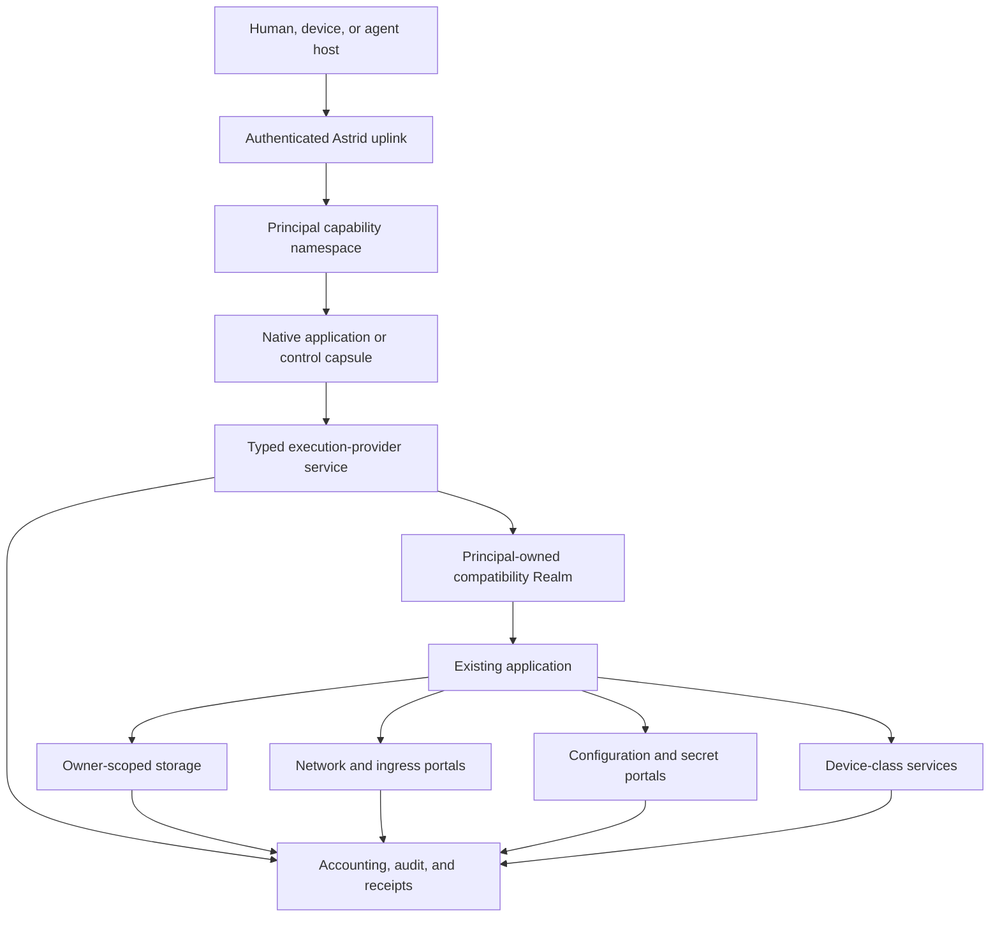

# Astrid Universal Application Substrate

Status: proposed architecture specification and implementation programme

Implementation epic: [astrid#1564](https://github.com/astrid-runtime/astrid/issues/1564)

Last reviewed: 2026-08-18

Related documents:

- [Astrid Resource Ownership Model](astrid-resource-ownership-model.md)
- [Astrid AI-Native OS Workplan](astrid-ai-native-os-workplan.md)
- [Astrid Kernel Charter](astrid-kernel-charter.md)
- [Astrid Native Component Kernel](astrid-native-kernel.md)
- [Astrid Driver Domain Contract](astrid-driver-domain-contract.md)
- [Astrid Principal Store](astrid-principal-store.md)
- [Astrid Principal Store Runtime Realization](astrid-principal-store-runtime.md)
- [Astrid User, Fleet, and Principal Ownership](astrid-user-fleet-ownership.md)
- [Distro Signing and Trust](distro-signing.md)

## 1. Decision

Astrid is the operating system. Existing operating systems, language runtimes,
frameworks, agent harnesses, and applications are compatibility payloads or
service providers inside Astrid; they are not the authority beneath Astrid.

An existing program should retain the ABI and ergonomics it expects while its
consequential effects map onto Astrid-owned resources:

```text
program-visible operation       Astrid-owned effect
-------------------------       -------------------
open/read/write/fsync           owner-scoped durable storage
socket/connect/listen           governed network and ingress portals
getenv/read credential          scoped configuration or secret delivery
spawn/exec/thread               principal-charged compute and lifecycle
clock/random                    admitted time and entropy services
device access                   typed device-class capabilities
stdout/stderr/logging           bounded streams, audit, and receipts
service discovery              principal capability namespace
```

Linux is the first broad compatibility personality because it admits existing
software with the least rewriting. It is replaceable. A principal's identity,
authority, state, applications, and history must survive replacement of the
Linux distribution, runtime backend, host operating system, or physical
machine.

The system therefore follows this rule:

> Preserve the application's interface; replace the plumbing beneath it with
> principal-scoped Astrid resources.

This specification is the joining contract for the hosted runtime, Principal
Store, Linux Realm, native component kernel, remote administration, distros,
and the first universal-application proof using Hermes Agent.

The resource ownership model defines the locked native semantics beneath this
product architecture. Where this document describes an application-facing
resource, the ownership model controls its authority, lifecycle, transfer,
accounting, and recovery behavior.

## 2. Scope and claim boundary

### 2.1 Goals

Astrid must support:

1. one verified immutable application closure reused by many principals;
2. isolated mutable state, secrets, processes, budgets, and capability
   namespaces for every principal;
3. unmodified or minimally adapted Linux applications without granting ambient
   host process, host filesystem, or host network authority;
4. native WASM components and compatibility workloads in the same authority
   model;
5. atomic system generations, rollback, recovery, and replacement of the
   compatibility distribution without replacement of principal state;
6. familiar human administration through authenticated remote CLI, mounted
   filesystems, terminal sessions, and an optional SSH compatibility gateway;
7. the same public application, storage, authority, and receipt semantics on a
   hosted daemon and a future freestanding Astrid kernel; and
8. measured economic evidence for artifact reuse, dormant-state cost, startup,
   execution overhead, storage amplification, and operational density.

### 2.2 Non-goals

This specification does not:

- place Linux, POSIX, Python, Hermes, package management, or user policy in ring
  0;
- require existing applications to be rewritten as WASM;
- make a pathname, port number, process identifier, tool name, or manifest
  declaration an authority token;
- reproduce all of Unix or Rust `std` inside the native kernel;
- make a shared multi-tenant application process the principal isolation
  boundary;
- expose the host root filesystem, host process table, Docker socket, or host
  network namespace as a compatibility shortcut;
- claim binary compatibility before a conformance workload has run; or
- make the native kernel a prerequisite for proving the application model on
  the current hosted runtime.

### 2.3 Terminology

- **Principal computer:** the durable logical computer projected to one
  principal: its capability namespace, service instances, private state,
  workspaces, budgets, and compatibility Realms.
- **Application closure:** an immutable, content-identified set of program,
  runtime, library, configuration-schema, and provenance objects.
- **System generation:** an atomically selectable immutable composition of
  Astrid services, application closures, compatibility images, and policy
  inputs. It excludes secrets and principal-writable state.
- **Realm:** a principal-owned compatibility environment implementing a guest
  ABI over Astrid resources. Linux Realm is the first implementation, not the
  definition.
- **Execution provider:** a typed service that admits, runs, supervises, and
  accounts for a workload without widening the caller's authority.
- **Portal:** a typed boundary that maps a guest-visible effect to an
  independently authorized Astrid resource.
- **Projection:** a consumer-specific view of an authoritative Astrid resource,
  such as a POSIX filesystem mount or a Linux block device.

## 3. System invariant

For every effect `E` requested by workload `W` on behalf of principal `P`, the
effective authority is intersection-only. The initiating authority is exactly
one host-stamped authenticated invocation or one durable, revocable service
lease; scheduled/background services do not fabricate a human session:

```text
effective(E) =
    (authenticated invocation authority OR admitted service-lease authority)
  ∩ principal P authority
  ∩ calling application/capsule authority
  ∩ execution-provider authority
  ∩ Realm-instance authority, when applicable
  ∩ guest job/process/descriptor authority, when applicable
  ∩ selected portal authority
  ∩ per-job resource and policy ceilings
```

No layer may union rights, infer authority from a name, or fall back to an
ambient host operation when an Astrid provider is unavailable. Failure to
resolve, authenticate, bind, meter, or establish required admission/receipt
evidence fails closed for the effect. Loss of observability-only telemetry
follows its declared continue-and-alert policy and is never represented as a
durable receipt.

The host or kernel stamps the effective principal. A guest payload cannot name
another principal, owner, fleet, workspace, secret set, or network policy to
change the binding.

## 4. Architecture



The hosted daemon and the future native kernel are alternate providers for the
lower boundary. They must expose the same semantic resources and run the same
conformance suite. Host implementation details must not enter application
identity or durable principal state.

## 5. Principal computers and shared applications

### 5.1 Share bytes, not authority

An application such as Hermes is installed once as an immutable closure. Many
principals may reference the same closure and physically share verified code,
read-only package data, compiled artifacts, base-image pages, and safe caches.

Each principal nevertheless receives a distinct logical service instance with:

- its own service identity and lifecycle generation;
- its own home, databases, sessions, memory, skills, and configuration;
- its own secret handles and provider credentials;
- its own process tree, descriptors, temporary state, and workspace mounts;
- its own CPU, resident-memory, storage, network, and operation budgets; and
- its own visible capability namespace.

Physical reuse must not make another principal's mutable bytes, timing-sensitive
private cache entries, credentials, or handles observable. Logical accounting
must not depend on whether another principal caused a shared immutable object to
be resident first.

### 5.2 Lifecycle

A principal service may be:

- **cold:** no resident process or Realm memory; durable state remains;
- **starting:** immutable generation and principal state are admitted;
- **ready:** service endpoint is published in the principal namespace;
- **busy:** one or more bounded jobs are active;
- **draining:** new work is rejected while admitted work reaches a defined
  completion or cancellation boundary;
- **suspended:** a verified checkpoint and durable state exist without active
  compute; or
- **failed:** the endpoint is withdrawn and recovery policy decides restart,
  rollback, or operator intervention.

Namespace publication is atomic with readiness. A stale endpoint or handle must
fail closed after restart, replacement, revocation, or generation change.

### 5.3 Fleet sharing

Fleet storage, services, and application instances are separate owner classes,
not implicit extensions of every member's home. A principal sees a fleet
resource only through a granted mount or service handle. Mounting does not
create an owner, principal, quota, application, or workspace.

## 6. Application and system generations

### 6.1 Application descriptor

The universal application descriptor must name or derive:

- application identity and immutable closure root;
- executable entry points and supported execution-provider interfaces;
- guest ABI and architecture requirements;
- configuration schema and non-secret defaults;
- requested portals and their typed operations;
- resource-envelope requests and hard maxima;
- service endpoints, health checks, shutdown, and checkpoint hooks;
- durable-state schema version and migration hooks;
- upgrade, rollback, and incompatibility policy;
- provenance, source, builder, dependency, and signature evidence; and
- expected conformance suite and known semantic gaps.

The descriptor requests authority. It never grants itself authority.

### 6.2 Closure identity

Application identity must exclude:

- principal identifiers;
- secrets;
- writable homes and databases;
- invocation workspaces;
- host paths;
- runtime process identifiers;
- transient network endpoints; and
- machine-local compiled caches unless their compatibility tuple is part of a
  separate derived identity.

A target-specific AOT artifact or Realm image is derived from the canonical
source closure and an exact build/target profile. The derivation binds its
builder, inputs, configuration, target ABI, and output digest.

### 6.3 Atomic selection

An update constructs and verifies a complete candidate generation before
selection. Selection atomically changes one generation pointer. Activation and
data migration are separately receipted. Rollback changes the selected system
generation without silently rolling back or discarding principal data.

Garbage collection follows live roots, retained rollback generations, active
leases, checkpoints, exports, and policy pins. It must not scan a host directory
and infer authority from whatever files remain there.

## 7. Execution-provider contract

The first internal execution-provider contract must be Linux-neutral even when
Linux Realm is its first consumer. It requires at least:

```text
inspect(provider, stamped_context) -> capabilities and limits
admit(stamped_context, application, generation, resource_request, portals) -> instance
start(instance) -> lifecycle generation
execute(instance, job, stdin, workdir, limits) -> streams and result
attach(instance, stream_or_terminal) -> bounded attachment
signal(instance_or_job, typed_signal) -> acknowledgement
checkpoint(instance, policy) -> immutable checkpoint reference
restore(instance, checkpoint, refreshed_portals) -> lifecycle generation
drain(instance, deadline) -> outcome
stop(instance, reason) -> outcome
status(instance) -> typed state and accounting
```

Every handle binds provider identity, application generation, owner principal,
authority epoch, lifecycle generation, and resource envelope. Workdir and mount
selection use admitted opaque attachments, not guest-supplied host paths.

The provider may implement execution through:

- an Astrid-native WASM component;
- nested core WASM;
- an interpreted or translated Linux machine;
- hardware virtualization behind the same Realm contract;
- a remote Astrid execution domain; or
- a future architecture-specific native domain.

Provider replacement is permitted only when the conformance suite establishes
the promised behavior and receipts state the selected backend. There is no
silent host-shell fallback.

## 8. Astrid-owned plumbing

### 8.1 Storage

Authoritative storage is the owner-scoped Principal Store over `AstridVolume`,
not a host directory. A hosted deployment may place the volume in a host file;
bare metal may place it on a block device; tests may use memory. Those are
providers of the same path-free volume contract.

Applications receive one or more projections:

- immutable system/package generation;
- principal-durable home or application state;
- explicitly granted workspace;
- explicitly granted fleet share;
- ephemeral temporary storage; and
- optional synthetic status/device trees.

The application cannot select an owner through a path. The kernel-issued lease
or portal handle fixes the owner and access mode.

### 8.2 Filesystem and block semantics

Astrid must not describe all storage projections as equivalent. Providers must
advertise supported semantics, including:

- atomic rename and replacement;
- durability and flush boundaries;
- file and directory identity;
- sparse files and allocation behavior;
- links and path traversal;
- advisory and mandatory locking;
- memory mapping;
- open-after-unlink;
- mode, ownership, and extended attributes;
- device and special-node behavior; and
- crash recovery.

Simple native capsules should use typed file/object/KV interfaces. Compatibility
workloads that require SQLite, compilers, package managers, or databases should
receive a block-local filesystem or another provider that actually satisfies
their POSIX expectations. A narrow 9P projection must not be represented as a
general POSIX disk merely because ordinary reads and writes work.

### 8.3 Processes and compute

Astrid owns admission, attribution, ceilings, cancellation, and lifecycle.
The compatibility personality may implement process identifiers, signals,
pipes, threads, and exec semantics internally, but it cannot mint additional
CPU, memory, descriptors, executable artifacts, or external effects.

Child and sub-agent budgets attenuate from the parent's delegated authority.
Resident memory uses a host-wide physical ledger and per-principal logical
charges. Termination, crash, revocation, and principal deletion release every
non-durable reservation.

### 8.4 Networking and ingress

Guest sockets terminate in an Astrid network portal or virtual device whose
policy is bound before use. The portal owns:

- DNS and endpoint resolution policy;
- destination and listen scope;
- protocol, byte, connection, and rate ceilings;
- TLS key and certificate access where delegated;
- connection attribution and revocation;
- inbound route publication; and
- audit and receipt coverage.

Applications may retain normal sockets. They must not receive a raw host network
namespace as an implementation shortcut. Provider capsules should hold external
service credentials where possible; compatibility secrets placed in a guest
environment are an explicitly broader grant.

### 8.5 Configuration and secrets

Non-secret configuration is versioned input to an application instance. Secrets
are independently authorized resources. A secret may be delivered as:

- an operation-specific connector handle;
- a short-lived file or descriptor;
- a bounded environment value for an unmodified application; or
- a local proxy that performs the credentialed operation without revealing the
  credential.

The narrowest compatible delivery wins. Secret rotation must not require
rebuilding the immutable application closure.

### 8.6 Time, entropy, devices, and observability

Clock and entropy providers state their guarantees. Checkpoints cannot restore
stale authority, secrets, wall clocks, nonces, or live handles.

Hardware is exposed through typed device-class services. A guest never receives
arbitrary MMIO, DMA, interrupts, or physical addresses. Driver domains and
virtualizers follow the separate driver-domain contract.

Normal application output remains ergonomic. Detailed principal, generation,
authority, accounting, and causal evidence belongs in structured operator
receipts rather than being injected into every model response or terminal line.

## 9. Storage independence is the immediate dependency

The host-filesystem-independent storage programme is the most important current
substrate for this specification. It must land and stabilize before the
universal-application layer invents parallel persistence.

The required sequence is:

1. place authoritative system, principal, fleet, audit, capsule-registry,
   configuration, secret metadata, and workspace state behind typed storage
   interfaces;
2. retain host paths only as hosted volume placement, explicit external
   attachments, import/export sources, and human mounts;
3. certify recovery, migration, quota, compaction, physical reclamation, and
   mounted-provider behavior;
4. expose owner-bound filesystem and block portals without leaking provider
   paths into requests;
5. make the same volume and storage protocols available to native user-space
   storage domains; and
6. boot the native system with only a minimal block transport in ring 0 while
   keeping filesystems, databases, placement, and GC in restartable user space.

Host independence does not mean that the hosted deployment stops using files.
It means host filesystem objects no longer define Astrid identity, ownership,
authority, or logical layout.

## 10. `no_std`, `std`, and compatibility semantics

### 10.1 Direct answer

Astrid needs a `no_std` kernel and portable `no_std` contracts. It does **not**
need to recreate the complete Rust standard library or complete POSIX semantics
inside ring 0.

Astrid must own the semantics that form its security and recovery boundary:

- memory and protection domains;
- capability handles and revocation;
- IPC, waits, deadlines, and cancellation;
- scheduling and resource accounting;
- interrupt, DMA, and device admission;
- boot, measurement, recovery, and monotonic epochs; and
- minimal block, clock, entropy, and console primitives needed to start
  user-space services.

Filesystems, sockets, TLS, package management, SQLite, shells, process models,
and broad language-runtime behavior belong outside ring 0.

### 10.2 Rust portability classes

The workspace should classify crates explicitly:

1. **Kernel/ABI (`#![no_std]`, normally no allocator in critical paths):**
   syscall and IPC structures, identifiers, capability rights, bounded codecs,
   boot records, and architecture-independent kernel objects.
2. **Portable system library (`#![no_std]` plus `alloc`):** canonical encodings,
   crypto primitives where supported, typed resource clients, storage formats,
   and pure policy/state machines.
3. **Native Astrid user-space:** small executors and runtime hosts built against
   the Astrid native ABI; use `alloc` and selected portable libraries, with no
   assumption of Unix processes or paths.
4. **Hosted adapters (`std`):** Tokio, Unix sockets, FSKit/FUSE/WinFsp,
   host-process sandboxes, host networking, CLI, and desktop integration.
5. **Compatibility payloads (`std`/libc/POSIX as expected):** Linux programs,
   Python, Node, databases, compilers, and agent harnesses. Their familiar
   semantics are supplied by the Realm and its advertised storage/network
   providers.

Feature boundaries must be additive and testable. A portable crate must not
hide host filesystem, environment, thread, wall-clock, or socket use behind a
default feature that native builds accidentally enable.

### 10.3 Astrid native ABI

The native ABI should stay smaller and more explicit than POSIX. It requires
bounded operations for:

- domain and thread lifecycle;
- memory allocation, mapping, protection, and shared-memory handles;
- capability transfer and revocation;
- endpoint send/receive and multiplexed waits;
- monotonic timers and deadlines;
- structured fault delivery;
- block, stream, interrupt, and DMA resource handles; and
- audit/recovery events.

Higher-level Rust crates can construct ergonomic async, file, network, and
service APIs over those primitives. Compatibility Realms construct POSIX
semantics over the same resources. The kernel does not expose a global Unix
filesystem or process namespace.

### 10.4 Optional Rust `std` target

A future Rust target with an Astrid `std` port may be valuable for conventional
native applications. It is optional and sequenced after the ABI stabilizes.
Such a port would define threading, synchronization, time, networking,
filesystem, environment, panic, and process behavior over Astrid services. It
must not become a prerequisite for the kernel, component host, or Linux
compatibility path, and it must not pretend unsupported Unix behavior exists.

### 10.5 Conformance rule

Every semantic surface is versioned and advertised. An application is admitted
only when its required semantics are a subset of those supplied by the selected
provider. Provider names such as `linux`, `posix`, `filesystem`, or `std` are not
sufficient evidence; executable conformance cases establish the claim.

## 11. Hermes as the reference universal application

Hermes is the first forcing workload because it combines Python, native wheels,
HTTP model access, MCP, subprocesses, skills, persistent memory, SQLite,
long-lived gateway operation, messaging ingress, and human terminal UX.

### 11.1 Sharing and isolation

Astrid stores one immutable Hermes closure and one or more compatible Realm
system generations. Each authorized principal receives a separate Hermes
service instance and private `HERMES_HOME`. Immutable Python packages and image
pages may be reused; configuration, sessions, databases, memory, skills,
credentials, processes, and workspaces may not.

### 11.2 Initial compatibility closure

The first Hermes closure must contain:

- an exact upstream Hermes revision;
- Python within Hermes's declared supported range;
- all direct and transitive dependencies with hashes and provenance;
- prebuilt guest-architecture native extensions or reproducible source-build
  derivations;
- CA roots and timezone data;
- a fixed launcher and configuration schema;
- no online `pip`, `uv`, package-hook, or `curl | sh` step at activation; and
- an SBOM and vulnerability-review receipt.

The current Realm Python and Hermes Python constraints must be reconciled in the
image derivation rather than bypassed with an unsupported interpreter.

### 11.3 Vertical slices

#### H0: dependency and filesystem proof

- Import the immutable Hermes closure without network installation.
- Place one private `HERMES_HOME` on an application-consistent durable provider.
- Run Hermes import, configuration, SQLite, skill discovery, and session-store
  probes without a model call.
- Crash at named storage boundaries and prove recovery.

#### H1: one governed turn

- Admit one principal and one workspace.
- Deliver one model-provider capability through a governed connector or
  domain-scoped HTTPS portal.
- Run one headless Hermes turn with a minimal tool set.
- Bind result, model, application generation, principal, workspace generation,
  egress policy, resource use, and state transition into a receipt.

#### H2: Astrid tool plumbing

- Expose the principal's live Astrid capability namespace to Hermes through a
  stable adapter.
- Prefer typed remote tools/connectors over guest-local replicas.
- Map approvals and cancellation across the boundary.
- Prove that a tool visible to Alice is neither enumerable nor callable by Bob.

#### H3: supervised service

- Run the Hermes API/gateway as a supervised principal service.
- Publish readiness atomically and support streaming, cancellation, draining,
  restart, and checkpoint-aware recovery.
- Scale an idle instance to cold state and restore it without changing service
  identity or losing committed sessions.

#### H4: human ergonomics

- Attach a terminal when PTY semantics are available.
- Support messaging ingress through Astrid routes and connector capsules.
- Support authorized SSH attachment to the principal computer without exposing
  a host shell.

### 11.4 Hermes claim gate

Astrid may claim “Hermes runs on Astrid” only when H1 passes on a released
artifact. It may claim “Hermes is an Astrid service” only when H3 passes. It may
claim “multi-principal Hermes” only after concurrent hostile isolation,
accounting, restart, and revocation tests pass.

## 12. Human and operator access

### 12.1 Higher-layer experience enabled by Astrid

Astrid does not own or render a graphical desktop, Home, component tree, or
personal interface. Higher-layer hosts may build those experiences over the
substrate defined here. This section describes a forcing consumer experience,
not an Astrid-owned product surface or kernel service.

A graphical host may present a small number of immediately legible
concepts:

- **Spaces:** personal or collaborative compositions of work, people, agents,
  services, and explicitly attached resources;
- **ongoing work:** durable activities that can be resumed where they were
  left;
- **collaborators:** humans and agents such as Hermes acting inside the current
  admitted context;
- **owned things:** semantic objects the person can inspect or use directly;
  and
- **changes:** an attributable timeline of consequential effects, receipts,
  and available compensating or rollback operations.

Such an experience answers “where am I?”, “what is happening?”, “what can I
continue?”, and “what can I ask?” without exposing principals, capabilities,
mounts, Realms, providers, or generations as normal product vocabulary. Those
mechanisms remain available through progressive disclosure for administration,
recovery, and exact authority inspection.

A Space is a higher-layer presentation and navigation composition with
explicit Astrid resource attachments.
It is not a principal, owner, capability set, policy realm, filesystem
namespace, or ambient context switch. Entering or sharing a Space never changes
the kernel-stamped principal or widens the accessible resource set. Missing or
stale attachments become non-enumerating unavailable placeholders and never
silently retarget. Cross-Space drag/drop proposes a typed copy, move, share, or
delegation operation; it does not itself transfer authority.

### 12.2 Host-facing semantic state and action boundary

Astrid exposes principal-scoped typed objects, relationships, current state,
and proposed actions through a host-neutral boundary. A consuming host may
translate that boundary into A2UI, graphical, terminal, accessibility, or other
native experiences. Astrid does not own layout, components, rendering,
personalization, or the visual metaphor.

The normative invariant is:

> A host projection of Astrid state is never Astrid identity, authority,
> consent, or policy. Presentation and personalization remain host concerns.

The architecture separates three concerns:

1. an **Astrid projection boundary** exposing bounded typed state, object
   identities, eligible action descriptors, and opaque action references;
2. a **host-owned experience** controlling scenes, components, layout, density,
   modality, accessibility, theme, and personalization; and
3. an **Astrid enforcement boundary** controlling authenticated context,
   authority validation, action dispatch, lifecycle, and receipts.

Astrid's boundary contains no HTML, JavaScript, CSS, webviews, layout tree, or
executable presentation instructions. Any A2UI-like component grammar and its
rendering limits belong to the consuming host.

Every actionable element carries only an opaque host-issued action reference.
Its table entry binds the canonical action-descriptor digest, view revision,
target semantic-object identities, typed arguments, authority delta,
confirmation policy, expiry, and relevant principal/session/application/
provider/lifecycle/attachment epochs. Host labels, icons, ordering, layout, and
component state never participate in authority resolution. Every invocation
revalidates current authority through the ordinary admission path.

For authority expansion Astrid emits typed pending-operation data and a
single-use challenge bound to the exact operation and authenticated context. A
trusted host decides how to present that decision and returns the bound
response; Astrid validates and consumes it. Astrid does not own the graphical
chrome, but arbitrary application or agent content cannot substitute for the
host's confirmation path. Generic semantic `Confirm`, clicks, drag/drop, or
elicitation responses are not consent.

Type metadata may be cached globally, but the visible semantic catalog is
filtered by the current stamped principal, admitted application/Space
attachments, and exact generations. Knowing a schema, topic, name, or receipt
grants no right to enumerate, subscribe, publish, invoke, or view data. Schema
collisions reject rather than overwrite. WIT descriptions and agent prose are
untrusted descriptive content, not security language.

The earlier in-runtime agent-owned A2UI/TUI design in issues #629 and #630 is
not revived. Build internal Rust projection/action domain types first. A
presentation owner may separately prove an A2UI-like protocol and
multiple renderers without making Astrid itself the UI framework.

### 12.3 Authentication and principal selection

Remote access authenticates a user/device or machine credential first. The
session then requests a principal view. The authority service verifies that the
authenticated subject owns, operates, or holds an explicit delegation for that
principal.

```text
device or user authentication
  -> authorized principal selection
  -> principal-bound session capability
  -> capability namespace and optional workspace attachments
  -> shell, service, filesystem, and management operations
```

The selected principal cannot be changed by a later command argument. An admin
“act as” operation is an explicit, scoped, time-bounded delegation with an audit
record. User identity, fleet role, principal ownership, and operator authority
remain distinct.

### 12.4 Native administration

The primary interface is the Astrid CLI/API, with context switching across
hosts. It should provide at least:

```text
astrid context add|list|use|current
astrid auth login|status|logout
astrid principals list|show
astrid services list|show|start|stop|restart
astrid exec --principal <p> -- <command>
astrid attach --principal <p> <service-or-session>
astrid logs --principal <p> --follow
astrid usage --principal <p>
astrid grants inspect|trace|revoke
astrid storage mount|status|sync|unmount
astrid system generations|switch|rollback|doctor
```

The API returns typed state. Terminal rendering is a client concern.

### 12.5 SSH compatibility gateway

An optional SSH gateway may preserve familiar `ssh`, terminal forwarding, and
SFTP ergonomics. It is a protocol adapter to the same authenticated Astrid
session and never an ambient Unix login service.

- SSH public keys bind devices/users, not unrestricted host accounts.
- Requested user/principal names are authorization requests.
- A shell attaches to a principal-owned Realm or native management session.
- SFTP projects an owner-bound storage lease.
- Port forwarding requires separate ingress/egress capabilities.
- Agent forwarding, host filesystem access, and host process access are denied
  unless separately modeled and explicitly granted.
- Session close revokes invocation-scoped attachments and handles.

Local recovery retains a minimal console path that can inspect boot slots,
storage health, authority epochs, audit integrity, and service failures without
requiring the normal application stack.

## 13. Distro and Nix-inspired generation model

Astrid should adopt the useful Nix properties without making Nix its kernel or
authority model:

- content-identified immutable inputs and outputs;
- complete closure verification;
- reproducible derivations;
- atomic profile/generation switching;
- rollback by root selection;
- shared physical artifacts with explicit privacy domains;
- garbage collection from declared live roots; and
- a strict separation between immutable system and mutable state.

Two meanings of “distro” must remain explicit:

1. An **Astrid distro** is a signed composition of capsules, applications,
   services, compatibility Realms, configuration schemas, and authority
   requests.
2. A **Linux distribution generation** is an optional compatibility image
   selected by an Astrid application or system generation.

Reprovisioning a distro must transactionally reconcile the installed set.
Artifacts removed from the new signed closure cannot continue loading merely
because old directories remain. Side-loaded artifacts have separately recorded
provenance and are not silently pruned as if they belonged to the distro.

## 14. Hosted and native implementations

### 14.1 Hosted Astrid

The current daemon remains the first production host. It may use Tokio,
Wasmtime, host files, sockets, platform mounts, and OS sandboxes internally.
Those dependencies live behind provider traits and do not define public
resource identity.

Hosted conformance is not a temporary mock. It is one supported implementation
of the same Astrid contracts and remains useful for laptops, servers, CI, and
incremental adoption.

### 14.2 Native Astrid

The freestanding system uses:

- a minimal `no_std` capability kernel in ring 0;
- restartable ring-3 init, runtime, storage, network, audit, driver, and
  application domains;
- a `no_std`/`alloc` component host using verified AOT or Pulley artifacts;
- the same Principal Store formats and logical protocols over a native block
  provider;
- the same signed system/application generation model; and
- the same principal namespace, execution-provider, portal, and receipt
  semantics.

Linux runs as a Realm in user space. A future hardware-virtualized backend may
replace interpretation where available, but it must reproduce the same
authority, storage, portal, lifecycle, checkpoint, and accounting contract.

### 14.3 Conformance corpus

The same corpus must run against hosted and native providers:

- capability visibility and stale-handle rejection;
- owner-scoped file/object/KV operations and crash recovery;
- application generation admission and rollback;
- execution, cancellation, resource exhaustion, and process-tree cleanup;
- network destination/listener policy and revocation;
- secret isolation and rotation;
- checkpoint authority refresh;
- receipt completeness for receipt-required effects plus declared behavior for
  observability loss; and
- concurrent hostile principals.

Provider-specific performance is reported separately from semantic conformance.

## 15. Security invariants

The implementation must preserve these properties:

1. A guest cannot select or forge its effective principal.
2. A path cannot select an owner outside its admitted mount or portal.
3. A name, descriptor, manifest, endpoint, or object digest is not authority.
4. A child process or sub-agent cannot exceed delegated parent budgets.
5. Shared immutable bytes never make mutable principal state shared.
6. A compatibility workload receives no ambient host process, filesystem,
   network, credential, device, or control-plane access.
7. Portal loss, revocation, provider failure, and stale lifecycle generations
   fail closed without fallback.
8. Checkpoint restore refreshes principal, authority, workspace, network,
   secret, time, and lifecycle bindings.
9. Installation, execution, promotion, ingress publication, and authority grant
   are separate actions.
10. Ring-0 compromise authority stays minimal; filesystems, Linux, application
    policy, package managers, and agent logic remain outside it.
11. Recovery state is reserved and cannot be exhausted by ordinary principals.
12. Every externally consequential effect is attributable to principal,
    application generation, provider, authority epoch, and causal request.

## 16. Economic proof

The economic case must be measured against ordinary containers and VMs rather
than asserted from architecture. The benchmark suite records:

- physical bytes for one application versus 10, 100, and 1,000 principals;
- logical per-principal charge and physical deduplication separately;
- cold, warm, and checkpoint-restored startup latency;
- dormant bytes per principal;
- resident memory and CPU under idle, burst, and sustained workloads;
- storage write amplification, compaction, reclamation, and backup cost;
- Realm execution overhead versus native Linux and a conventional container;
- portal latency for files, network, secrets, and tools;
- scale-to-zero recovery time and first-token latency for Hermes;
- update download size and rollback time; and
- operator effort for install, upgrade, recovery, migration, and incident
  inspection.

Claims must state hardware, provider, application generation, workload,
concurrency, durability policy, cache state, and measurement interval. Shared
page-cache warmth and stored green fixtures are not independent economic proof.

## 17. Reclaiming previous work

Previous implementation work should be reclaimed by contract and evidence, not
merged wholesale or rewritten from memory.

### 17.1 Host-independent storage and mounts

Treat the current storage/mounted-filesystem branch and PR as the immediate
substrate. Land it on its own correctness and migration evidence. This
specification must consume its `AstridVolume`, owner, filesystem, mount-lease,
workspace, registry, audit, and migration boundaries rather than creating a
parallel application store.

Before dependent work begins, reconcile its final public types, current CI,
remaining physical reclamation, filesystem semantic profile, and native block
provider seam.

### 17.2 Linux Realm

Recover the preserved Linux Realm source and installable artifact from its
owning repository/branch. Inventory each capability and test against the
execution-provider and portal contracts above. Preserve its principal-resident,
no-`host_process`, bounded `realm_shell`, durable home, workspace, signed worker,
and intersection-authority properties.

Forward-port rather than recreate:

- authenticated workspace attachment and lifecycle epochs;
- immutable system generation and checkpoint binding;
- application-consistent durable storage;
- long-lived service supervision;
- network, secret, and ingress portals;
- PTY only when the underlying process semantics are complete; and
- backend-neutral receipts and conformance cases.

Do not promote the current Realm to a production general Linux claim until its
advertised Python, package, network, PTY, filesystem, and service semantics pass
the relevant workload gates.

### 17.3 Native kernel skeleton

Recover the isolated native-kernel branch as the executable proof of boot,
memory protection, domains, capabilities, IPC, legibility, and audit ordering.
Keep it isolated until the current draft's failures, determinism, supervisor
fault delivery, and reclaim behavior are resolved.

Do not add filesystems, Linux, Hermes, policy engines, or application semantics
to ring 0. The next reclaim increment should connect a small native block/IPC
ABI and a restartable user-space service, then run the hosted/native conformance
corpus.

### 17.4 Earlier unikernel and `no_std` reconnaissance

Retain the useful seams:

- injected `KernelResources` and provider traits;
- portable task/time/storage/capability libraries;
- Wasmtime custom-platform/AOT/Pulley analysis;
- Hermit and other kernels as mechanism references; and
- load-time-bound device handles instead of arbitrary MMIO.

Reject the collapsed premise that a Hermit appliance, a hosted daemon, and the
Astrid trusted kernel are interchangeable projects. They are different hosts
for related contracts with different TCBs and evidence.

## 18. Implementation programme

### Stage A: adopt the contract and land storage

- Review and adopt this specification as the umbrella architecture.
- Land and certify the host-independent storage/mount programme.
- Publish exact storage, filesystem-semantic, mount-lease, owner, and native
  volume contracts.
- Fix distro reconciliation so removed artifacts stop loading.
- Inventory crate portability and classify every host dependency.

Exit gate: authoritative Astrid state no longer depends on host directory
layout, and no dependent design invents a second persistence authority.

### Stage B: universal application control plane on the hosted runtime

- Define the internal application-generation and execution-provider types.
- Define internal host-neutral object, action, attachment, and
  pending-confirmation types without freezing public WIT or adopting a UI
  grammar.
- Prove the projection/action boundary with non-graphical fixtures. A host may
  build a disposable graphical consumer separately over ephemeral state;
  durable Spaces and preferences wait for authoritative storage.
- Define lifecycle, streams, cancellation, health, checkpoint, and receipt
  types.
- Implement principal namespace publication and stale-handle invalidation.
- Implement typed storage, workspace, network, configuration, secret, and
  ingress portal bindings.
- Add one trivial unmodified Linux application fixture before Hermes.

Exit gate: two principals run the same immutable application closure with
isolated state and resources; revocation and replacement fail closed.

### Stage C: Hermes H0 and H1

- Produce the hermetic Hermes closure and compatible Realm image.
- Prove its dependency and filesystem behavior.
- Execute one governed turn through a single model provider.
- Store and recover the resulting principal state.
- Record exact cost and receipt evidence.

Exit gate: released artifacts and a reproducible test prove the narrow “Hermes
runs on Astrid” claim.

### Stage D: services, tools, remote administration, and SSH

- Add Hermes namespace/tool mapping and approval propagation.
- Expose Hermes through the host-neutral object/action boundary and prove that
  any host projection cannot widen its authority.
- Let a consuming host persist Space composition and presentation
  preferences separately from Astrid application data and authority.
- Add supervised long-lived services and scale-to-zero lifecycle.
- Complete remote CLI authentication and host contexts.
- Add explicit principal shell/attach and storage mount commands.
- Implement SSH/SFTP only as adapters to these native operations.

Exit gate: an authorized human or host can enter a principal computer,
administer its Hermes service, consume the same typed objects/actions through
independent projections, mount its storage, and disconnect without leaving
ambient authority or stale attachments. Astrid itself need not render them.

### Stage E: portable `no_std` substrate and freestanding service host

- Make ABI, identifiers, bounded codecs, authority, and storage format crates
  compile under their declared `no_std`/`alloc` profiles.
- Freeze the Astrid native ABI and conformance harness.
- Recover and harden the native-kernel skeleton.
- Start a restartable native user-space service over IPC.
- Run Principal Store over a native volume provider.
- Start one existing capsule through the freestanding component host.

Exit gate: the native machine boots, recovers durable state, and serves one
principal operation with the same observable contract as the hosted runtime.

### Stage F: Linux Realm on native Astrid

- Supply compute, storage, clock, entropy, and portal providers from native
  domains.
- Boot the same Realm generation and refresh all principal authority after
  restore.
- Run the application conformance corpus.
- Select interpreted, translated, or virtualized execution by measured policy,
  never by changing application authority.

Exit gate: the same Hermes application generation and principal state move
between hosted and native Astrid without semantic or authority drift.

### Stage G: broader platform and application ecosystem

- Add architecture and hardware providers behind the frozen contracts.
- Add additional compatibility personalities only for demonstrated workloads.
- Add graphical, audio, accelerator, and device services through typed driver
  domains.
- Establish third-party application packaging, certification, and update
  tooling.

Exit gate: application authors can target Astrid-native services or bring an
existing application closure, while operators retain one coherent authority,
storage, lifecycle, and recovery model.

## 19. Contract and RFC ownership

This document belongs in `astrid` because it governs internal architecture and
cross-repository implementation order. Public capsule-visible WIT changes must
be proposed separately in `astrid-rfcs` and land in canonical `wit` before SDK
and implementation activation.

Expected contract work includes:

- execution provider and application lifecycle;
- lifecycle-stamped service handles and namespace deltas;
- typed stream, terminal, signal, cancellation, and status surfaces;
- stable workspace attachment identity and epoch;
- filesystem semantic profiles and optional operations;
- block-volume portal where compatibility workloads require it;
- network connect/listen and ingress route resources;
- configuration and secret resource delivery;
- checkpoint prepare/commit/restore hooks; and
- application generation, migration, promotion, and receipt types.

Start with internal Rust protocols where possible. A public WIT contract is
justified only when independently released capsules must implement or consume
the boundary.

## 20. Required evidence

No stage is complete from documentation or fixture success alone. The evidence
set must include:

- exact source and artifact digests;
- reproducible build instructions;
- negative authority and cross-principal tests;
- crash and power-loss injection at named boundaries;
- cancellation, timeout, quota, and exhaustion cases;
- stale-handle, restart, upgrade, rollback, and revocation cases;
- filesystem and application conformance workloads;
- hosted/native differential results;
- migration from released state, not synthetic state alone;
- hostile manifest, image, checkpoint, and portal inputs;
- measured performance and economics with stated baselines; and
- a claim ledger distinguishing captured, prototyped, verified, and production
  properties.

## 21. Open decisions

The following decisions require prototypes or measurements:

1. the first stable execution-provider wire shape and whether it begins as
   internal IPC or canonical WIT;
2. the filesystem/block provider used for SQLite-heavy Realm applications;
3. the network portal boundary: virtual NIC, socket proxy, protocol connector,
   or a measured combination;
4. checkpoint granularity and application-consistency hooks;
5. the first hardware-virtualized Realm backend and its conformance envelope;
6. logical versus physical accounting for shared immutable application pages;
7. privacy domains for deduplication and shared caches;
8. system-generation migration and rollback behavior when application state
   schemas change;
9. whether an Astrid Rust `std` target provides enough value after the native
   ABI stabilizes; and
10. which Hermes feature subset constitutes the first released closure; and
11. the minimum host-neutral object/action projection contract needed by
    presentation owners without adopting their component grammar.

An open decision does not authorize an ambient host fallback.

## 22. Definition of success

This programme succeeds when all of the following are true:

- an existing non-WASM program runs without treating the host OS as its
  authority;
- every external effect maps to an authenticated, principal-scoped Astrid
  resource;
- one immutable application closure safely serves many isolated principals;
- principal state survives application, Linux distribution, host OS, and
  machine replacement;
- hosted and native Astrid pass the same semantic conformance suite;
- a human can authenticate, enter, administer, mount, recover, and leave a
  principal computer with familiar tools;
- a consuming host can safely project Astrid's typed state and admitted
  actions without making Astrid own the graphical interface;
- the native kernel remains `no_std`, small, and free of application/POSIX
  policy;
- compatibility providers supply only the semantics they can prove; and
- measured density, startup, storage, recovery, and operational cost establish
  the economic claim against conventional containers and VMs.

The product result is not “Linux inside a WASM capsule.” It is a portable,
principal-owned computer whose applications may believe they are running on
Linux while Astrid owns the identity, authority, storage, compute, devices,
network, lifecycle, and evidence beneath them.
