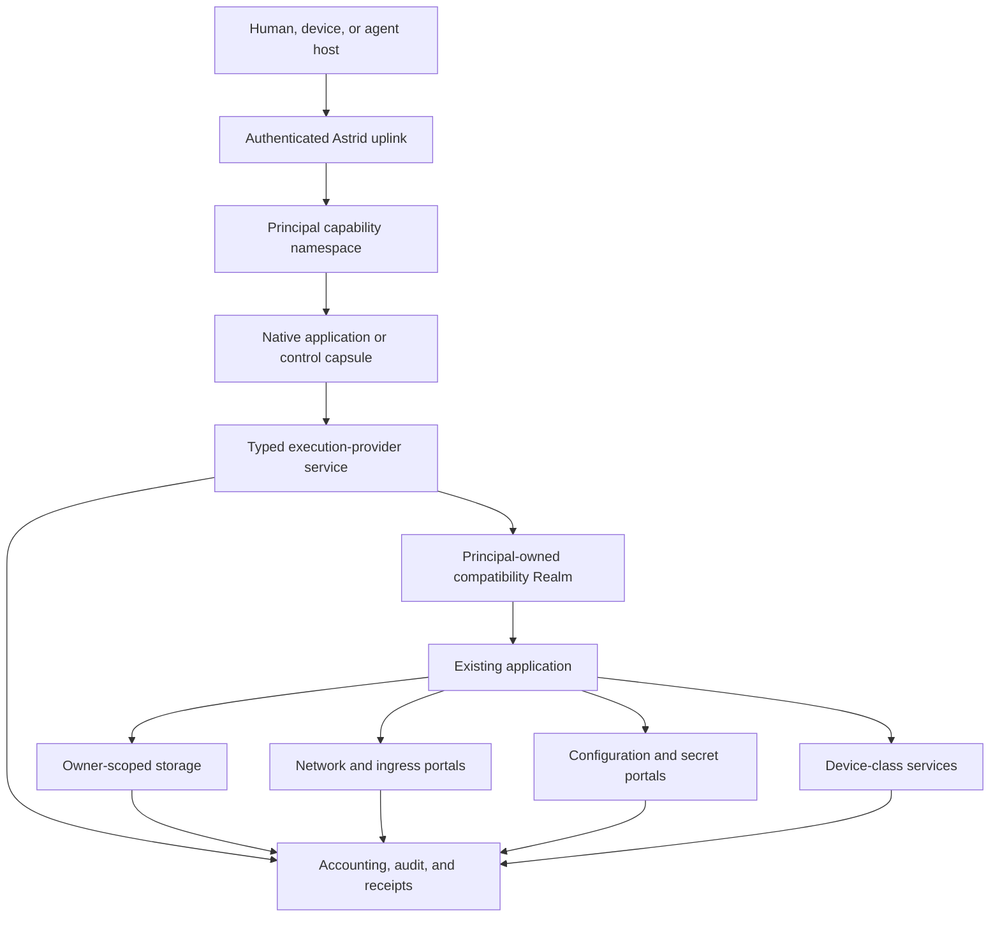

# Astrid Universal Application Substrate

Status: WP0 architecture freeze. This document is a locked architecture
contract, not an assertion that the kernel, Realm, Hermes, boot chain, or
first-owner ceremony has landed. No section is a standalone completion claim.

Canonical namespace: `astrid-runtime`. Redirects from `unicity-astrid` are not
authority.

Implementation epic: [astrid#1564](https://github.com/astrid-runtime/astrid/issues/1564)

Last reviewed: 2026-08-24

Evidence snapshot: `astrid-runtime/astrid` `origin/main`
`6e43da5f68f4ca10899236598988fe3ebadd7a39`. Historical branch snapshots and
green runs are not merge evidence.

Landed storage on this main, not future work:
[astrid#1535](https://github.com/astrid-runtime/astrid/pull/1535) merged
`3f82d81e` (2026-08-19);
[astrid#1562](https://github.com/astrid-runtime/astrid/pull/1562) merged
`0aca3f40` (2026-08-20);
[astrid#1601](https://github.com/astrid-runtime/astrid/pull/1601) merged
`a7d50f55` (2026-08-22). `AstridVolume` is media/projection over one catalog
CAS/blob path, not a second ingest. Volume WAL is the `transactions.wal`
region, default off, not a host `PathBuf` authority.

Types foundation [astrid#1565](https://github.com/astrid-runtime/astrid/issues/1565)
exists on `codex/resource-types-foundation`
`800cee5a4731c38a912ebc72f053c5165f8cd9b4`, with no pull request. Independent
local quality evidence on that SHA is 17 tests, `no_std`/`wasm32` checks,
`clippy -D warnings`, and `fmt`. It is not merged and is not a behavior change.

The first Linux Realm semantic backend is a recoverable RV64-in-WASM oracle
plus a BusyBox argv fixture. Hermes and native hardware virtualization are
later. [unicity-aos/aos-ce#77](https://github.com/unicity-aos/aos-ce/pull/77)
(`b64d8d94`, draft, conflicting) is inventory only.

Related documents:

- [Astrid Resource Ownership Model](astrid-resource-ownership-model.md)
- [Astrid AI-Native OS Workplan](astrid-ai-native-os-workplan.md)
- [Astrid Kernel Charter](astrid-kernel-charter.md)
- [Astrid Native Component Kernel](astrid-native-kernel.md)
- [Astrid Driver Domain Contract](astrid-driver-domain-contract.md)
- [Astrid Principal Store](astrid-principal-store.md)
- [Astrid Principal Store Runtime Realization](astrid-principal-store-runtime.md)
- [Astrid User, Fleet, and Principal Ownership](astrid-user-fleet-ownership.md)
- [Distro Signing and Trust](distro-signing.md)

## 1. Decision

Astrid is the operating system. Existing operating systems, language runtimes,
frameworks, agent harnesses, and applications are compatibility payloads or
service providers inside Astrid; they are not the authority beneath Astrid.

Astrid is a standalone, independently bootable operating-system substrate.
Astrid machine authority begins at verified firmware/loader handoff and the
native kernel. A distribution selects a signed Astrid System Generation:
system and provider Capsules, compatibility Realms, policy inputs, defaults,
applications, and update/recovery policy. The distribution does not replace or
sit beneath Astrid's machine authority.

Astrid also supports a hosted deployment on Linux, macOS, or Windows. Hosted
Astrid exposes the same principal, Capsule, storage, authority, generation, and
application contracts while explicitly inheriting firmware, kernel, process,
device, and physical-isolation guarantees from its host. It is a valid
deployment and development/conformance environment, but hosted evidence cannot
satisfy a standalone-machine, native boot, DMA-containment, or physical-device
claim. When hosted behavior and the portable Astrid contract disagree, the
contract and standalone executable evidence win.

An existing program should retain the ABI and ergonomics it expects while its
consequential effects map onto Astrid-owned resources:

```text
program-visible operation       Astrid-owned effect
-------------------------       -------------------
open/read/write/fsync           owner-scoped durable storage
socket/connect/listen           governed network and ingress portals
getenv/read credential          scoped configuration or secret delivery
spawn/exec/thread               principal-charged compute and lifecycle
clock/random                    admitted time and entropy services
device access                   typed device-class capabilities
stdout/stderr/logging           bounded streams, audit, and receipts
service discovery              principal capability namespace
```

Linux is the first broad compatibility personality because it admits existing
software with the least rewriting. It is replaceable. A principal's identity,
authority, state, applications, and history must survive replacement of the
Linux distribution, runtime backend, host operating system, or physical
machine.

The system therefore follows this rule:

> Preserve the application's interface; replace the plumbing beneath it with
> principal-scoped Astrid resources.

This specification is the joining contract for the hosted runtime, Principal
Store, Linux Realm, native component kernel, remote administration, distros,
and the first universal-application proof using Hermes Agent.

The resource ownership model defines the locked native semantics beneath this
product architecture. Where this document describes an application-facing
resource, the ownership model controls its authority, lifecycle, transfer,
accounting, and recovery behavior.

## 2. Scope and claim boundary

### 2.1 Goals

Astrid must support:

1. one verified immutable application closure reused by many principals;
2. isolated mutable state, secrets, processes, budgets, and capability
   namespaces for every principal;
3. unmodified or minimally adapted Linux applications without granting ambient
   host process, host filesystem, or host network authority;
4. native WASM components and compatibility workloads in the same authority
   model;
5. atomic system generations, rollback, recovery, and replacement of the
   compatibility distribution without replacement of principal state;
6. familiar human administration through authenticated remote CLI, mounted
   filesystems, terminal sessions, and an optional SSH compatibility gateway;
7. a bootable native Astrid system whose application, storage, authority, and
   receipt contracts are also provided by hosted Astrid deployments; and
8. measured economic evidence for artifact reuse, dormant-state cost, startup,
   execution overhead, storage amplification, and operational density.

### 2.2 Non-goals

This specification does not:

- define, ship, or privilege one canonical agent, reasoning loop, model
  provider, memory strategy, tool broker, prompt format, or harness;
- place Linux, POSIX, Python, Hermes, package management, or user policy in ring
  0;
- require existing applications to be rewritten as WASM;
- make a pathname, port number, process identifier, tool name, or manifest
  declaration an authority token;
- reproduce all of Unix or Rust `std` inside the native kernel;
- make a shared multi-tenant application process the principal isolation
  boundary;
- expose the host root filesystem, host process table, Docker socket, or host
  network namespace as a compatibility shortcut;
- claim binary compatibility before a conformance workload has run;
- let a host mint, copy, or widen action handles through labels, icons, or
  layout;
- treat QEMU, TCG, or KVM success as bare-metal, no-host, or hypervisor
  machine authority, or as proof that host or hypervisor authority is
  absent; or
- treat hosted success as evidence that Astrid itself boots, owns the machine,
  contains hardware effects, or satisfies a product release gate.

### 2.3 Terminology

- **Principal computer:** the durable logical computer projected to one
  principal: its capability namespace, service instances, private state,
  workspaces, budgets, and compatibility Realms.
- **Application closure:** an immutable, content-identified set of program,
  runtime, library, configuration-schema, and provenance objects.
- **System generation:** an atomically selectable immutable composition of
  Astrid services, application closures, compatibility images, and policy
  inputs. It excludes secrets and principal-writable state.
- **Realm:** a principal-owned compatibility environment implementing a guest
  ABI over Astrid resources. Linux Realm is the first implementation, not the
  definition.
- **Execution provider:** a typed service that admits, runs, supervises, and
  accounts for a workload without widening the caller's authority.
- **Portal:** a typed boundary that maps a guest-visible effect to an
  independently authorized Astrid resource.
- **Projection:** a consumer-specific view of an authoritative Astrid resource,
  such as a POSIX filesystem mount or a Linux block device.
- **Agent composition:** an ordinary distribution/application composition of
  Capsules, providers, state, tools, ingress, and policy. Astrid does not
  interpret an agent role: a loop Capsule, model connector, memory service, or
  tool provider is simply a component with typed resources and explicit
  authority.

## 3. System invariant

For every effect `E` requested by workload `W` on behalf of principal `P`, the
effective authority is intersection-only. The initiating authority is exactly
one host-stamped authenticated invocation or one durable, revocable service
lease; scheduled/background services do not fabricate a human session:

```text
effective(E) =
    (authenticated invocation authority OR admitted service-lease authority)
  ∩ principal P authority
  ∩ calling application/capsule authority
  ∩ execution-provider authority
  ∩ Realm-instance authority, when applicable
  ∩ guest job/process/descriptor authority, when applicable
  ∩ selected portal authority
  ∩ per-job resource and policy ceilings
```

No layer may union rights, infer authority from a name, or fall back to an
ambient host operation when an Astrid provider is unavailable. Failure to
resolve, authenticate, bind, meter, or establish required admission/receipt
evidence fails closed for the effect. Loss of observability-only telemetry
follows its declared continue-and-alert policy and is never represented as a
durable receipt.

The host or kernel stamps the effective principal. A guest payload cannot name
another principal, owner, fleet, workspace, secret set, or network policy to
change the binding.

## 4. Architecture



Astrid has two deployment modes. Standalone Astrid begins at firmware handoff
and owns the machine through its native kernel and system-service domains.
Hosted Astrid begins at an authenticated adapter boundary above an existing
host OS and inherits that host's lower-level guarantees. Both expose the same
portable semantic resources and run the same conformance suite, but only
standalone evidence establishes Astrid-owned machine authority. Hosted
implementation details must not enter application identity or durable principal
state.

## 5. Principal computers and shared applications

### 5.1 Share bytes, not authority

An application such as Hermes is installed once as an immutable closure. Many
principals may reference the same closure. Physical reuse is a placement
optimization, not shared ownership.

Each principal nevertheless receives a distinct logical service instance with:

- its own service identity and lifecycle generation;
- its own home, databases, sessions, memory, skills, and configuration;
- its own secret handles and provider credentials;
- its own process tree, descriptors, temporary state, and workspace mounts;
- its own CPU, resident-memory, storage, network, and operation budgets; and
- its own visible capability namespace.

The privacy ceiling for physical sharing and dedup is:

- the default is hostile-principal isolation of every physical sharing class;
- a sharing class is permitted only when a named, evidence-backed threat
  model covers that exact class;
- verified immutable application or system closure bytes remain a candidate
  sharing class, not an automatic exemption from isolation or leakage
  controls;
- hostile principals must not share writable pages, residual memory after
  use, credentials, or live handles;
- isolation and any permitted sharing class must cover storage contention
  and timing, dedup equality and existence observability, shared device
  queues, cache and microarchitectural channels, and any equivalent
  cross-principal leakage;
- logical owner, quota, accounting, and non-enumeration remain separate
  whether or not physical bytes are shared; they do not close those leakage
  classes by themselves; and
- content-addressed deduplication may share physical bytes of non-secret
  immutable objects without merging logical owners only when the named
  threat model for that class is proven.

A later measurement may prove a narrower sharing implementation. It cannot
relax this ceiling by default or treat cache warmth, logical accounting, or
non-enumeration as a security proof.

### 5.2 Lifecycle

A principal service may be:

- **cold:** no resident process or Realm memory; durable state remains;
- **starting:** immutable generation and principal state are admitted;
- **ready:** service endpoint is published in the principal namespace;
- **busy:** one or more bounded jobs are active;
- **draining:** new work is rejected while admitted work reaches a defined
  completion or cancellation boundary;
- **suspended:** a verified checkpoint and durable state exist without active
  compute; or
- **failed:** the endpoint is withdrawn and recovery policy decides restart,
  rollback, or operator intervention.

Namespace publication is atomic with readiness. A stale endpoint or handle must
fail closed after restart, replacement, revocation, or generation change.

### 5.3 Fleet sharing

Fleet storage, services, and application instances are separate owner classes,
not implicit extensions of every member's home. A principal sees a fleet
resource only through a granted mount or service handle. Mounting does not
create an owner, principal, quota, application, or workspace.

## 6. Application and system generations

### 6.1 Application descriptor

The universal application descriptor must name or derive:

- application identity and immutable closure root;
- executable entry points and supported execution-provider interfaces;
- guest ABI and architecture requirements;
- configuration schema and non-secret defaults;
- requested portals and their typed operations;
- resource-envelope requests and hard maxima;
- service endpoints, health checks, shutdown, and checkpoint hooks;
- durable-state schema version and migration hooks;
- upgrade, rollback, and incompatibility policy;
- provenance, source, builder, dependency, and signature evidence; and
- expected conformance suite and known semantic gaps.

The descriptor requests authority. It never grants itself authority.

### 6.2 Closure identity

Application identity must exclude:

- principal identifiers;
- secrets;
- writable homes and databases;
- invocation workspaces;
- host paths;
- runtime process identifiers;
- transient network endpoints; and
- machine-local compiled caches unless their compatibility tuple is part of a
  separate derived identity.

A target-specific AOT artifact or Realm image is derived from the canonical
source closure and an exact build/target profile. The derivation binds its
builder, inputs, configuration, target ABI, and output digest.

### 6.3 Atomic selection

An update constructs and verifies a complete candidate generation before
selection. Selection atomically changes one generation pointer. Activation and
data migration are separately receipted. Rollback changes the selected system
generation without silently rolling back or discarding principal data.

Garbage collection follows live roots, retained rollback generations, active
leases, checkpoints, exports, and policy pins. It must not scan a host directory
and infer authority from whatever files remain there.

## 7. Execution-provider contract

The first internal execution-provider contract must be Linux-neutral even when
Linux Realm is its first consumer. It requires at least:

```text
inspect(provider, stamped_context) -> capabilities and limits
admit(stamped_context, application, generation, resource_request, portals) -> instance
start(instance) -> lifecycle generation
execute(instance, job, stdin, workdir, limits) -> streams and result
attach(instance, stream_or_terminal) -> bounded attachment
signal(instance_or_job, typed_signal) -> acknowledgement
checkpoint(instance, policy) -> immutable checkpoint reference
restore(instance, checkpoint, refreshed_portals) -> lifecycle generation
drain(instance, deadline) -> outcome
stop(instance, reason) -> outcome
status(instance) -> typed state and accounting
```

Every handle binds provider identity, application generation, owner principal,
authority epoch, lifecycle generation, and resource envelope. Workdir and mount
selection use admitted opaque attachments, not guest-supplied host paths.

The provider may implement execution through:

- an Astrid-native WASM component;
- nested core WASM;
- an interpreted or translated Linux machine;
- hardware virtualization behind the same Realm contract;
- a remote Astrid execution domain; or
- a future architecture-specific native domain.

Provider replacement is permitted only when the conformance suite establishes
the promised behavior and receipts state the selected backend. There is no
silent host-shell fallback.

## 8. Astrid-owned plumbing

### 8.1 Storage

Authoritative storage is the owner-scoped Principal Store over `AstridVolume`,
not a host directory. `AstridVolume` is media/projection: it holds bytes and
recovery regions for the one catalog CAS/blob path. It is not a second ingest,
not a second store, and not an owner. A hosted deployment may place the volume
in a host file; bare metal may place it on a block device; tests may use
memory. Those are providers of the same path-free volume contract. A host file
or `PathBuf` that contains the volume is placement, not owner authority.

Applications receive one or more projections:

- immutable system/package generation;
- principal-durable home or application state;
- explicitly granted workspace;
- explicitly granted fleet share;
- ephemeral temporary storage; and
- optional synthetic status/device trees.

The application cannot select an owner through a path. The kernel-issued lease
or portal handle fixes the owner and access mode.

### 8.2 Filesystem and block semantics

Astrid must not describe all storage projections as equivalent. Providers must
advertise supported semantics, including:

- atomic rename and replacement;
- durability and flush boundaries;
- file and directory identity;
- sparse files and allocation behavior;
- links and path traversal;
- advisory and mandatory locking;
- memory mapping;
- open-after-unlink;
- mode, ownership, and extended attributes;
- device and special-node behavior; and
- crash recovery.

Simple native capsules should use typed file/object/KV interfaces. Compatibility
workloads that require SQLite, compilers, package managers, or databases should
receive a block-local filesystem or another provider that actually satisfies
their POSIX expectations. A narrow 9P projection must not be represented as a
general POSIX disk merely because ordinary reads and writes work.

### 8.3 Processes and compute

Astrid owns admission, attribution, ceilings, cancellation, and lifecycle.
The compatibility personality may implement process identifiers, signals,
pipes, threads, and exec semantics internally, but it cannot mint additional
CPU, memory, descriptors, executable artifacts, or external effects.

Child and sub-agent budgets attenuate from the parent's delegated authority.
Resident memory uses a host-wide physical ledger and per-principal logical
charges. Termination, crash, revocation, and principal deletion release every
non-durable reservation.

### 8.4 Networking and ingress

Guest sockets terminate in an Astrid network portal or virtual device whose
policy is bound before use. The portal owns:

- DNS and endpoint resolution policy;
- destination and listen scope;
- protocol, byte, connection, and rate ceilings;
- TLS key and certificate access where delegated;
- connection attribution and revocation;
- inbound route publication; and
- audit and receipt coverage.

Applications may retain normal sockets. They must not receive a raw host network
namespace as an implementation shortcut. Provider capsules should hold external
service credentials where possible; compatibility secrets placed in a guest
environment are an explicitly broader grant.

### 8.5 Configuration and secrets

Non-secret configuration is versioned input to an application instance. Secrets
are independently authorized resources. A secret may be delivered as:

- an operation-specific connector handle;
- a short-lived file or descriptor;
- a bounded environment value for an unmodified application; or
- a local proxy that performs the credentialed operation without revealing the
  credential.

The narrowest compatible delivery wins. Secret rotation must not require
rebuilding the immutable application closure.

### 8.6 Time, entropy, devices, and observability

Clock and entropy providers state their guarantees. Checkpoints cannot restore
stale authority, secrets, wall clocks, nonces, or live handles.

Hardware is exposed through typed resource services. A guest never receives
arbitrary MMIO, DMA, interrupts, or physical addresses. Astrid has no
privileged driver subsystem. Device-specific behavior lives in restartable
provider Capsules or isolated compatibility/device Realms. Ring 0 owns only
discovery facts, protection, interrupt routing, IOMMU/DMA mediation and
revocation, reset, quarantine, and capability transfer. It contains no
device-class policy, vendor protocol, filesystem, network stack, dynamically
loaded module, or conventional driver stack.

Normal application output remains ergonomic. Detailed principal, generation,
authority, accounting, and causal evidence belongs in structured operator
receipts rather than being injected into every model response or terminal line.

## 9. Storage independence is the immediate dependency

The host-filesystem-independent storage programme has landed on `origin/main`
through [astrid#1535](https://github.com/astrid-runtime/astrid/pull/1535),
[astrid#1562](https://github.com/astrid-runtime/astrid/pull/1562), and
[astrid#1601](https://github.com/astrid-runtime/astrid/pull/1601). Dependent
universal-application work consumes that volume, owner, mount, and recovery
contract. It must not invent a parallel persistence authority or a second
ingest.

The remaining sequence is:

1. place remaining authoritative system, principal, fleet, audit,
   capsule-registry, configuration, secret metadata, and workspace state
   behind the landed typed storage interfaces;
2. retain host paths only as hosted volume placement, explicit external
   attachments, import/export sources, and human mounts;
3. keep certifying recovery, migration, quota, compaction, physical
   reclamation, and mounted-provider behavior against the landed volume;
4. expose owner-bound filesystem and block portals without leaking provider
   paths into requests;
5. make the same volume and storage protocols available to native user-space
   storage domains; and
6. preload the authenticated kernel, recovery, and initial provider bundle
   before kernel handoff, then give an isolated storage provider mediated
   device resources while keeping device protocol, filesystems, databases,
   placement, and GC outside ring 0.

`AstridVolume` remains media/projection over one catalog path. Host
independence does not mean that the hosted deployment stops using files. It
means host filesystem objects no longer define Astrid identity, ownership,
authority, or logical layout.

## 10. `no_std`, `std`, and compatibility semantics

### 10.1 Direct answer

Astrid needs a `no_std` kernel and portable `no_std` contracts. It does **not**
need to recreate the complete Rust standard library or complete POSIX semantics
inside ring 0.

Astrid must own the semantics that form its security and recovery boundary:

- memory and protection domains;
- capability handles and revocation;
- IPC, waits, deadlines, and cancellation;
- scheduling and resource accounting;
- interrupt, DMA, and device admission;
- boot, measurement, recovery, and monotonic epochs; and
- device-independent clock, entropy, bounded debug, and resource mediation
  needed to start preloaded user-space services.

Filesystems, sockets, TLS, package management, SQLite, shells, process models,
and broad language-runtime behavior belong outside ring 0.

### 10.2 Rust portability classes

The workspace should classify crates explicitly:

1. **Kernel/ABI (`#![no_std]`, normally no allocator in critical paths):**
   syscall and IPC structures, identifiers, capability rights, bounded codecs,
   boot records, and architecture-independent kernel objects.
2. **Portable system library (`#![no_std]` plus `alloc`):** canonical encodings,
   crypto primitives where supported, typed resource clients, storage formats,
   and pure policy/state machines.
3. **Native Astrid user-space:** small executors and runtime hosts built against
   the Astrid native ABI; use `alloc` and selected portable libraries, with no
   assumption of Unix processes or paths.
4. **Hosted adapters (`std`):** Tokio, Unix sockets, FSKit/FUSE/WinFsp,
   host-process sandboxes, host networking, CLI, and desktop integration.
5. **Compatibility payloads (`std`/libc/POSIX as expected):** Linux programs,
   Python, Node, databases, compilers, and agent harnesses. Their familiar
   semantics are supplied by the Realm and its advertised storage/network
   providers.

Feature boundaries must be additive and testable. A portable crate must not
hide host filesystem, environment, thread, wall-clock, or socket use behind a
default feature that native builds accidentally enable.

### 10.3 Astrid native ABI

The native ABI should stay smaller and more explicit than POSIX. It requires
bounded operations for:

- domain and thread lifecycle;
- memory allocation, mapping, protection, and shared-memory handles;
- capability transfer and revocation;
- endpoint send/receive and multiplexed waits;
- monotonic timers and deadlines;
- structured fault delivery;
- block, stream, interrupt, and DMA resource handles; and
- audit/recovery events.

Higher-level Rust crates can construct ergonomic async, file, network, and
service APIs over those primitives. Compatibility Realms construct POSIX
semantics over the same resources. The kernel does not expose a global Unix
filesystem or process namespace.

### 10.4 Optional Rust `std` target

A future Rust target with an Astrid `std` port may be valuable for conventional
native applications. It is optional and sequenced after the ABI stabilizes.
Such a port would define threading, synchronization, time, networking,
filesystem, environment, panic, and process behavior over Astrid services. It
must not become a prerequisite for the kernel, component host, or Linux
compatibility path, and it must not pretend unsupported Unix behavior exists.

### 10.5 Conformance rule

Every semantic surface is versioned and advertised. An application is admitted
only when its required semantics are a subset of those supplied by the selected
provider. Provider names such as `linux`, `posix`, `filesystem`, or `std` are not
sufficient evidence; executable conformance cases establish the claim.

## 11. Agents are applications; Hermes is one reference workload

Astrid does not make the agent. An agent may run inside Astrid as:

- an existing harness such as Hermes inside a compatibility Realm;
- a native Capsule composition whose replaceable parts provide a loop, model
  access, memory, tools, ingress, and presentation; or
- another application graph selected by a distribution or user.

The composition mechanism stays small: verified component identities, typed
links, resource attachments, state roots, authority requests, and lifecycle
selection. Astrid does not assign special kernel meaning to “agent”, “ReAct”,
“model”, “memory”, “tool”, or “prompt”.

A distribution may expose a composition as maximally inspectable and hackable:
parts can be replaced, rewired, or developed locally, with each executable
change producing a new application generation and fresh admission. It may
instead publish a frozen, reproducible, signed closure whose parts change only
through reviewed generation replacement. Hackable and frozen are policies over
the same composition format; neither requires a second runtime or authority
model. Mutable principal state remains separate in both cases.

Hermes is the first forcing workload because it combines Python, native wheels,
HTTP model access, MCP, subprocesses, skills, persistent memory, SQLite,
long-lived gateway operation, messaging ingress, and human terminal UX.

Hermes is not the Astrid agent, a mandatory system service, or the template every
native agent must copy. It is one compatibility and economics conformance
workload.

### 11.1 Sharing and isolation

Astrid stores one immutable Hermes closure and one or more compatible Realm
system generations. Each authorized principal receives a separate Hermes
service instance and private `HERMES_HOME`. Immutable Python packages and image
pages may be reused; configuration, sessions, databases, memory, skills,
credentials, processes, and workspaces may not.

### 11.2 Initial compatibility closure

The first Hermes closure must contain:

- an exact upstream Hermes revision;
- Python within Hermes's declared supported range;
- all direct and transitive dependencies with hashes and provenance;
- prebuilt guest-architecture native extensions or reproducible source-build
  derivations;
- CA roots and timezone data;
- a fixed launcher and configuration schema;
- no online `pip`, `uv`, package-hook, or `curl | sh` step at activation; and
- an SBOM and vulnerability-review receipt.

The current Realm Python and Hermes Python constraints must be reconciled in the
image derivation rather than bypassed with an unsupported interpreter.

### 11.3 Vertical slices

#### H0: dependency and filesystem proof

- Import the immutable Hermes closure without network installation.
- Place one private `HERMES_HOME` on an application-consistent durable provider.
- Run Hermes import, configuration, SQLite, skill discovery, and session-store
  probes without a model call.
- Crash at named storage boundaries and prove recovery.

#### H1: one governed turn

- Admit one principal and one workspace.
- Deliver one model-provider capability through a governed connector or
  domain-scoped HTTPS portal.
- Run one headless Hermes turn with a minimal tool set.
- Bind result, model, application generation, principal, workspace generation,
  egress policy, resource use, and state transition into a receipt.

#### H2: Astrid tool plumbing

- Expose the principal's live Astrid capability namespace to Hermes through a
  stable adapter.
- Prefer typed remote tools/connectors over guest-local replicas.
- Map approvals and cancellation across the boundary.
- Prove that a tool visible to Alice is neither enumerable nor callable by Bob.

#### H3: supervised service

- Run the Hermes API/gateway as a supervised principal service.
- Publish readiness atomically and support streaming, cancellation, draining,
  restart, and checkpoint-aware recovery.
- Scale an idle instance to cold state and restore it without changing service
  identity or losing committed sessions.

#### H4: human ergonomics

- Attach a terminal when PTY semantics are available.
- Support messaging ingress through Astrid routes and connector capsules.
- Support authorized SSH attachment to the principal computer without exposing
  a host shell.

### 11.4 Hermes claim gate

Astrid may claim “Hermes runs on Astrid” only when H1 passes on a released
standalone Astrid System Generation. It may claim “Hermes is an Astrid service”
only when H3 passes natively. It may claim “multi-principal Hermes” only after
the concurrent hostile isolation, accounting, restart, and revocation corpus
passes on standalone Astrid. Hosted results remain differential evidence.

## 12. Human and operator access

### 12.1 Higher-layer experience enabled by Astrid

Astrid does not own or render a graphical desktop, Home, component tree, or
personal interface. Higher-layer hosts may build those experiences over the
substrate defined here. This section describes a forcing consumer experience,
not an Astrid-owned product surface or kernel service.

A graphical host may present a small number of immediately legible
concepts:

- **Spaces:** personal or collaborative compositions of work, people, agents,
  services, and explicitly attached resources;
- **ongoing work:** durable activities that can be resumed where they were
  left;
- **collaborators:** humans and agents such as Hermes acting inside the current
  admitted context;
- **owned things:** semantic objects the person can inspect or use directly;
  and
- **changes:** an attributable timeline of consequential effects, receipts,
  and available compensating or rollback operations.

Such an experience answers “where am I?”, “what is happening?”, “what can I
continue?”, and “what can I ask?” without exposing principals, capabilities,
mounts, Realms, providers, or generations as normal product vocabulary. Those
mechanisms remain available through progressive disclosure for administration,
recovery, and exact authority inspection.

A Space is a higher-layer presentation and navigation composition with
explicit Astrid resource attachments.
It is not a principal, owner, capability set, policy realm, filesystem
namespace, or ambient context switch. Entering or sharing a Space never changes
the kernel-stamped principal or widens the accessible resource set. Missing or
stale attachments become non-enumerating unavailable placeholders and never
silently retarget. Cross-Space drag/drop proposes a typed copy, move, share, or
delegation operation; it does not itself transfer authority.

### 12.2 Host-facing semantic state and action boundary

Astrid exposes principal-scoped typed objects, relationships, current state,
and proposed actions through a host-neutral boundary. A consuming host may
translate that boundary into A2UI, graphical, terminal, accessibility, or other
native experiences. Astrid does not own layout, components, rendering,
personalization, or the visual metaphor.

The normative invariant is:

> A host projection of Astrid state is never Astrid identity, authority,
> consent, or policy. Presentation and personalization remain host concerns.

The architecture separates three concerns:

1. an **Astrid projection boundary** exposing bounded typed state, object
   identities, eligible action descriptors, and Astrid-issued admitted action
   handles;
2. a **host-owned experience** controlling scenes, components, layout, density,
   modality, accessibility, theme, and personalization; and
3. an **Astrid enforcement boundary** controlling authenticated context,
   authority validation, action dispatch, lifecycle, and receipts.

Astrid's boundary contains no HTML, JavaScript, CSS, webviews, layout tree, or
executable presentation instructions. Any A2UI-like component grammar and its
rendering limits belong to the consuming host.

Astrid issues every actionable element's opaque admitted action handle. The
handle is an Astrid table entry, not a host token. Its entry binds the
canonical action-descriptor digest, view revision, target semantic-object
identities, typed arguments, authority delta, confirmation policy, expiry, and
relevant principal/session/application/provider/lifecycle/attachment epochs.
A host may present labels, icons, ordering, layout, and component state derived
from the descriptor. Presentation never mints, copies, widens, or substitutes
an action handle, and a visible control is not authority. Every invocation
revalidates current authority through the ordinary admission path.

For authority expansion Astrid emits typed pending-operation data and a
single-use challenge bound to the exact operation and authenticated context. A
trusted host decides how to present that decision and returns the bound
response; Astrid validates and consumes it. Astrid does not own the graphical
chrome, but arbitrary application or agent content cannot substitute for the
host's confirmation path. Generic semantic `Confirm`, clicks, drag/drop, or
elicitation responses are not consent.

Type metadata may be cached globally, but the visible semantic catalog is
filtered by the current stamped principal, admitted application/Space
attachments, and exact generations. Knowing a schema, topic, name, or receipt
grants no right to enumerate, subscribe, publish, invoke, or view data. Schema
collisions reject rather than overwrite. WIT descriptions and agent prose are
untrusted descriptive content, not security language.

The earlier in-runtime agent-owned A2UI/TUI design in issues #629 and #630 is
not revived. Build internal Rust projection/action domain types first. A
presentation owner may separately prove an A2UI-like protocol and
multiple renderers without making Astrid itself the UI framework.

### 12.3 Authentication and principal selection

Remote access authenticates a user/device or machine credential first. The
session then requests a principal view. The authority service verifies that the
authenticated subject owns, operates, or holds an explicit delegation for that
principal.

```text
device or user authentication
  -> authorized principal selection
  -> principal-bound session capability
  -> capability namespace and optional workspace attachments
  -> shell, service, filesystem, and management operations
```

The selected principal cannot be changed by a later command argument. An admin
“act as” operation is an explicit, scoped, time-bounded delegation with an audit
record. User identity, fleet role, principal ownership, and operator authority
remain distinct.

### 12.4 Native administration

The primary interface is the Astrid CLI/API, with context switching across
hosts. It should provide at least:

```text
astrid context add|list|use|current
astrid auth login|status|logout
astrid principals list|show
astrid services list|show|start|stop|restart
astrid exec --principal <p> -- <command>
astrid attach --principal <p> <service-or-session>
astrid logs --principal <p> --follow
astrid usage --principal <p>
astrid grants inspect|trace|revoke
astrid storage mount|status|sync|unmount
astrid system generations|switch|rollback|doctor
```

The API returns typed state. Terminal rendering is a client concern.

### 12.5 SSH compatibility gateway

An optional SSH gateway may preserve familiar `ssh`, terminal forwarding, and
SFTP ergonomics. It is a protocol adapter to the same authenticated Astrid
session and never an ambient Unix login service.

- SSH public keys bind devices/users, not unrestricted host accounts.
- Requested user/principal names are authorization requests.
- A shell attaches to a principal-owned Realm or native management session.
- SFTP projects an owner-bound storage lease.
- Port forwarding requires separate ingress/egress capabilities.
- Agent forwarding, host filesystem access, and host process access are denied
  unless separately modeled and explicitly granted.
- Session close revokes invocation-scoped attachments and handles.

Local recovery retains a minimal console path that can inspect boot slots,
storage health, authority epochs, audit integrity, and service failures without
requiring the normal application stack.

## 13. Distro and Nix-inspired generation model

Astrid should adopt the useful Nix properties without making Nix its kernel or
authority model:

- content-identified immutable inputs and outputs;
- complete closure verification;
- reproducible derivations;
- atomic profile/generation switching;
- rollback by root selection;
- shared physical artifacts under the section 5.1 privacy ceiling;
- garbage collection from declared live roots; and
- a strict separation between immutable system and mutable state.

Two meanings of “distro” must remain explicit:

1. An **Astrid distribution** is a signed composition of capsules, applications,
   services, compatibility Realms, configuration schemas, and authority
   requests. It is a distribution built on Astrid, analogous to a Linux
   distribution rather than an operating system beneath Astrid. It owns product
   selection, defaults, channels, installer policy, and presentation; Astrid
   owns the boot, authority, resource, storage, Capsule, generation, and
   recovery contracts it must satisfy.
2. A **Linux distribution generation** is an optional compatibility image
   selected by an Astrid application or system generation.

Reprovisioning a distro must transactionally reconcile the installed set.
Artifacts removed from the new signed closure cannot continue loading merely
because old directories remain. Side-loaded artifacts have separately recorded
provenance and are not silently pruned as if they belonged to the distro.

A distribution decides which compositions are editable, which inputs may be
overridden, and which closures are frozen. Astrid supplies one transparent
generation mechanism for both: edits never mutate an already identified
closure; they derive a new candidate, make its authority delta visible, and
switch only after admission. A frozen distribution may disable local
derivation entirely.

## 14. Standalone and hosted deployments

### 14.1 Hosted Astrid

The current daemon is a supported hosted deployment and remains useful for
incremental adoption, development, migration, CI, and differential conformance.
It may use Tokio, Wasmtime, host files, sockets, platform mounts, and OS
sandboxes internally. Those dependencies live behind provider traits and do not
define Astrid resource identity. Its security statement names the inherited
host boundary explicitly. A hosted result can complete a hosted claim, but not
a standalone boot, machine-authority, DMA, recovery-independence, or physical
hardware claim.

### 14.2 Standalone Astrid

The freestanding system uses:

- a minimal `no_std` capability kernel in ring 0;
- restartable ring-3 init/recovery, runtime, storage, identity, admission,
  network, audit, update, hardware-provider, and application domains;
- a `no_std`/`alloc` component host using verified AOT or Pulley artifacts;
- the same Principal Store formats and logical protocols over a native block
  provider;
- the same signed system/application generation model; and
- the same principal namespace, execution-provider, portal, and receipt
  semantics.

Linux runs as a Realm in user space. The first semantic backend is a
recoverable RV64-in-WASM oracle plus a BusyBox argv fixture. A later
hardware-virtualized backend may replace interpretation where available, but
it must reproduce the same authority, storage, portal, lifecycle, checkpoint,
and accounting contract. Neither QEMU nor a hosted Realm proves native machine
authority.

### 14.3 Conformance corpus

The same corpus must run against hosted and native providers:

- capability visibility and stale-handle rejection;
- owner-scoped file/object/KV operations and crash recovery;
- application generation admission and rollback;
- execution, cancellation, resource exhaustion, and process-tree cleanup;
- network destination/listener policy and revocation;
- secret isolation and rotation;
- checkpoint authority refresh;
- receipt completeness for receipt-required effects plus declared behavior for
  observability loss; and
- concurrent hostile principals.

Provider-specific performance is reported separately from semantic conformance.

### 14.4 Mandatory boot and recovery chain

```text
firmware / UEFI
  -> firmware authenticates the Astrid loader
  -> loader separately verifies the Astrid kernel/bootstrap closure and the
     distribution-supplied immutable System Generation, then preloads both
  -> ring 0 establishes CPU, memory, protection, scheduling, IPC, discovery
     facts, interrupt routing, IOMMU/DMA mediation, reset, and capabilities
  -> plan-bounded init/recovery realizes the selected A/B system generation
  -> hardware claims are transferred to isolated provider Capsules or dedicated
     compatibility/device Realms
  -> audit, storage, Principal Store, identity/key, time/entropy, component-host,
     admission, network/uplink, update, and administration services become ready
  -> principals, Capsules, compatibility Realms, and applications may start
```

The sealed boot bundle contains enough authenticated provider artifacts to
reach storage and recovery without conventional device-specific code in ring
0. The initial experimental machine contract is x86-64 QEMU/KVM with UEFI,
fixed memory, one CPU, serial diagnostics, APIC timer, and an explicit
virtio/IOMMU topology. QEMU, TCG, and KVM runs establish only the named
emulator machine-contract enforcement boundary. They are functional and
conformance evidence for that emulator contract. They never establish
bare-metal, no-host, or hypervisor machine authority, DMA containment
against a malicious hypervisor, or physical-machine ownership. Standalone
machine-authority claims are reserved for named physical board, firmware,
and device evidence. First-owner enrollment remains the unresolved
ceremony in section 14.5 and is not this contract. The contract becomes a
supported machine only after install, interrupted-update, rollback,
recovery, isolation, and hardware-provider gates pass on its exact named
claims. Physical-hardware support requires a separately named board,
firmware, and device contract with continuous hardware evidence.

### 14.5 Trust-boundary handoff and first-owner enrollment

Machine authority is a chain of named handoffs, not a successful boot log.
Each stage authenticates the next and cannot mint owner identity for the one
after it:

```text
board firmware
  -> authenticates the Astrid loader; firmware identity is board evidence,
     not Astrid owner identity
  -> loader verifies the kernel/bootstrap closure and the distribution
     System Generation as separate signed artifacts
  -> ring 0 accepts only those verified closures and establishes protection,
     DMA mediation, and capability transfer
  -> recovery/init realizes the selected generation from the sealed bundle
  -> first-owner enrollment binds a user/device credential to machine
     ownership through a dedicated ceremony
  -> ordinary principal login, remote administration, and application start
     consume that enrolled ownership; they never create it
```

Distribution signing selects and authenticates the System Generation. It does
not enroll the machine owner and does not make the first installer process an
administrator.

The first-owner ceremony is an unresolved contract. Until it is specified and
proven, no product claim of the form "this standalone machine has an owner" is
authorized. The freeze already rejects these substitutes:

- a default root or first-user account;
- local console presence as administrator authority;
- first network caller, first CLI context, or first SSH key as owner;
- TOFU of an unauthenticated daemon as machine ownership; and
- recovery-console reachability as enrollment.

The unresolved ceremony must bind an authenticated user/device credential to
machine ownership, be distinct from ordinary principal login, survive
interrupted update and recovery, and fail closed if no owner has been
enrolled. This document does not choose the ceremony mechanism.

## 15. Security invariants

The implementation must preserve these properties:

1. A guest cannot select or forge its effective principal.
2. A path cannot select an owner outside its admitted mount or portal.
3. A name, descriptor, manifest, endpoint, or object digest is not authority.
4. A child process or sub-agent cannot exceed delegated parent budgets.
5. Shared immutable bytes never make mutable principal state shared.
6. A compatibility workload receives no ambient host process, filesystem,
   network, credential, device, or control-plane access.
7. Portal loss, revocation, provider failure, and stale lifecycle generations
   fail closed without fallback.
8. Checkpoint restore refreshes principal, authority, workspace, network,
   secret, time, and lifecycle bindings.
9. Installation, execution, promotion, ingress publication, and authority grant
   are separate actions.
10. Ring-0 compromise authority stays minimal; filesystems, Linux, application
    policy, package managers, and agent logic remain outside it.
11. Recovery state is reserved and cannot be exhausted by ordinary principals.
12. Every externally consequential effect is attributable to principal,
    application generation, provider, authority epoch, and causal request.
13. Presentation never implies authority; only Astrid-issued admitted action
    handles are invocable.
14. Firmware, loader, distribution, recovery, and first-owner enrollment are
    distinct trust boundaries; none of the first four mints machine-owner
    identity.

## 16. Economic proof

The economic case must be measured against ordinary containers and VMs rather
than asserted from architecture. The benchmark suite records:

- physical bytes for one application versus 10, 100, and 1,000 principals;
- logical per-principal charge and physical deduplication separately;
- cold, warm, and checkpoint-restored startup latency;
- dormant bytes per principal;
- resident memory and CPU under idle, burst, and sustained workloads;
- storage write amplification, compaction, reclamation, and backup cost;
- Realm execution overhead versus native Linux and a conventional container;
- portal latency for files, network, secrets, and tools;
- scale-to-zero recovery time and first-token latency for Hermes;
- update download size and rollback time; and
- operator effort for install, upgrade, recovery, migration, and incident
  inspection.

Claims must state hardware, provider, application generation, workload,
concurrency, durability policy, cache state, and measurement interval. Shared
page-cache warmth and stored green fixtures are not independent economic proof.
Hostile-principal page or cache sharing is not an economic optimization that
overrides the section 5.1 privacy ceiling. Logical charges are reported even
when physical bytes are shared, and they do not close the named leakage
classes.

## 17. Reclaiming previous work

Previous implementation work should be reclaimed by contract and evidence, not
merged wholesale or rewritten from memory.

### 17.1 Host-independent storage and mounts

Treat the landed storage/mounted-filesystem programme
([astrid#1535](https://github.com/astrid-runtime/astrid/pull/1535),
[astrid#1562](https://github.com/astrid-runtime/astrid/pull/1562),
[astrid#1601](https://github.com/astrid-runtime/astrid/pull/1601)) as the
immediate substrate. This specification consumes its `AstridVolume`, owner,
filesystem, mount-lease, workspace, registry, audit, and migration boundaries
rather than creating a parallel application store. `AstridVolume` is
media/projection, not a second ingest.

Dependent work still reconciles remaining public types, filesystem semantic
profile, physical reclamation, and the native block-provider seam against
current main. Historical storage-branch hashes are not merge instructions.

### 17.2 Linux Realm

Recover the preserved Linux Realm source and installable artifact from its
owning repository/branch as inventory, not as a merge unit.
[unicity-aos/aos-ce#77](https://github.com/unicity-aos/aos-ce/pull/77)
(`b64d8d94`, draft, conflicting) is inventory only. The first semantic backend
is a recoverable RV64-in-WASM oracle plus a BusyBox argv fixture, before Hermes
and before native hardware virtualization. Inventory each capability and test
against the execution-provider and portal contracts above. Preserve
principal-resident, no-`host_process`, bounded `realm_shell`, durable home,
workspace, signed worker, and intersection-authority properties.

Forward-port rather than recreate:

- authenticated workspace attachment and lifecycle epochs;
- immutable system generation and checkpoint binding;
- application-consistent durable storage;
- long-lived service supervision;
- network, secret, and ingress portals;
- PTY only when the underlying process semantics are complete; and
- backend-neutral receipts and conformance cases.

Do not promote the current Realm to a production general Linux claim until its
advertised Python, package, network, PTY, filesystem, and service semantics pass
the relevant workload gates.

### 17.3 Native kernel skeleton

Recover the isolated native-kernel branch as the executable proof of boot,
memory protection, domains, capabilities, IPC, legibility, and audit ordering.
Keep it isolated until the current draft's failures, determinism, supervisor
fault delivery, and reclaim behavior are resolved.

The older `astrid-native-kernel.md` implementation programme is retained as a
historical research record, not a normative milestone plan. Its conventional
driver-host, ring-0 virtio bootstrap, System Distro, and Dock milestones are
superseded by this specification, the kernel charter, and the hardware-provider
model. Reclaim mechanisms and tests individually; do not inherit its product or
distribution ownership.

Do not add filesystems, Linux, Hermes, policy engines, or application semantics
to ring 0. The next reclaim increment should connect a small native block/IPC
ABI and a restartable user-space service, then run the hosted/native conformance
corpus.

### 17.4 Earlier unikernel and `no_std` reconnaissance

Retain the useful seams:

- injected `KernelResources` and provider traits;
- portable task/time/storage/capability libraries;
- Wasmtime custom-platform/AOT/Pulley analysis;
- Hermit and other kernels as mechanism references; and
- load-time-bound device handles instead of arbitrary MMIO.

Reject the collapsed premise that a Hermit appliance, a hosted daemon, and the
Astrid trusted kernel are interchangeable projects. They are different hosts
for related contracts with different TCBs and evidence.

## 18. Implementation programme

### Stage A: adopt the contract and consume landed storage

- Review and adopt this specification as the umbrella architecture.
- Consume the landed host-independent storage/mount programme
  ([astrid#1535](https://github.com/astrid-runtime/astrid/pull/1535),
  [astrid#1562](https://github.com/astrid-runtime/astrid/pull/1562),
  [astrid#1601](https://github.com/astrid-runtime/astrid/pull/1601)) rather than
  relanding it.
- Land or rebase the portable resource-types foundation
  ([astrid#1565](https://github.com/astrid-runtime/astrid/issues/1565)
  `800cee5a`) as types only; it is not a behavior or storage change.
- Publish exact storage, filesystem-semantic, mount-lease, owner, and native
  volume contracts from the landed types.
- Fix distro reconciliation so removed artifacts stop loading.
- Inventory crate portability and classify every host dependency.

Exit gate: authoritative Astrid state no longer depends on host directory
layout, no dependent design invents a second persistence authority, and the
portable resource vocabulary is available without claiming runtime behavior.

After Stage A, native machine authority and Realm semantics proceed as
independent tracks. Neither is a hidden prerequisite that freezes the other.

- **Track N, native machine authority:** Stages B and C. Boot, protection,
  DMA mediation, recovery, and one Capsule on the freestanding kernel.
- **Track R, first Realm semantic backend:** a recoverable RV64-in-WASM
  oracle plus a BusyBox argv fixture, before Hermes and before native
  hardware virtualization. AOS-CE PR #77 is inventory only.

Hermes on standalone Astrid (Stage E) consumes both tracks. It is not the
first Realm proof and not a native-kernel completion claim.

### Stage B: standalone boot and machine authority

- Freeze one experimental machine contract and its canonical firmware/loader
  handoff.
- Build deterministic signed boot images containing the kernel, plan-bounded
  init/recovery, and the initial provider bundle.
- Bring up memory protection, domains, scheduling, IPC, timers, interrupt
  routing, IOMMU/DMA mediation, reset/quarantine, capability tables, fault
  delivery, and recovery reserves.
- Prove that no device-specific protocol or conventional driver stack exists in
  ring 0.
- Start one preloaded provider Capsule or isolated device Realm from the signed
  boot plan and publish only its typed service.

Emulator exit gate: QEMU, TCG, or KVM evidence establishes only that the
named experimental machine contract in section 14.4 enforces protection,
capability, IPC, a hostile native domain, and authenticated sealed-bundle
recovery on that emulator. It never establishes bare-metal, no-host, or
hypervisor machine authority, and it does not prove DMA containment against
a malicious hypervisor.

Standalone machine-authority claims are reserved for separately named
physical board, firmware, and device evidence. First-owner enrollment
remains the unresolved ceremony in section 14.5 and is not this gate.

### Stage C: native system services and Capsule host

- Make ABI, identifiers, bounded codecs, authority, and storage-format crates
  compile under their declared `no_std`/`alloc` profiles.
- Bootstrap and supervise distribution-selected implementations of the required
  init/recovery, audit, identity/key, admission, resource-table, time/entropy,
  storage, update, administration, and component-host service classes.
- Run Principal Store through an isolated storage provider over mediated device
  resources.
- Start one existing Capsule through the freestanding component host.
- Run the hosted deployment as a supported adapter and differential oracle for
  the same portable contracts.

Exit gate: the standalone machine recovers durable state and serves one
principal Capsule operation without relying on a host daemon.

### Stage D: native universal-application control plane

- Define and implement application generations, execution providers,
  lifecycle, streams, cancellation, health, checkpoint, receipt, projection,
  action, attachment, and pending-confirmation types.
- Implement principal namespace publication, stale-handle invalidation, and
  typed storage, workspace, network, configuration, secret, and ingress portal
  bindings.
- Prove the projection/action boundary with non-graphical fixtures; graphical
  presentation remains distribution/consumer-owned. Action handles are
  Astrid-issued; host presentation cannot mint or widen them.
- On Track R, the first compatibility proof is the recoverable RV64-in-WASM
  oracle plus BusyBox argv fixture; it does not wait for native HV or Hermes.

Exit gate: two principals run one immutable application closure on standalone
Astrid with isolated state and resources; revocation and replacement fail
closed.

### Stage E: Linux Realm and Hermes on standalone Astrid

Hermes is a later forcing workload, not the first Realm semantic backend and
not a native-kernel completion claim.

- Supply compute, storage, clock, entropy, and portal providers from native
  domains.
- Boot the Linux Realm as a principal-owned compatibility provider after the
  Track R oracle and BusyBox fixture.
- Produce the hermetic Hermes closure and execute H0/H1 through that Realm.
- Store, crash, recover, and receipt the resulting principal state.
- Run the application conformance corpus and record exact cost evidence.

Exit gate: released native artifacts and a reproducible standalone test prove
the narrow “Hermes runs on standalone Astrid” claim. Hosted Hermes may
separately satisfy an explicitly hosted-Astrid claim. That claim still does
not prove native machine authority or first-owner enrollment.

### Stage F: services, administration, distribution, and recovery

- Add Hermes tools, supervision, scale-to-zero, attachment, reconnect, and
  current-authority refresh.
- Complete authenticated CLI contexts, principal shell/attach, storage mounts,
  and optional SSH/SFTP adapters.
- Let distributions and consuming hosts select product composition and
  presentation without widening Astrid authority.
- Build and test distribution-neutral bootstrap, slot activation,
  System-Generation selection, interrupted-update, rollback, state-migration,
  authenticated-recovery, and destructive-reset primitives and contracts. A
  distribution-owned installer supplies workflow, policy, and presentation.

Exit gate: an authorized operator can install, provision, update, roll back,
recover, administer, and leave a standalone Astrid machine without ambient or
stale authority.

### Stage G: broader machine and application ecosystem

- Qualify additional machine contracts and hardware providers behind the frozen
  resource interfaces.
- Add compatibility personalities only for demonstrated workloads.
- Add graphics, audio, accelerator, input, and other device services through
  typed provider Capsules or isolated device Realms.
- Establish third-party distribution, application, provider, certification,
  and update tooling.

Exit gate: distributions and application authors can target Astrid-native
services or bring existing application closures while Astrid retains one
coherent boot, authority, storage, lifecycle, hardware-resource, and recovery
model.

## 19. Contract and RFC ownership

This document belongs in `astrid` because it governs internal architecture and
cross-repository implementation order. Public capsule-visible WIT changes must
be proposed separately in `astrid-rfcs` and land in canonical `wit` before SDK
and implementation activation.

Expected contract work includes:

- execution provider and application lifecycle;
- lifecycle-stamped service handles and namespace deltas;
- typed stream, terminal, signal, cancellation, and status surfaces;
- stable workspace attachment identity and epoch;
- filesystem semantic profiles and optional operations;
- block-volume portal where compatibility workloads require it;
- network connect/listen and ingress route resources;
- configuration and secret resource delivery;
- checkpoint prepare/commit/restore hooks; and
- application generation, migration, promotion, and receipt types.

Start with internal Rust protocols where possible. A public WIT contract is
justified only when independently released capsules must implement or consume
the boundary.

## 20. Required evidence

No stage is complete from documentation or fixture success alone. This
document is not evidence. The evidence set must include:

- exact source and artifact digests;
- reproducible build instructions;
- negative authority and cross-principal tests;
- crash and power-loss injection at named boundaries;
- cancellation, timeout, quota, and exhaustion cases;
- stale-handle, restart, upgrade, rollback, and revocation cases;
- filesystem and application conformance workloads;
- hosted/native differential results;
- migration from released state, not synthetic state alone;
- hostile manifest, image, checkpoint, and portal inputs;
- measured performance and economics with stated baselines; and
- a claim ledger distinguishing captured, prototyped, verified, and production
  properties.

Execution-scope claims are falsifiable. Each names a subject, a claim,
evidence, and a non-claim:

- **Native kernel.** Claim: boots and enforces protection, capability, and IPC
  on a named machine contract. Evidence: signed image digest, boot log,
  isolation and recovery tests on that contract. Non-claim: QEMU, TCG, or KVM
  evidence establishes only the named emulator machine-contract enforcement
  boundary; it is not bare-metal, no-host, or hypervisor machine authority,
  and not physical ownership.
- **System image.** Claim: authenticates a signed System Generation and
  selected slot. Evidence: signature verification, slot activation,
  rollback/recovery. Non-claim: image presence is not first-owner enrollment.
- **Provider.** Claim: supplies only the advertised semantic profile.
  Evidence: the conformance corpus for that profile. Non-claim: provider
  success is not kernel or owner authority.
- **Storage.** Claim: owner-scoped Principal Store over `AstridVolume` media.
  Evidence: crash/reopen, quota, mount revocation, migration from released
  state. Non-claim: host path or `PathBuf` placement is not owner authority;
  volume is not a second ingest.
- **Realm.** Claim: recovers the RV64-in-WASM oracle and BusyBox argv fixture.
  Evidence: exact artifact digest and oracle/argv tests. Non-claim: Hermes,
  native hardware virtualization, or AOS-CE PR #77 is not this proof.

## 21. Open decisions

The following decisions require prototypes, measurements, or a later HQ
ruling. Frozen ceilings in this document are not reopened by the list:

1. the first stable execution-provider wire shape and whether it begins as
   internal IPC or canonical WIT;
2. the filesystem/block provider used for SQLite-heavy Realm applications;
3. the network portal boundary: virtual NIC, socket proxy, protocol connector,
   or a measured combination;
4. checkpoint granularity and application-consistency hooks;
5. the first hardware-virtualized Realm backend and its conformance envelope,
   which remains later than the RV64-in-WASM oracle and BusyBox argv fixture;
6. remaining measurements of physical-sharing implementations under the
   section 5.1 privacy ceiling; the ceiling itself is frozen; logical charges
   remain separate and do not close the named leakage classes;
7. remaining cache-implementation evidence under that same ceiling;
8. system-generation migration and rollback behavior when application state
   schemas change;
9. whether an Astrid Rust `std` target provides enough value after the native
   ABI stabilizes;
10. which Hermes feature subset constitutes the first released closure;
11. the minimum host-neutral object/action projection contract needed by
    presentation owners without adopting their component grammar; and
12. the first-owner enrollment ceremony. Until it is specified and proven,
    standalone machine-owner claims are unauthorized.

An open decision does not authorize an ambient host fallback, a host-issued
action handle, or a QEMU non-claim as a completion proof.

## 22. Definition of success

This programme succeeds when all of the following are true:

- a signed Astrid image independently boots an authenticated System Generation
  on at least one qualified machine contract without a host operating system or
  conventional privileged driver stack; emulator QEMU/KVM/TCG evidence cannot
  satisfy this no-host machine-authority claim;
- distribution-neutral Astrid primitives let a distribution-owned installer
  provision, update, roll back, and recover that machine while preserving
  ownership, revocation, audit, and principal state;
- an existing non-WASM program runs without treating the host OS as its
  authority;
- every external effect maps to an authenticated, principal-scoped Astrid
  resource;
- one immutable application closure safely serves many isolated principals;
- principal state survives application, Linux distribution, host OS, and
  machine replacement;
- hosted and standalone Astrid pass the same portable semantic conformance
  suite, with deployment-specific claims naming their actual lower boundary;
- a human can authenticate, enter, administer, mount, recover, and leave a
  principal computer with familiar tools;
- a consuming host can safely project Astrid's typed state and admitted
  actions without making Astrid own the graphical interface;
- the native kernel remains `no_std`, small, and free of application/POSIX
  policy;
- compatibility providers supply only the semantics they can prove; and
- measured density, startup, storage, recovery, and operational cost establish
  the economic claim against conventional containers and VMs.

The result is not “Linux inside a WASM capsule.” Astrid is the independently
bootable kernel and universal operating substrate. Distributions select the
signed system composition and product experience above it. Applications may
believe they are running on Linux while Astrid owns the identity, authority,
storage, compute, hardware resources, network, lifecycle, and evidence beneath
them.
